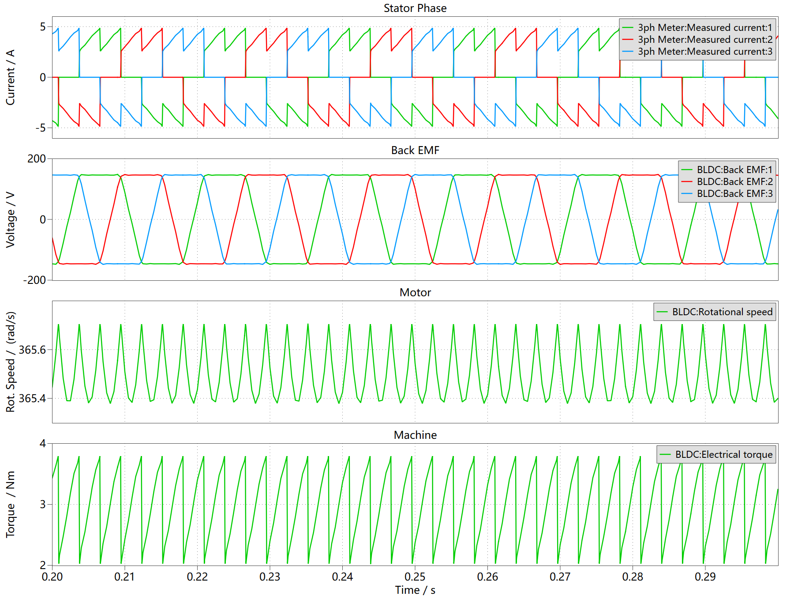
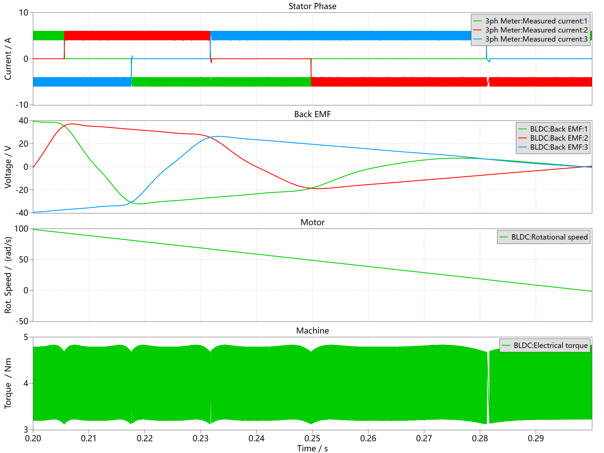
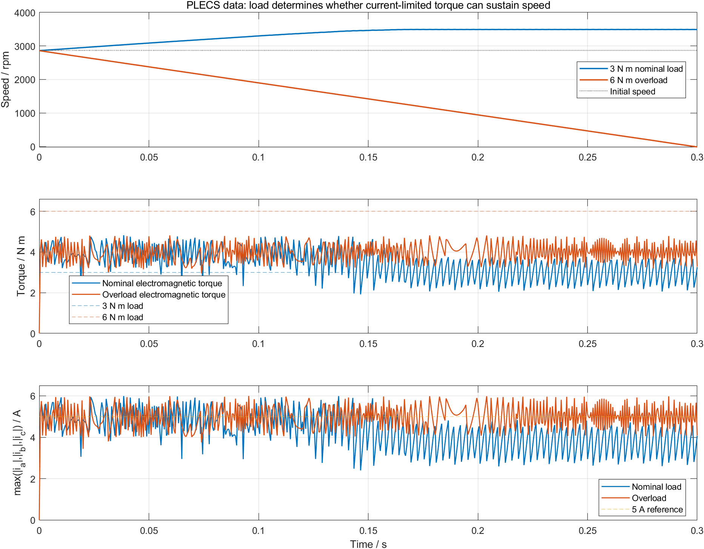
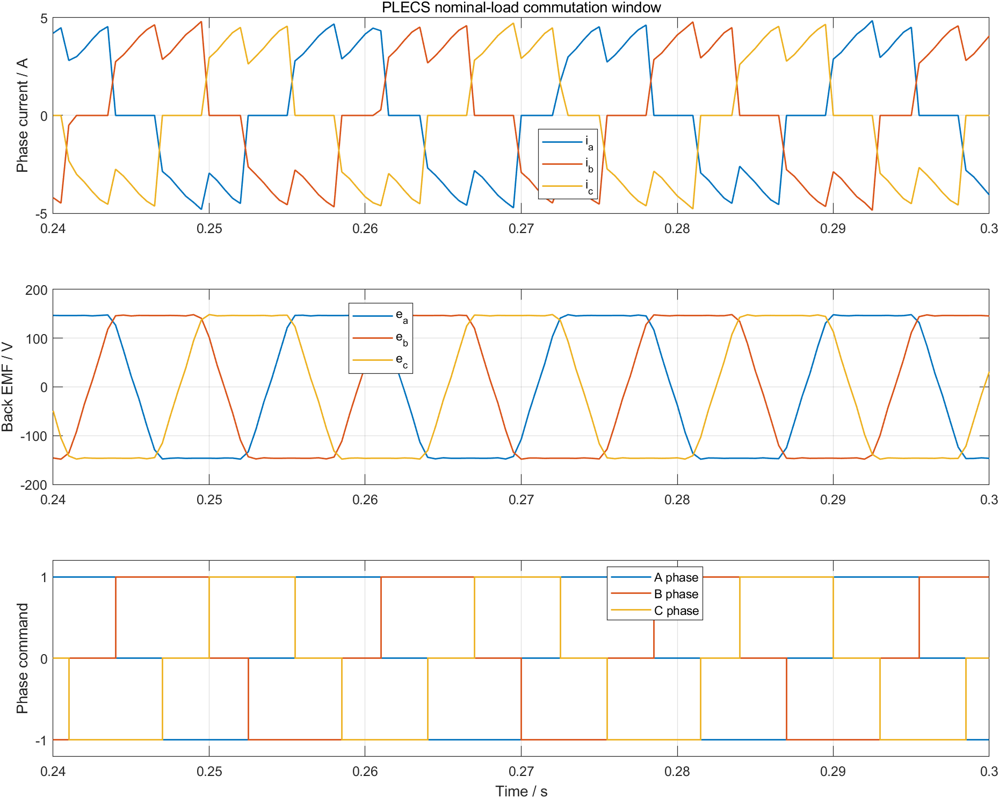

# 01 让 BLDC 在 PLECS 里真正转起来：电流、转矩与负载的因果链

给 BLDC 一个 5 A 电流参考，电机就一定能维持速度吗？

同一个 PLECS 模型里，3 N m 负载时，尾段转速为 3490.23 rpm；把负载提高到 6 N m，电流仍被限制在约 6 A，但尾段转速降到 271.99 rpm，并继续接近停转。

决定速度的不是“有没有电流”，而是电磁转矩能否持续大于负载转矩。本章从这组可复现现象出发，把三相桥、电机电磁量和机械负载连成一条因果链。

配套仓库：[https://github.com/Old-Ding/BLDC](https://github.com/Old-Ding/BLDC)

## 先建立最小物理模型

BLDC 从控制命令到机械转速，至少经过五次转换：

```text
电流参考 + 转子角度
  -> 换相控制器决定 A/B/C 三值相命令
  -> 逆变器把直流母线变成三相电流
  -> 三相电流与反电动势共同形成电磁转矩
  -> 电磁转矩克服负载并改变转速
```

这条链里，前一层的输出是后一层的输入：

| 层 | 输入 | 内部作用 | 输出 | 本章证据 |
|---|---|---|---|---|
| 换相控制 | 电流参考、转子角度、三相电流 | 按转子位置切换通电相，并限制相电流 | A/B/C 三值相命令 | PLECS `phase_cmd_a/b/c` |
| 三相逆变器 | 300 V 母线、三值相命令 | 将每相的正接、悬空或负接要求作用到桥臂 | `ia/ib/ic` | PLECS Stator Phase |
| BLDC 电磁模型 | 三相电流、转子位置 | 生成梯形反电动势和电磁转矩 | `ea/eb/ec`、`Te` | PLECS Back EMF、Machine |
| 机械模型 | 电磁转矩、负载转矩、转动惯量 | 对净转矩积分 | 机械角速度 `ωm` | PLECS Motor |

电机为什么加速或减速，由机械方程直接决定：

```text
J * dωm/dt = Te - TL - B * ωm
```

- `J` 是转动惯量。
- `Te` 是电磁转矩。
- `TL` 是负载转矩。
- `B * ωm` 是粘性阻尼转矩。

当 `Te > TL + Bωm`，净转矩为正，电机加速；当 `Te < TL + Bωm`，净转矩为负，电机减速。速度不是控制器直接“写进去”的数值，而是净转矩随时间积分后的结果。

## 三相电流为什么能形成转矩

BLDC 的反电动势接近梯形。六步换相让两相通电、一相悬空，并尽量让相电流方向与相反电动势的有效平顶区匹配。

忽略损耗时，电磁功率可写成：

```text
Pe = ea * ia + eb * ib + ec * ic
Te = Pe / ωm    (ωm != 0)
```

这里最重要的不是背公式，而是看乘积的符号：当通电相的 `e * i` 主要为正，电能转化为正向机械功率；换相顺序错误时，部分相的乘积会变成负值，电磁转矩下降甚至反向。

本章 PLECS 模型使用电流换相控制器、标准两电平 IGBT 三相桥和 BLDC Machine 元件。仓库模型由 PLECS Standalone 5.0.2 内置 `brushless_dc_machine` 示例改造而来，增加了集中参数、顶层数据输出和 Scope 自动导出脚本。这个出处很重要：功率级和电机响应由 PLECS 求解，MATLAB 不承担电机模型的主证据。

## 实验参数

| 参数 | 符号 | 数值 | 单位 | 在模型中的作用 |
|---|---|---:|---|---|
| 直流母线电压 | `Udc` | 300 | V | 给三相逆变器供电 |
| 电流参考 | `Iref` | 5 | A | 限制换相电流量级 |
| 定子相电阻 | `R` | 0.388 | Ω | 决定铜耗和电流动态 |
| 定子电感 | `L0` | 2.84 | mH | 限制相电流变化速度 |
| 转动惯量 | `J` | 2e-3 | kg m² | 决定转速对净转矩的响应快慢 |
| 粘性阻尼 | `B` | 0 | N m s/rad | 本章先隔离负载转矩对速度的影响 |
| 极对数 | `p` | 1 | 1 | 本章先固定电角度与机械角度比例 |
| 初始机械角速度 | `ωm0` | 300 | rad/s | 本章观察运行状态，不用于证明静止启动 |
| 仿真时长 |  | 0.3 | s | 覆盖额定运行和过载减速过程 |
| CSV 采样间隔 |  | 0.5 | ms | 输出 601 个等间隔数据点 |

初始转速设为 300 rad/s，是为了把第一章的观察焦点固定在“电流、转矩、负载、转速”这条链上。静止启动需要处理初始转子位置、开环拖动和切换条件，会在开环启动章节单独验证。

## 两个场景只改变负载

| 场景 | `Udc` | `Iref` | `TL` | 要检查的现象 |
|---|---:|---:|---:|---|
| `nominal_load` | 300 V | 5 A | 3 N m | 电磁转矩能否跟随负载，速度能否维持 |
| `overload` | 300 V | 5 A | 6 N m | 电流受限后，可用转矩不足会怎样反映到速度 |

母线、电机参数和电流参考完全相同，所以两组结果的主要差异可以归因到负载转矩，而不是同时改动多个参数后的猜测。

## 额定负载：先看四组 PLECS 波形



这张图由 PLECS 模型内的 `Export Chapter 01 Scope Evidence` 脚本直接导出。按从上到下的顺序读：

| Scope 区域 | 先看什么 | 得到的结论 |
|---|---|---|
| `Stator Phase` | 任一时刻主要有两相带电流，第三相接近零 | 六步换相采用“两相通电、一相悬空” |
| `Back EMF` | 三相梯形反电动势彼此错开 120° 电角度 | 换相位置必须跟随转子电角度 |
| `Motor` | 转速在约 365.5 rad/s 附近呈小幅周期纹波 | 转矩脉动经过转动惯量积分后表现为较小速度纹波 |
| `Machine` | 电磁转矩在约 2.0 至 3.8 N m 之间脉动 | 六步换相的瞬时转矩不是常数，应看周期平均值 |

额定场景的尾段平均电磁转矩是 2.9936 N m，几乎等于 3 N m 负载。净转矩的周期平均值接近零，因此转速不再持续下降。

相电流峰值为 5.9941 A，高于 5 A 参考。这个峰值来自滞环控制的上下阈值和开关纹波，并不表示电流环失效；判断电流限制时必须同时看参考值、滞环带和实际峰值，不能只拿一个采样点比较。

## 过载：电流还在，速度为什么掉下去



过载图要先看 `Motor`，再回到 `Stator Phase` 和 `Machine`：

1. 0.20 s 到 0.30 s 内，机械角速度从约 100 rad/s 持续降到接近 0。
2. 三相电流仍维持在约 5 A 的受限区间，没有随着负载提高到 6 N m 而无限增大。
3. 尾段平均电磁转矩只有 4.0098 N m，明显小于 6 N m 负载。
4. `Te - TL` 长时间为负，机械方程积分后只能得到持续下降的转速。

因此，“电流环仍然工作”和“电机仍能维持速度”是两个不同判断。电流限制保护了功率级和绕组，但它不能凭空增加电机的可用转矩。

## 把两组 PLECS 数据放在同一坐标系



这张图由 MATLAB 读取 `plecs_nominal_load.csv` 和 `plecs_overload.csv` 后生成。它是 PLECS 数据的后处理图，不是另一套 MATLAB 电机仿真。

三行图分别回答三个问题：

- 转速：3 N m 时上升后稳定，6 N m 时持续下降。
- 转矩：额定场景的平均值能覆盖负载，过载场景的平均值达不到 6 N m。
- 电流：两种负载下相电流峰值都保持在约 6 A，说明失速的根因不是“没有电流”，而是受限电流对应的转矩能力不足。

对应的汇总指标如下：

| 场景 | 相电流峰值 | 尾段转速 | 最终角速度 | 尾段平均电磁转矩 | 结果 |
|---|---:|---:|---:|---:|---|
| `nominal_load` | 5.9941 A | 3490.23 rpm | 365.40 rad/s | 2.9936 N m | PASS |
| `overload` | 5.9982 A | 271.99 rpm | -1.26 rad/s | 4.0098 N m | PASS |

过载场景的 PASS 表示“成功复现电流受限后的失速边界”。它不表示 6 N m 工况满足速度指标。

## 放大一次换相：命令、电流和反电动势如何对应



局部图仍然来自 PLECS CSV。这里画的是三值相命令，不是六个 IGBT 的独立门极电平：

| 相命令值 | 期望桥臂状态 |
|---:|---|
| `1` | 该相接正母线，上桥导通 |
| `0` | 该相关断，处于悬空窗口 |
| `-1` | 该相接负母线，下桥导通 |

沿任意一个换相边沿向上看，可以观察到三件事：

1. 一相命令退出，另一相命令接管，始终保留一相悬空。
2. 相电流不会瞬间跳到新值，因为绕组电感限制 `di/dt`。
3. 反电动势的平顶区决定当前哪一组通电方向能产生正向电磁功率。

这就是后续换相表的物理依据。换相表不是六行需要死记的位模式，而是在六个电角度扇区里选择正通电相、负通电相和悬空相。

## 如何解读本章证据

| 已观察到的证据 | 本章可以得到的结论 | 不要误读成 |
|---|---|---|
| PLECS 两电平 IGBT 桥和 BLDC Machine 共同运行 | 三相电流、反电动势、转矩和转速属于同一物理模型链 | 硬件器件损耗和热设计已经验证 |
| 3 N m 场景转矩平均值跟随负载 | 5 A 电流参考在该参数下可覆盖 3 N m 负载 | 已完成速度 PI 调参 |
| 6 N m 场景电流受限且速度塌落 | 电流上限对应有限转矩能力 | 保护逻辑已经完成 |
| 模型按连续转子角度换相 | 可观察理想位置反馈下的电磁链 | Hall 边沿量化、非法 Hall 状态和安装偏差已经验证 |
| 初始速度为 300 rad/s | 可稳定观察运行区换相和负载能力 | 已证明 BLDC 能从静止可靠启动 |

## 复现实验

先启动 PLECS，并在 Preferences 中启用端口 `1080` 的 XML-RPC 服务。然后执行：

```powershell
git clone https://github.com/Old-Ding/BLDC.git
Set-Location .\BLDC
python .\scripts\ch01_plecs_bldc_baseline.py
matlab -batch "run('scripts/ch01_control_chain_demo.m')"
```

期望输出：

```text
Generated chapter 01 PLECS baseline. scenarios=2 pass=2 time_points=601 signals=11 elapsed_s=<总耗时>
Generated chapter 01 MATLAB post-processing. scenarios=2 pass=2 figures=2
```

PLECS Scope 主图由模型内置脚本生成：

```text
Simulation -> Simulation scripts...
-> Export Chapter 01 Scope Evidence
-> Run
```

## 配套文件

| 类型 | 路径 | 作用 |
|---|---|---|
| PLECS 模型 | `models/plecs/ch01_bldc_baseline/ch01_bldc_baseline.plecs` | 三相桥、BLDC 电磁模型和机械负载 |
| PLECS 模型说明 | `models/plecs/ch01_bldc_baseline/README.md` | 来源、改动和 Outport 映射 |
| PLECS 运行器 | `scripts/ch01_plecs_bldc_baseline.py` | 运行场景、判定结果、生成 CSV 和报告 |
| MATLAB 后处理 | `scripts/ch01_control_chain_demo.m` | 读取 PLECS CSV，生成对比图和局部图 |
| 逐点数据 | `waveforms/01-bldc-control-chain/plecs_nominal_load.csv` | 额定负载 601 点、11 路 PLECS 输出 |
| 逐点数据 | `waveforms/01-bldc-control-chain/plecs_overload.csv` | 过载 601 点、11 路 PLECS 输出 |
| 汇总数据 | `waveforms/01-bldc-control-chain/plecs_baseline_summary.csv` | 参数、指标和 PASS/FAIL |
| PLECS 主图 | `assets/01-bldc-control-chain/plecs_scope_*.png` | PLECS Scope 直接导出的正式证据 |
| MATLAB 辅助图 | `assets/01-bldc-control-chain/plecs_*.png` | 对比和换相局部放大 |
| 测试报告 | `reports/01-bldc-control-chain-test_report.md` | 参数、场景和判定边界 |
| 复现说明 | `docs/01-bldc-control-chain-reproduce.md` | 环境、命令、输出和失败解释 |

## 下一章：三值相命令怎样变成六路门极信号

本章已经看到 `phase_cmd_a/b/c = 1/0/-1` 与三相电流的对应关系。下一章把两电平三相桥单独拆开，验证三值相命令如何展开成六路 IGBT 门极信号，以及上桥导通、下桥导通、悬空和同桥臂直通时 A/B/C 相端会出现什么状态。
