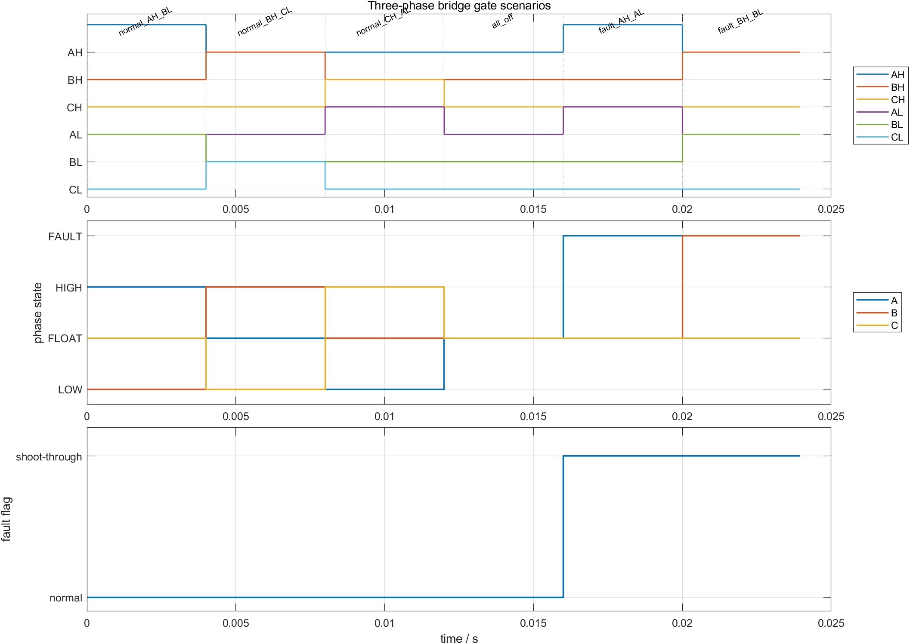
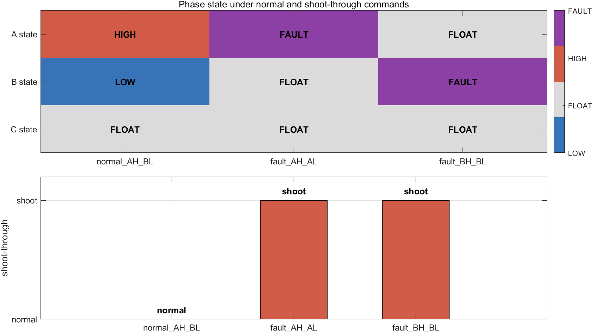

# BLDC 三相桥的 6 个开关：先把 AH/BH/CH/AL/BL/CL 翻译成相状态

很多人第一次看 BLDC 六步波形时，会直接盯着 PWM 脉冲或换相表。但更底层的问题是：给定 `AH/BH/CH/AL/BL/CL` 六个 gate 命令后，A/B/C 三相到底分别接到了正母线、负母线，还是悬空。

如果这个问题没有先讲清楚，后面讨论换相表、Hall、PWM、速度环时，就会把“谁决定导通相”和“谁调节能量”混在一起。

配套仓库：

[https://github.com/Old-Ding/BLDC](https://github.com/Old-Ding/BLDC)

## 本篇只解决什么

本篇只回答一个问题：

```text
AH/BH/CH/AL/BL/CL
  -> A/B/C 相状态
  -> shoot_through
```

这里的 `AH` 表示 A 相上桥，`AL` 表示 A 相下桥；B、C 两相同理。

本篇不讨论：

| 不讨论的内容 | 后续位置 |
|---|---|
| 六步换相表如何产生 gates | 第 04 篇 |
| PWM duty 如何叠加到高边或低边 | 第 08 篇 |
| 电机电流、反电动势、转矩和负载 | Step 08 完整 PLECS 模型 |
| 死区时间、驱动芯片保护和硬件互锁 | 第二阶段工程化保护 |

这一层的唯一职责是把 6 路开关命令翻译成三相状态，并标记同一相上下桥是否同时导通。

## 配套实验包

本篇不是只看文字。仓库里新增了一个 MATLAB 场景测试脚本：

```text
scripts/ch02_three_phase_bridge_tests.m
```

它会生成：

| 文件 | 作用 |
|---|---|
| `assets/02-three-phase-bridge/bridge_state_scenarios.png` | 六个 gate、三相状态和直通标志的时序图 |
| `assets/02-three-phase-bridge/bridge_state_fault_matrix.png` | 正常导通与直通故障的矩阵对比 |
| `waveforms/02-three-phase-bridge/bridge_state_timeseries.csv` | 时序图背后的逐点数据 |
| `waveforms/02-three-phase-bridge/bridge_state_summary.csv` | 场景级 PASS/FAIL 汇总 |
| `reports/02-three-phase-bridge-test_report.md` | 参数、结果和边界说明 |

对应的 C 源码在：

```text
learning_model/steps/step_01_three_phase_bridge/bridge_state.c
```

MATLAB 脚本复现这层逻辑并导出图表；C 文件表达控制代码里这层应该承担的职责。

## 状态编码

为了让 CSV 和图能直接读，实验使用下面的状态编码：

| 状态 | 编码 | 含义 |
|---|---:|---|
| `HIGH` | `1` | 该相通过上桥接正母线 |
| `LOW` | `-1` | 该相通过下桥接负母线 |
| `FLOAT` | `0` | 该相上下桥都关闭，处于悬空状态 |
| `FAULT` | `2` | 同一相上下桥同时导通 |

本章参数很少，因为它不是电机动态仿真：

| 参数 | 数值 | 单位 | 说明 |
|---|---:|---|---|
| 采样周期 | 50 | us | 用于生成可读时序图 |
| 每个场景采样点 | 80 | 点 | 每个 gate 组合保持固定时间 |
| 单场景持续时间 | 4.000 | ms | 让图中每个场景分段清楚 |
| 测试场景数 | 6 | 个 | 3 个正常导通、1 个全关、2 个直通故障 |

## 半桥状态如何判断

单相半桥只有四种结果：

| 上桥 | 下桥 | 相状态 | 直通 |
|---:|---:|---|---:|
| 0 | 0 | `FLOAT` | 0 |
| 1 | 0 | `HIGH` | 0 |
| 0 | 1 | `LOW` | 0 |
| 1 | 1 | `FAULT` | 1 |

这就是 `bridge_state.c` 里的核心规则。它不需要知道当前是第几步换相，也不需要知道 duty 是多少。

最小逻辑可以读成：

```text
如果 high=1 且 low=1：该相 FAULT，并置 shoot_through=1
否则 high=1：该相 HIGH
否则 low=1：该相 LOW
否则：该相 FLOAT
```

三相桥只是把这个半桥规则分别应用到 A、B、C 三相。

## 场景测试结果

本篇用 6 个场景覆盖正常状态、全关状态和故障状态：

| 场景 | Gates | 实际状态 | shoot_through | 结果 |
|---|---|---|---:|---|
| `normal_AH_BL` | `AH=1 BH=0 CH=0 AL=0 BL=1 CL=0` | `A=HIGH B=LOW C=FLOAT` | 0 | PASS |
| `normal_BH_CL` | `AH=0 BH=1 CH=0 AL=0 BL=0 CL=1` | `A=FLOAT B=HIGH C=LOW` | 0 | PASS |
| `normal_CH_AL` | `AH=0 BH=0 CH=1 AL=1 BL=0 CL=0` | `A=LOW B=FLOAT C=HIGH` | 0 | PASS |
| `all_off` | `AH=0 BH=0 CH=0 AL=0 BL=0 CL=0` | `A=FLOAT B=FLOAT C=FLOAT` | 0 | PASS |
| `fault_AH_AL` | `AH=1 BH=0 CH=0 AL=1 BL=0 CL=0` | `A=FAULT B=FLOAT C=FLOAT` | 1 | PASS |
| `fault_BH_BL` | `AH=0 BH=1 CH=0 AL=0 BL=1 CL=0` | `A=FLOAT B=FAULT C=FLOAT` | 1 | PASS |

完整结果在：

```text
waveforms/02-three-phase-bridge/bridge_state_summary.csv
reports/02-three-phase-bridge-test_report.md
```

## 图 1：gate 到相状态



这张图按三层读：

| 子图 | 看什么 | 结论 |
|---|---|---|
| `Three-phase bridge gate scenarios` | 六路 gate 在每个场景中的 0/1 状态 | 每个场景只改变桥臂命令，不引入 PWM 或电机动态 |
| `phase state` | A/B/C 三相对应 `LOW/FLOAT/HIGH/FAULT` | 相状态完全由同相上下桥决定 |
| `fault flag` | `shoot_through` 是否变为 1 | 只有同一相上下桥同时导通时，直通标志才出现 |

从 `normal_AH_BL` 看，`AH=1`、`BL=1`，所以 A 相是 `HIGH`，B 相是 `LOW`，C 相是 `FLOAT`。这就是六步换相里“一相拉高、一相拉低、一相悬空”的基本形态。

从 `all_off` 看，六个 gate 全部为 0 时，A/B/C 都是 `FLOAT`，没有直通。这种状态不产生有效转矩，但它是停机、故障关断或上电初始化时经常需要识别的状态。

从 `fault_AH_AL` 和 `fault_BH_BL` 看，只要同一相上桥和下桥同时为 1，该相立刻变成 `FAULT`，`shoot_through` 变为 1。这个判断属于三相桥状态层，不属于速度 PI 层。

## 图 2：正常导通和直通故障的区别



这张图只比较三个关键场景：

| 场景 | 读图方式 |
|---|---|
| `normal_AH_BL` | A 相 `HIGH`，B 相 `LOW`，C 相 `FLOAT`，直通标志为 `normal` |
| `fault_AH_AL` | A 相变为 `FAULT`，直通标志为 `shoot` |
| `fault_BH_BL` | B 相变为 `FAULT`，直通标志为 `shoot` |

关键区别不是“有几个 gate 为 1”，而是同一相内部是否同时打开上下桥。`normal_AH_BL` 也有两个 gate 为 1，但它们分属 A 上桥和 B 下桥，所以不是直通。`fault_AH_AL` 只有 A 相内部上下桥同时导通，才是直通故障。

## 为什么直通判断放在三相桥层

速度环输出的是 `duty`，换相表输出的是基础 gates，PWM 层把 duty 调成脉冲。它们都不应该把三相桥内部状态当成自己的主职责。

直通判断放在三相桥状态层有两个好处：

| 好处 | 说明 |
|---|---|
| 可定位 | 看到 `shoot_through=1` 时，先查同相上下桥命令，而不是先怀疑 PI 参数 |
| 可复用 | 不管 gates 来自开环、Hall 换相还是 PWM 调制，最后都经过同一个状态判断 |

真实硬件里还会有驱动芯片互锁、死区、过流保护和故障锁存。那些属于保护执行层，不改变本章这个状态模型的职责边界。

## 与 PLECS 的关系

当前仓库已有 Step 01 PLECS 教学模型：

```text
learning_model/steps/step_01_three_phase_bridge/step_01_three_phase_bridge.plecs
```

Scope 里应观察：

```text
AH/BH/CH/AL/BL/CL
A_state/B_state/C_state
shoot_through
```

本篇 MATLAB 实验用于批量生成场景数据和图。PLECS 模型用于把同一组信号放进可视化模型里观察。两者边界不同：

| 工具 | 本篇职责 |
|---|---|
| MATLAB | 批量生成场景、CSV、PNG 和测试报告 |
| C | 表达三相桥状态判断的控制逻辑 |
| PLECS | 作为 Step 01 教学模型入口，观察同名信号 |

如果本机没有启动 PLECS RPC，本篇 MATLAB 实验仍然可以完整复现。PLECS RPC 只影响模型自动加载验证，不影响本篇 CSV 和 PNG 证据。

## 如何复现

在 PowerShell 中运行：

```powershell
Set-Location D:\1codex\BLDC
matlab -batch "run('D:\1codex\BLDC\scripts\ch02_three_phase_bridge_tests.m')"
```

期望输出：

```text
Generated chapter 02 three-phase bridge tests. scenarios=6 pass=6 figures=2
```

查看汇总：

```powershell
Get-Content -LiteralPath .\waveforms\02-three-phase-bridge\bridge_state_summary.csv -Encoding UTF8
Get-Content -LiteralPath .\reports\02-three-phase-bridge-test_report.md -Encoding UTF8
```

复现说明见：

```text
docs/02-three-phase-bridge-reproduce.md
```

## 本篇证明什么

本篇证明：

| 结论 | 证据 |
|---|---|
| 六个 gate 可以唯一映射到 A/B/C 相状态 | `bridge_state_timeseries.csv` 和图 1 |
| 正常双管导通不等于直通 | `normal_AH_BL` 场景 |
| 同相上下桥同时导通会产生 `FAULT` 和 `shoot_through=1` | `fault_AH_AL`、`fault_BH_BL` 场景 |
| 当前 6 个测试场景全部符合期望 | `bridge_state_summary.csv` 和测试报告 |

本篇不证明：

| 不证明的内容 | 原因 |
|---|---|
| 电机能转起来 | 没有电机本体、电流和转矩模型 |
| 硬件已经安全 | 没有死区、驱动芯片、过流保护和故障锁存验证 |
| 换相顺序正确 | 本章没有引入 step 或 Hall 状态 |
| PWM 调制正确 | 本章没有引入 carrier 和 duty |

## 下一篇

下一篇进入电角度、机械角度和极对数。只有把“机械转一圈”和“电角度走几圈”讲清楚，后面六步换相表和 Hall 反馈才不会变成死记硬背。
