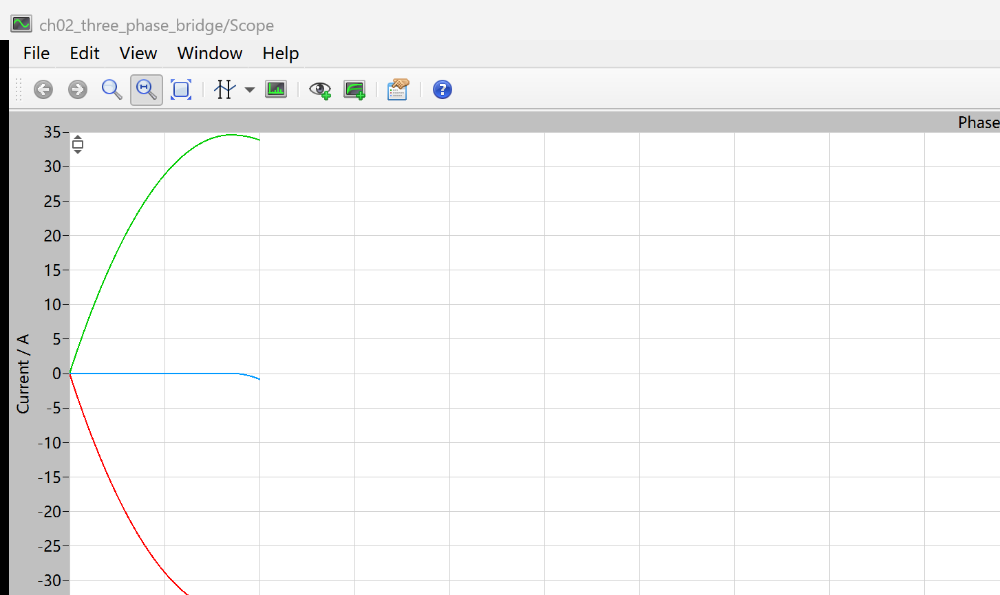
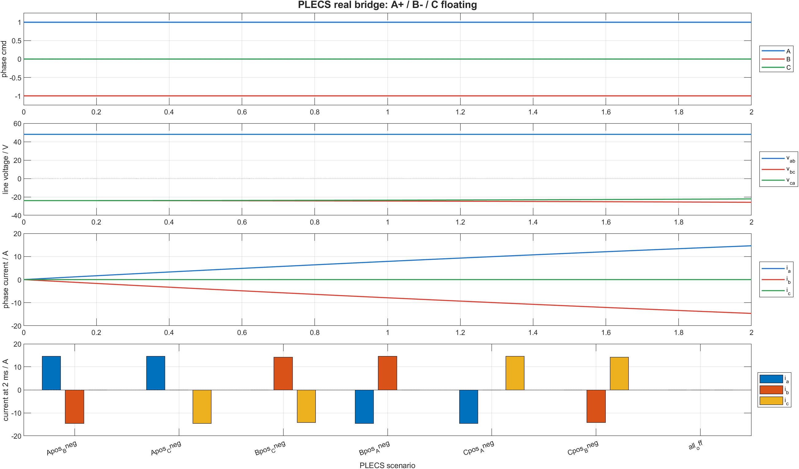
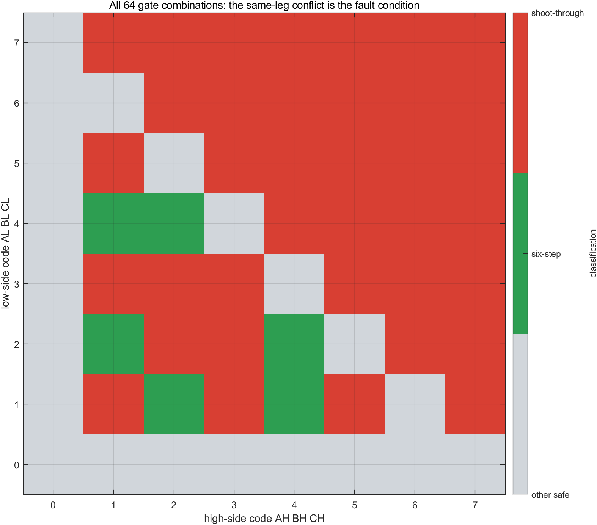

# 02 三值相命令怎样变成真实电流：BLDC 三相桥的上桥、下桥与悬空

`phase_cmd = [1, -1, 0]` 不是六路 IGBT 门极波形。它只表达三个桥臂各自要进入什么状态：A 相接正母线，B 相接负母线，C 相悬空。

真正需要建立的因果链是：

```text
AH/BH/CH/AL/BL/CL 六路门极请求
  -> 每个桥臂检查是否直通
  -> A/B/C 三值相命令
  -> PLECS 两电平 IGBT 三相桥
  -> 线电压
  -> BLDC 绕组电流
```

本章把这条链完整跑通。六路门极组合由真值表审计，功率级和绕组响应由 PLECS 计算，MATLAB 只读取 PLECS CSV 做对比图。

配套仓库：[https://github.com/Old-Ding/BLDC](https://github.com/Old-Ding/BLDC)

## 先看一个桥臂，不要先背六步表

每一相都是一个半桥。以 A 相为例，上管是 `AH`，下管是 `AL`，两者组合只有四种结果。

| AH | AL | A 相状态 | 三值编码 | 物理含义 |
|---:|---:|---|---:|---|
| 0 | 0 | `FLOAT` | 0 | 上下管都关断，A 相端不被桥臂主动钳位 |
| 1 | 0 | `HIGH` | +1 | A 相接直流母线正端 |
| 0 | 1 | `LOW` | -1 | A 相接直流母线负端 |
| 1 | 1 | `FAULT` | 不生成 | 同一桥臂上下管同时请求导通，形成直通请求 |

B、C 两相使用完全相同的规则。三值相命令只是把三个半桥的合法状态压缩成一个长度为 3 的向量。

因此：

```text
AH=1, BL=1，其余门极为 0
  -> A=+1, B=-1, C=0
  -> phase_cmd = [1, -1, 0]
```

而 `AH=1, AL=1` 不会得到某个正常三值命令。它首先被归类为同桥臂直通请求。

## PLECS 模型里的三值输入来自哪里

本章正式模型是：

```text
models/plecs/ch02_three_phase_bridge/ch02_three_phase_bridge.plecs
```

它由第 01 篇已经跑通的 BLDC 功率级母模型机械派生，保留以下真实对象：

- 48 V 直流电源；
- PLECS `2-Level IGBT Conv.` 两电平三相桥；
- 三相电压、电流测量；
- PLECS `BLDC Machine` 绕组和机械端口。

本章只把第 01 篇的电流控制器替换为可配置三值相命令。PLECS 变流器的输入端接受每相 `+1/0/-1` 状态，并在内部驱动对应桥臂。这样可以把“控制接口”和“六路器件状态”分开观察，又不会把三值命令误写成六路门极。

## 参数先固定，再看波形

| 参数 | 数值 | 单位 | 本章用途 |
|---|---:|---|---|
| 直流母线电压 | 48 | V | 决定有效线电压幅值 |
| BLDC 相电阻 | 0.388 | ohm | 决定电流稳态值和铜耗 |
| BLDC 相电感 | 2.84 | mH | 决定电流上升速度 |
| 极对数 | 1 | - | 沿用母模型，本章不研究极对数 |
| 初始机械角速度 | 0 | rad/s | 先隔离桥和绕组的电流建立过程 |
| 单场景仿真时间 | 2 | ms | 足以观察 R-L 电流上升且转子角度变化仍很小 |
| 输出采样间隔 | 10 | us | 每个场景导出 201 个时刻 |

本章不是用理想电阻代替电机。BLDC Machine 仍在电路里，所以 CSV 同时包含反电动势、转速和电磁转矩；只是 2 ms 时间窗让问题集中在桥命令、线电压和绕组电流上。

## 七个场景覆盖六个有效矢量和全关

| 场景 | 三值相命令 | 导通路径 | 悬空相 |
|---|---|---|---|
| `Apos_Bneg` | `[+1,-1,0]` | DC+ -> A 相 -> B 相 -> DC- | C |
| `Apos_Cneg` | `[+1,0,-1]` | DC+ -> A 相 -> C 相 -> DC- | B |
| `Bpos_Cneg` | `[0,+1,-1]` | DC+ -> B 相 -> C 相 -> DC- | A |
| `Bpos_Aneg` | `[-1,+1,0]` | DC+ -> B 相 -> A 相 -> DC- | C |
| `Cpos_Aneg` | `[-1,0,+1]` | DC+ -> C 相 -> A 相 -> DC- | B |
| `Cpos_Bneg` | `[0,-1,+1]` | DC+ -> C 相 -> B 相 -> DC- | A |
| `all_off` | `[0,0,0]` | 无主动导通路径 | A/B/C |

这七组不是换相时序。每次 PLECS 仿真只固定一个状态，从零初值开始，目的是先证明每个状态对应的电流路径。

## PLECS 原生 Scope：A 相送电、B 相回流、C 相悬空



这是 PLECS 原生 Scope 窗口截图，不是 MATLAB 重画图。读取它时先看三条曲线的方向：

- A 相电流从 0 向正方向上升；
- B 相电流以相同幅值向负方向下降；
- C 相电流保持在 0 附近。

三相电流满足：

```text
ia + ib + ic = 0
```

这说明电流从 A 相进入，经星形绕组内部节点流入 B 相，再由 B 下桥臂返回负母线。C 桥臂悬空时，C 相没有形成主动电流路径。

第 01 篇已经证明三相电流可以形成转矩；本章进一步把其中一个电流状态追溯到了桥臂命令和母线电压。

## 为什么 2 ms 时电流约为 14.65 A

在 `Apos_Bneg` 场景开始的极短时间内，转速接近 0，A、B 两相绕组串联在 48 V 母线上。忽略很小的反电动势，电流近似满足：

```text
2L * di/dt + 2R * i = Udc
```

代入 `R=0.388 ohm`、`L=2.84 mH`、`Udc=48 V`：

```text
i(t) = Udc/(2R) * (1 - exp(-R/L * t))
```

在 `t=2 ms` 时，R-L 近似值约为 14.8 A。PLECS 导出的结果是：

| 量 | 2 ms 实测值 |
|---|---:|
| `ia` | +14.6509 A |
| `ib` | -14.6509 A |
| `ic` | 0 A |
| `vab` 峰值 | 48 V |
| 机械角速度 | 3.0767 rad/s |

近似计算和 PLECS 结果接近，说明电流幅值不是随意画出的。两相电阻、电感以及开始出现的电磁运动共同决定了它。

## 把命令、线电压和相电流放在同一张图里



这张 MATLAB 图只读取 `plecs_Apos_Bneg.csv` 和七场景汇总表。四层应按顺序阅读：

1. `phase cmd` 固定为 A=+1、B=-1、C=0；
2. `vab` 立即建立 48 V 线电压；
3. A、B 相电流受绕组电感限制，不能瞬间跳变；
4. 六个有效矢量中，总有一相电流为正、一相为负、一相接近 0；全关场景三相均为 0。

七个场景的 PLECS 判定结果如下：

| 场景 | 末值 `ia`/A | 末值 `ib`/A | 末值 `ic`/A | 峰值线电压/V | 结果 |
|---|---:|---:|---:|---:|---|
| `Apos_Bneg` | +14.6509 | -14.6509 | 0 | 48 | PASS |
| `Apos_Cneg` | +14.6509 | 0 | -14.6509 | 48 | PASS |
| `Bpos_Cneg` | 0 | +14.2426 | -14.2426 | 48 | PASS |
| `Bpos_Aneg` | -14.6516 | +14.6516 | 0 | 48 | PASS |
| `Cpos_Aneg` | -14.6516 | 0 | +14.6516 | 48 | PASS |
| `Cpos_Bneg` | 0 | -14.2426 | +14.2426 | 48 | PASS |
| `all_off` | 0 | 0 | 0 | 0 | PASS |

PASS 的判据不是“电流必须等于某个手写常数”，而是检查：

- 送电相电流方向为正；
- 回流相电流方向为负；
- 悬空相末值电流不超过 2 A；
- 任意时刻三相电流和接近 0；
- 有效矢量能建立接近 48 V 的线电压；
- 全关时电流和线电压保持为 0。

## 64 组门极组合里，为什么只有 6 组是六步有效矢量

六个门极输入各有 0/1 两种状态，总组合数是：

```text
2^6 = 64
```

脚本逐组检查每个桥臂，再判断三相状态是否恰好包含一个 `HIGH`、一个 `LOW` 和一个 `FLOAT`。



矩阵分成三类：

| 分类 | 数量 | 含义 |
|---|---:|---|
| 同桥臂直通请求 | 37 | 至少一相的上、下管同时为 1 |
| 六步有效矢量 | 6 | 恰好一相高、一相低、一相悬空 |
| 其他无直通组合 | 21 | 包含全关、单管导通、多个同侧管导通等状态 |

“没有直通”不等于“可以产生六步转矩”。例如只有 `AH=1` 时没有同桥臂冲突，但没有返回路径；`AH=BH=1` 时也没有上下管冲突，但两相都被拉到同一母线端，不能形成期望的两相压差。

因此换相表必须同时满足两个条件：

1. 同桥臂不能同时导通；
2. 三相状态必须是 `HIGH/LOW/FLOAT` 的一个排列。

## 如何解读本章证据

| 观察到的证据 | 可以得出的结论 | 不要误读成 |
|---|---|---|
| PLECS Scope 中 A、B 电流等幅反向，C 电流为 0 | `[+1,-1,0]` 形成 A 到 B 的真实绕组电流路径 | 三值命令就是六路门极波形 |
| 六个有效矢量均建立 48 V 峰值线电压 | 三相桥能按命令切换送电相和回流相 | 已经实现了自动六步换相 |
| 64 组中 37 组含同桥臂冲突 | 直通判断必须逐桥臂进行 | 只要有两个门极为 1 就是直通 |
| `all_off` 的电流和线电压均为 0 | 全关没有主动能量输入 | 全关一定等于硬件安全停机 |

PLECS 模型使用理想 IGBT 变流器接口，当前没有加入驱动传播延迟、死区、器件压降、开关损耗和保护锁存。第 11 篇会单独处理 PWM 与死区，不在本章提前混入。

## 复现实验

启动 PLECS Standalone 并启用 `localhost:1080` XML-RPC，然后在 PowerShell 中执行：

```powershell
git clone https://github.com/Old-Ding/BLDC.git
Set-Location .\BLDC
python .\scripts\build_ch02_plecs_model.py
python .\scripts\ch02_plecs_three_phase_bridge.py
matlab -batch "run('scripts/ch02_three_phase_bridge_tests.m')"
```

期望输出：

```text
Generated chapter 02 PLECS bridge evidence. scenarios=7 pass=7 time_points=201 signals=14 gate_combinations=64 elapsed_s=<总耗时>
Generated chapter 02 MATLAB post-processing. scenarios=7 pass=7 figures=2
```

## 配套文件

| 文件 | 作用 |
|---|---|
| [`models/plecs/ch02_three_phase_bridge/ch02_three_phase_bridge.plecs`](../models/plecs/ch02_three_phase_bridge/ch02_three_phase_bridge.plecs) | 真实两电平 IGBT 桥与 BLDC 绕组模型 |
| [`scripts/build_ch02_plecs_model.py`](../scripts/build_ch02_plecs_model.py) | 从已验证母模型确定性派生第 02 篇模型 |
| [`scripts/ch02_plecs_three_phase_bridge.py`](../scripts/ch02_plecs_three_phase_bridge.py) | 运行七个 PLECS 场景并生成 CSV、报告和原生 Scope 截图 |
| [`scripts/ch02_three_phase_bridge_tests.m`](../scripts/ch02_three_phase_bridge_tests.m) | 读取 PLECS CSV，生成对比图和 64 组合矩阵 |
| [`waveforms/02-three-phase-bridge/plecs_bridge_summary.csv`](../waveforms/02-three-phase-bridge/plecs_bridge_summary.csv) | 七场景指标与 PASS/FAIL |
| [`waveforms/02-three-phase-bridge/gate_truth_table.csv`](../waveforms/02-three-phase-bridge/gate_truth_table.csv) | 64 组六路门极完整审计表 |
| [`reports/02-three-phase-bridge-test_report.md`](../reports/02-three-phase-bridge-test_report.md) | 参数、场景结果和证据边界 |
| [`docs/02-three-phase-bridge-reproduce.md`](../docs/02-three-phase-bridge-reproduce.md) | 完整 PowerShell 复现说明 |

## 下一章：极对数为什么会改变换相频率

下一章保持同一台 PLECS BLDC Machine，只改变极对数并同时观察机械角和电角。目标是用同一段机械转动证明：极对数为多少，电角度就转过多少圈。
