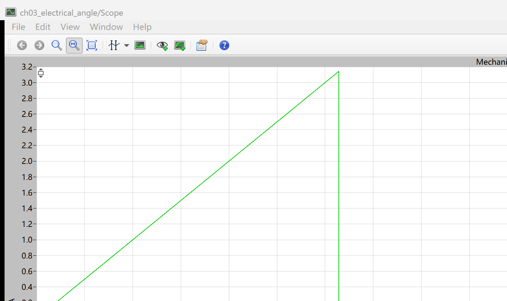
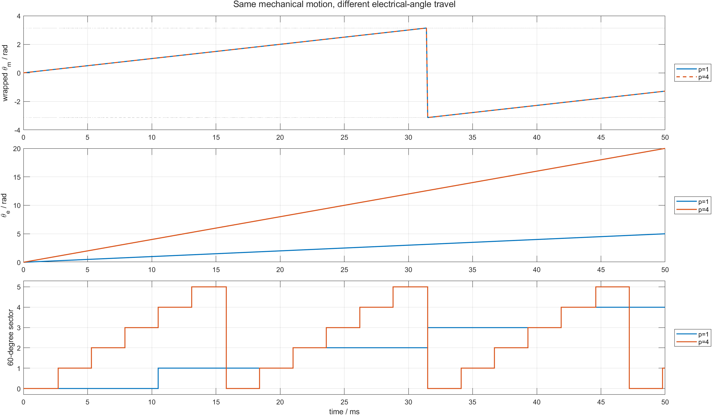

# 03 机械转一圈，电角度为什么可能转四圈：BLDC 极对数与换相频率

同样是 1000 rpm，为什么有的 BLDC Hall 边沿来得更快？原因不是转子机械速度变快，而是电机的极对数不同。

机械角描述转子轴实际转过多少；电角度描述转子磁场相对定子绕组完成了多少个磁周期。两者关系只有一条：

```text
theta_e = p * theta_m
```

其中 `p` 是极对数。四极电机有 2 对磁极，所以 `p=2`；八极电机有 4 对磁极，所以 `p=4`。

配套仓库：[https://github.com/Old-Ding/BLDC](https://github.com/Old-Ding/BLDC)

## 先区分三个角度变量

| 变量 | 含义 | 是否回绕 | 本章来源 |
|---|---|---|---|
| 原始机械角 `theta_m_raw` | PLECS Angle Sensor 当前显示值 | 在 `-pi` 与 `+pi` 之间回绕 | PLECS 直接导出 |
| 连续机械角 `theta_m` | 转子从仿真开始累计转过的角度 | 不回绕 | 对 PLECS 原始角做 unwrap |
| 电角度 `theta_e` | 转子磁场相对定子的累计磁周期角度 | 计算时不回绕 | `p * theta_m` |

换相扇区只需要电角度在一个周期内的位置，因此还会使用：

```text
theta_e_wrapped = theta_e mod (2*pi)
sector = floor(theta_e_wrapped / (pi/3))
```

六步换相把一个电周期分成 6 个 60 度扇区，所以 `sector` 取 0 到 5。

## 为什么 PLECS 曲线会突然从 +pi 跳到 -pi



这是 PLECS Angle Sensor 的原生 Scope。曲线从 0 上升到约 `+3.14 rad` 后跳到约 `-3.14 rad`，然后继续上升。

这个竖直跳变不是转子反转。角度传感器只是把同一圆周位置限制在 `[-pi, pi]`：

```text
+179 deg -> +180 deg -> -179 deg
```

三个数在显示上发生跳变，但机械运动方向没有改变。判断方向应看回绕前后的连续变化，或先做角度解包，不能直接用原始末值减初值。

## PLECS 实验怎样隔离极对数关系

本章模型继续使用 PLECS `BLDC Machine` 和机械角传感器：

```text
models/plecs/ch03_electrical_angle/ch03_electrical_angle.plecs
```

三相桥保持全关，母线提高到 300 V，避免转子反电动势通过续流二极管形成电流。电机以 `100 rad/s` 初速度自由转动 50 ms。

| 参数 | 场景 1 | 场景 2 | 单位 |
|---|---:|---:|---|
| 极对数 `p` | 1 | 4 | - |
| 初始机械角速度 | 100 | 100 | rad/s |
| 三值相命令 | `[0,0,0]` | `[0,0,0]` | - |
| 仿真时间 | 50 | 50 | ms |
| 采样间隔 | 0.1 | 0.1 | ms |

两组实验的机械运动完全相同，只改变 BLDC Machine 的极对数参数。

## 先手算机械角增量

速度固定为 `100 rad/s`，时间为 `0.05 s`：

```text
Delta theta_m = omega_m * Delta t
              = 100 * 0.05
              = 5 rad
```

因此两组场景都应累计转过 5 rad 机械角。电角增量分别为：

```text
p=1: Delta theta_e = 1 * 5 = 5 rad
p=4: Delta theta_e = 4 * 5 = 20 rad
```

PLECS 和后处理结果为：

| 场景 | 极对数 | 机械角增量/rad | 电角增量/rad | `Delta theta_e / Delta theta_m` | 结果 |
|---|---:|---:|---:|---:|---|
| `one_pole_pair` | 1 | 5.000000 | 5.000000 | 1.000000 | PASS |
| `four_pole_pairs` | 4 | 5.000000 | 20.000000 | 4.000000 | PASS |

PASS 同时要求平均机械速度保持 `100 rad/s`，三相电流保持为 0。这样极对数关系没有被负载、电流或控制器动态混入。

## 同一机械运动为什么跨过更多换相扇区



这张图按三层读：

1. 上图是 PLECS 原始机械角，`p=1` 和 `p=4` 完全重合，并在 `pi` 处回绕；
2. 中图先对机械角解包，再乘极对数，`p=4` 的电角斜率是 `p=1` 的 4 倍；
3. 下图把电角度折回一个电周期并划分成 6 个扇区，`p=4` 在同一时间内跨过更多扇区。

这就是“极对数改变换相频率”的因果链：

```text
机械速度相同
  -> 机械角增长率相同
  -> 电角增长率乘以 p
  -> 60 度扇区经过速度乘以 p
  -> Hall 边沿和换相事件频率乘以 p
```

## 从机械转速换算 Hall 边沿频率

机械转速为 `n_rpm` 时：

```text
f_mech = n_rpm / 60
f_elec = p * f_mech
f_hall_edge = 6 * f_elec
```

本章的 `100 rad/s` 等于：

```text
n_rpm = 100 * 60 / (2*pi) = 954.93 rpm
```

| 极对数 | 机械频率/Hz | 电频率/Hz | 六步扇区或 Hall 边沿频率/Hz |
|---:|---:|---:|---:|
| 1 | 15.915 | 15.915 | 95.493 |
| 4 | 15.915 | 63.662 | 381.972 |

同样是 954.93 rpm，`p=4` 每秒经过 381.97 个 60 度扇区，是 `p=1` 的 4 倍。第 12 篇用 Hall 边沿周期测速时，这个 `6p` 因子会直接进入 rpm 公式。

## 常见单位错误

| 错误写法 | 问题 | 正确处理 |
|---|---|---|
| 把极数当成极对数 | 八极电机误填 `p=8`，电角速度多算一倍 | 八极等于四对极，填 `p=4` |
| 用 rpm 直接乘角度公式 | rpm 不是 rad/s | 先乘 `2*pi/60` 转为 rad/s |
| 用回绕角末值减初值 | 跨过 `pi` 时得到错误负增量 | 先 unwrap，再计算累计角度 |
| 机械角直接分六扇区 | 多极电机换相频率过低 | 先算电角，再按 60 电角度分扇区 |

## 如何解读本章证据

| 证据 | 教学结论 | 不要误读成 |
|---|---|---|
| 两场景机械角曲线重合 | 改变极对数不等于改变机械速度 | 两台不同极数电机的所有参数都相同 |
| 电角增量比值严格等于 `p` | `theta_e = p*theta_m` 与 PLECS 参数一致 | PLECS Angle Sensor 直接输出电角度 |
| `p=4` 扇区变化更快 | 相同 rpm 下 Hall/换相事件更密集 | 电机输出转矩必然提高 4 倍 |
| 三相电流为 0 | 本实验隔离了角度映射 | 电机实际运行时没有电流 |

极对数还会影响反电动势空间周期和换相匹配，但不单独决定转矩、功率或最高转速。那些结论必须结合磁链、绕组、电压和负载数据。

## 复现实验

```powershell
Set-Location .\BLDC
python .\scripts\build_ch02_plecs_model.py
python .\scripts\build_ch03_plecs_model.py
python .\scripts\ch03_plecs_electrical_angle.py
matlab -batch "run('scripts/ch03_electrical_angle_postprocess.m')"
```

期望输出：

```text
Generated chapter 03 PLECS angle evidence. scenarios=2 pass=2 time_points=501 signals=15
Generated chapter 03 MATLAB post-processing. scenarios=2 pass=2 figures=1
```

## 配套文件

| 文件 | 作用 |
|---|---|
| [`models/plecs/ch03_electrical_angle/ch03_electrical_angle.plecs`](../models/plecs/ch03_electrical_angle/ch03_electrical_angle.plecs) | 参数化极对数并导出机械角的 PLECS 模型 |
| [`scripts/ch03_plecs_electrical_angle.py`](../scripts/ch03_plecs_electrical_angle.py) | 运行两组 PLECS 场景、解包机械角并生成报告 |
| [`scripts/ch03_electrical_angle_postprocess.m`](../scripts/ch03_electrical_angle_postprocess.m) | 读取 PLECS CSV 并生成角度、扇区对比图 |
| [`waveforms/03-electrical-angle/plecs_angle_summary.csv`](../waveforms/03-electrical-angle/plecs_angle_summary.csv) | 两场景指标和 PASS/FAIL |
| [`reports/03-electrical-angle-test_report.md`](../reports/03-electrical-angle-test_report.md) | 机械角、电角度和比值报告 |
| [`docs/03-mechanical-and-electrical-angle-reproduce.md`](../docs/03-mechanical-and-electrical-angle-reproduce.md) | 复现命令、生成物和失败解释 |

## 下一章：相电流为什么有时产生正转矩，有时产生负转矩

下一章回到第 01 篇 PLECS 电流、反电动势和电磁转矩数据，逐点计算 `ea*ia + eb*ib + ec*ic`。目标是用同一时刻的符号和功率证明：电流大小相近，并不代表转矩方向一定相同。
