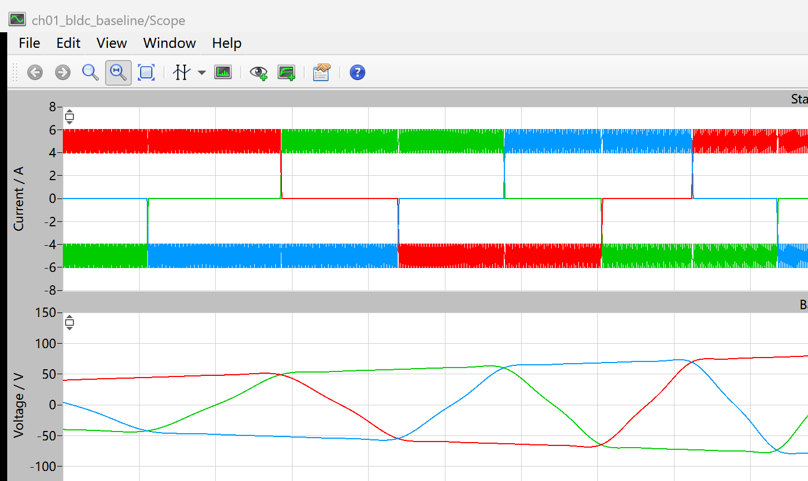
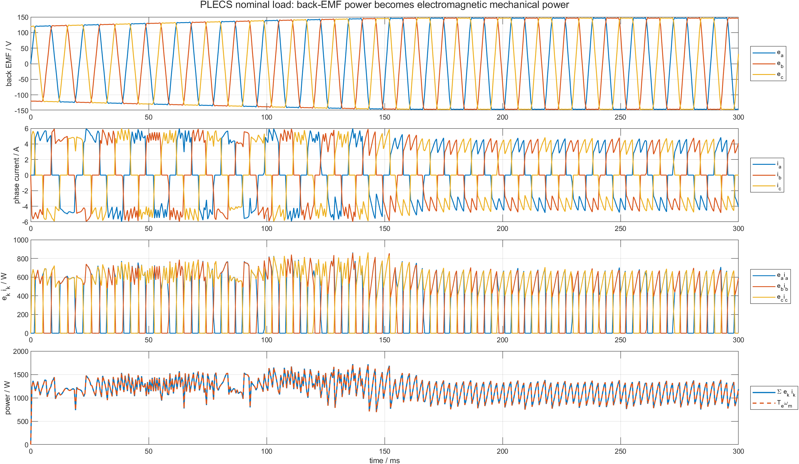
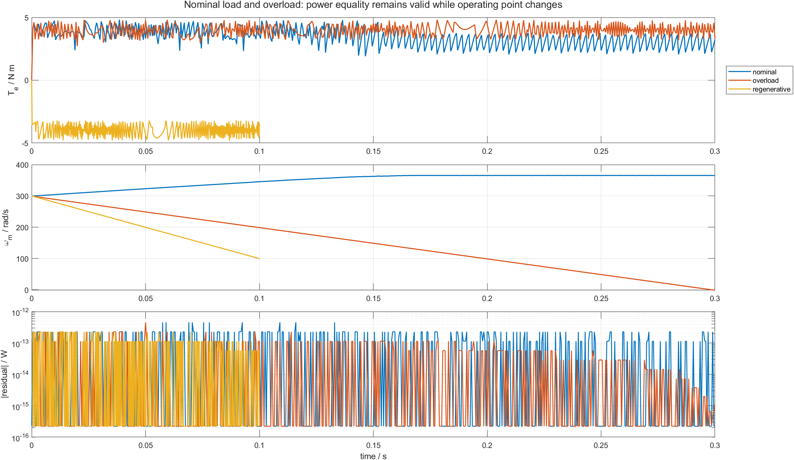

# 04 电流大小相近，转矩方向为什么不同：用 PLECS 验证 BLDC 的 e·i 功率链

看到三相电流后，不能只凭“电流有多大”判断电机在驱动还是制动。同样接近 5 A，电流与反电动势同向时向机械端送出功率；两者反向时，机械端能量回到电气侧。

BLDC 电磁能量转换的逐点关系是：

```text
p_em = ea*ia + eb*ib + ec*ic
p_mech = Te*omega_m
p_em = p_mech
```

本章不重新生成一套波形。额定、过载数据来自第 01 篇 PLECS 模型；再增加一个负电流参考的 PLECS 再生制动场景，然后在同一时刻逐点核对功率等式。

读这一章时先做一个预测：如果电机仍在正转，`Te` 为正时 `Σ(e*i)` 应为正；若电流方向被反过来产生制动，`Te` 和 `Σ(e*i)` 应同时变为负。后面的 PLECS 和 CSV 只是在验证这个符号关系是否逐点成立。

配套仓库：[https://github.com/Old-Ding/BLDC](https://github.com/Old-Ding/BLDC)

## 每相的 e·i 表示什么

反电动势 `e` 和相电流 `i` 都带方向。每相瞬时功率为：

```text
pa = ea*ia
pb = eb*ib
pc = ec*ic
```

三相相加后，正负号才表示电机电磁端的总能量方向。

| `Σ(e*i)` | `Te*omega` | 工作状态 |
|---:|---:|---|
| 正 | 正 | 电磁系统向机械端输出功率，电动运行 |
| 负 | 负 | 机械端向电磁系统回送功率，再生制动 |
| 接近 0 | 接近 0 | 可能是零转矩、零速或各相瞬时功率抵消，需要结合转矩和速度判断 |

当机械速度为正时，功率和转矩同号；机械速度为负时，不能只看功率符号推断转矩方向。

## 三个 PLECS 场景

| 场景 | 电流参考 | 负载转矩 | 仿真时间 | 要观察的现象 |
|---|---:|---:|---:|---|
| `nominal_load` | +5 A | 3 N m | 0.3 s | 正转矩、正机械功率，速度稳定在较高值 |
| `overload` | +5 A | 6 N m | 0.3 s | 电流受限、正转矩不足，速度持续下降 |
| `regenerative_braking` | -5 A | 0 N m | 0.1 s | 速度仍为正时产生负转矩和负功率 |

前三相电流、反电动势、速度和转矩都由：

```text
models/plecs/ch01_bldc_baseline/ch01_bldc_baseline.plecs
```

直接输出。Python 只做乘法、求和和误差判定。

## 先看 PLECS 原生再生制动电流



这张图来自负电流参考的 PLECS 原生 Scope。它证明数据不是用 MATLAB 按公式反推的；三相电流仍经过同一 IGBT 变流器和 BLDC Machine。

判断是不是再生制动不能停在这张电流图上。必须把电流与同一时刻的反电动势相乘，再与转矩、速度核对。

## 额定负载：三相功率怎样合成为机械功率



按四层读取：

1. 第一层是 PLECS 三相梯形反电动势；
2. 第二层是受控三相电流，每个时刻有两相通电、一相接近 0；
3. 第三层分别计算 `ea*ia`、`eb*ib`、`ec*ic`；
4. 最后一层把三相功率求和，并与 `Te*omega_m` 叠加。

最后一层两条曲线在绘图分辨率下完全重合。逐点数值检查的最大绝对残差为：

```text
4.547e-13 W
```

这属于浮点运算舍入量级，不是有意义的能量差。

## 过载时为什么电磁转矩仍为正，速度却下降

过载场景尾段数据为：

| 量 | 数值 |
|---|---:|
| 电磁转矩 | +4.0098 N m |
| 机械速度 | +28.4828 rad/s |
| `Σ(e*i)` | +114.5803 W |
| `Te*omega` | +114.5803 W |
| 外部负载转矩 | 6 N m |

电机仍在产生正转矩和正功率，但 `4.0098 N m < 6 N m`。净加速转矩为负，所以转速继续下降。

这说明两个判断不能混在一起：

- `e*i` 的符号判断电磁能量方向；
- `Te - Tload` 的符号判断机械速度是上升还是下降。

## 再生制动：负 e·i 对应负转矩

再生场景在 0.1 s 内保持机械速度为正，尾段结果为：

| 量 | 数值 |
|---|---:|
| 电磁转矩 | -3.9832 N m |
| 机械速度 | +119.5589 rad/s |
| `Σ(e*i)` | -476.2920 W |
| `Te*omega` | -476.2920 W |

速度为正、转矩为负，因此机械功率为负。转子动能正在减小，电磁系统吸收机械能量。

如果把仿真时间继续延长，转速会穿过 0 并反向。此时转矩和速度都为负，乘积又变为正，系统进入反向电动运行。因此“负转矩”等于“再生制动”只在速度方向已知时成立。

## 三个运行点改变，功率等式仍成立



上图显示电磁转矩，中图显示机械速度，下图以对数坐标显示：

```text
abs(Σ(e*i) - Te*omega)
```

三个场景的完整结果：

| 场景 | 点数 | 尾段电磁功率/W | 尾段转矩/N m | 尾段速度/rad/s | 最大残差/W | 结果 |
|---|---:|---:|---:|---:|---:|---|
| `nominal_load` | 601 | +1094.1534 | +2.9936 | +365.4961 | 4.547e-13 | PASS |
| `overload` | 601 | +114.5803 | +4.0098 | +28.4828 | 4.547e-13 | PASS |
| `regenerative_braking` | 501 | -476.2920 | -3.9832 | +119.5589 | 2.274e-13 | PASS |

PASS 要求功率残差相对场景功率尺度低于 `1e-9`。再生场景还额外要求速度保持为正、转矩低于 -2 N m、功率低于 -100 W。

## 为什么不能只看某一相

换相附近，一相退出、一相进入，单相 `e*i` 会快速变化。单独看到某一相功率为 0 或瞬时变小，不能判断总转矩消失。

正确顺序是：

```text
每相计算 e*i
  -> 三相求和
  -> 与 Te*omega 核对
  -> 已知 omega 符号后解释 Te 方向
```

## 如何解读本章证据

| 证据 | 教学结论 | 不要误读成 |
|---|---|---|
| 1703 个时刻功率残差低于 `4.55e-13 W` | PLECS BLDC 电磁功率和机械功率逐点一致 | 整个逆变器和电机系统没有损耗 |
| 过载时功率仍为正 | 电机仍输出电磁功率 | 负载要求已经满足 |
| 再生时功率、转矩为负且速度为正 | 机械能回到电磁侧，转子减速 | 直流母线一定具备吸收回馈能量的硬件能力 |
| 单相功率随换相切换 | 转矩由三相功率合成 | 任意时刻必须三相同时通电 |

本模型的 BLDC Machine 电磁转换是理想的，等式不包含 IGBT 导通损耗、开关损耗、绕组铜耗到电磁端之前的母线功率差，也不包含机械摩擦。若要核对整机效率，输入应从直流母线功率开始，并把损耗逐项列出。

## 复现实验

```powershell
Set-Location .\BLDC
python .\scripts\ch01_plecs_bldc_baseline.py
python .\scripts\ch04_torque_power_check.py
matlab -batch "run('scripts/ch04_torque_power_postprocess.m')"
```

期望输出：

```text
Generated chapter 04 power check. scenarios=3 pass=3 source=PLECS time_points=1703
Generated chapter 04 MATLAB post-processing. scenarios=3 pass=3 figures=2
```

## 配套文件

| 文件 | 作用 |
|---|---|
| [`models/plecs/ch01_bldc_baseline/ch01_bldc_baseline.plecs`](../models/plecs/ch01_bldc_baseline/ch01_bldc_baseline.plecs) | 本章复用的 BLDC Machine 和三相桥主模型 |
| [`scripts/ch04_torque_power_check.py`](../scripts/ch04_torque_power_check.py) | 运行再生 PLECS 场景并对三个场景逐点计算功率 |
| [`scripts/ch04_torque_power_postprocess.m`](../scripts/ch04_torque_power_postprocess.m) | 读取功率 CSV，生成能量链和场景对比图 |
| [`waveforms/04-torque-power/plecs_power_summary.csv`](../waveforms/04-torque-power/plecs_power_summary.csv) | 三场景功率、转矩、速度和残差汇总 |
| [`reports/04-torque-power-test_report.md`](../reports/04-torque-power-test_report.md) | 1703 点功率等式报告 |
| [`docs/04-back-emf-and-torque-reproduce.md`](../docs/04-back-emf-and-torque-reproduce.md) | 复现说明和证据边界 |

## 下一章：六个电流状态应该按什么顺序切换

下一章把第 02 篇的六个有效桥状态排成一个完整电周期，并用 C 换相表与 PLECS 电流逐步核对。目标是让 120 度导通顺序来自转矩方向，而不是死记六行表格。
