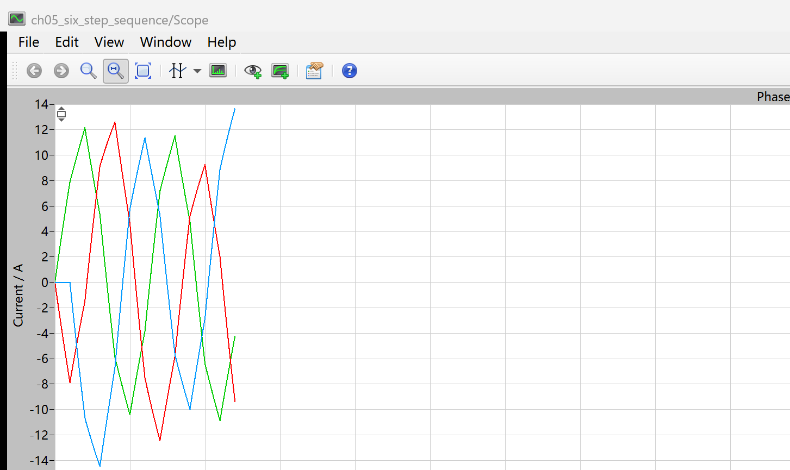
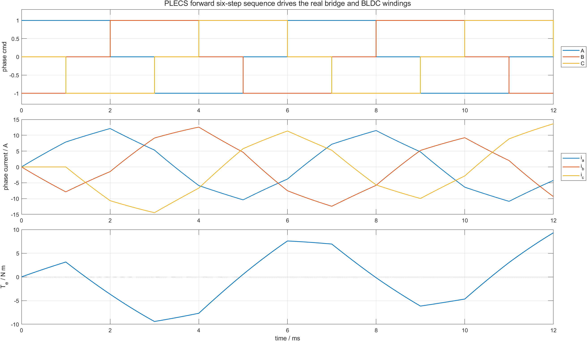
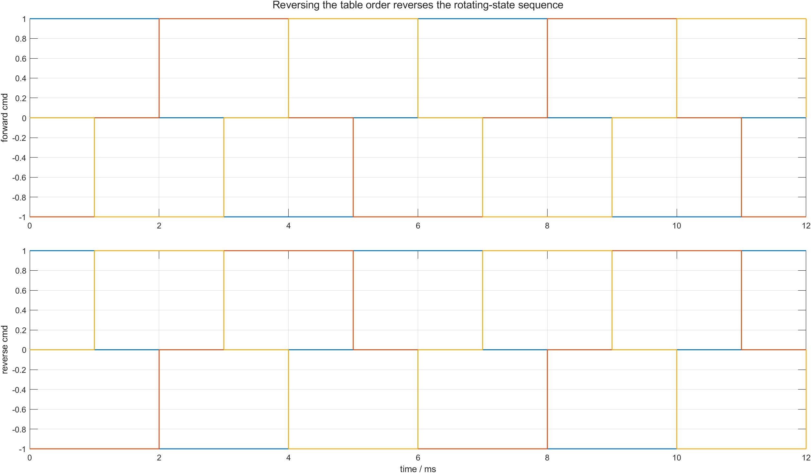

# 05 六个有效桥状态为什么要按这个顺序切换：120° 导通与六步换相表

第 02 篇已经得到六个合法 `HIGH/LOW/FLOAT` 状态，但把六行状态随意排列，并不会形成连续旋转的定子磁场。

正向六步序列是：

```text
A+ B- -> A+ C- -> B+ C- -> B+ A- -> C+ A- -> C+ B- -> repeat
```

每一步只有一相接正母线、一相接负母线、一相悬空；每经过一步，只替换一个导通桥臂。这样电流空间方向每次前进 60 电角度。

配套仓库：[https://github.com/Old-Ding/BLDC](https://github.com/Old-Ding/BLDC)

## 从三值相命令读懂六步表

| step | 三值相命令 `[A B C]` | 送电相 | 回流相 | 悬空相 |
|---:|---|---|---|---|
| 0 | `[+1,-1,0]` | A | B | C |
| 1 | `[+1,0,-1]` | A | C | B |
| 2 | `[0,+1,-1]` | B | C | A |
| 3 | `[-1,+1,0]` | B | A | C |
| 4 | `[-1,0,+1]` | C | A | B |
| 5 | `[0,-1,+1]` | C | B | A |

例如 step 0 到 step 1 时，A 上桥保持导通，只把回流路径从 B 下桥切换到 C 下桥。step 1 到 step 2 时，C 下桥保持导通，只把送电路径从 A 上桥切换到 B 上桥。

这种“每步只换一侧”的排列让电流空间矢量连续前进，而不是在不相关状态之间跳跃。

## 为什么叫 120° 导通

观察 A 相命令：

```text
step 0: +1
step 1: +1
step 2:  0
step 3: -1
step 4: -1
step 5:  0
```

每步占 60 电角度。A 相连续两个 step 接正母线，即上桥导通 120 电角度；随后悬空 60 度，再由下桥导通 120 度，再悬空 60 度。B、C 相完全相同，只是各自错开 120 电角度。

120° 描述每个器件在一个电周期内的导通区间，不表示三相同时导通。

## C 表和 PLECS 模型各负责什么

仓库中的表函数是：

```text
src/bldc_six_step.c
```

它只负责：

```text
step + direction -> [phase_cmd_a, phase_cmd_b, phase_cmd_c]
```

正式 PLECS 模型是：

```text
models/plecs/ch05_six_step_sequence/ch05_six_step_sequence.plecs
```

模型内的 C-Script 使用同一张六步表，PLECS `Clock` 提供时间，每 1 ms 推进一步，然后直接驱动两电平 IGBT 三相桥和 BLDC Machine。

换相表不判断转子是否跟上，也不调节电流或速度。它只生成合法状态顺序。

## 三个场景

| 场景 | step 周期 | 读取顺序 | 预期 |
|---|---:|---|---|
| `forward` | 1 ms | 0,1,2,3,4,5 | 正向旋转状态序列 |
| `reverse` | 1 ms | 0,5,4,3,2,1 | 反向旋转状态序列 |
| `all_off` | 0 | 不推进 | `[0,0,0]` |

仿真时间为 12 ms，所以正序、反序各覆盖两个完整电周期。

## PLECS 原生 Scope：状态切换后电流不能瞬间改变



Scope 中三相电流随换相状态交替建立和衰减。桥命令是瞬时切换的，但绕组电感使电流连续变化；换相瞬间，退出相电流需要时间下降，进入相电流也需要时间上升。

这说明“某相命令为 0”不等于该相电流在同一时刻立刻变成 0。悬空描述桥臂状态，实际电流还受绕组电感和续流路径影响。

## 把命令、电流和转矩放在一起



三层图依次表示：

1. 三值相命令严格按六个状态循环；
2. PLECS 绕组电流连续变化，并始终满足 `ia+ib+ic=0`；
3. 电磁转矩在正负之间交替。

第三层不是脚本错误。当前模型从静止开始，却立即按固定 1 ms 周期推进定子磁场。转子尚未与旋转磁场建立稳定相位关系，因此某些状态产生正转矩，另一些状态产生负转矩。

本章证明“六步表的状态和顺序合法”，不把它误读为“电机已经成功开环启动”。

## 反转为什么只需要倒序读取



正序从 step 0 走向 1，反序从 step 0 走向 5。每个状态本身仍是第 02 篇验证过的合法矢量，变化的只是空间矢量前进方向。

C 函数没有维护第二张反向表，而是对索引做：

```text
forward: 0,1,2,3,4,5
reverse: 0,5,4,3,2,1
```

这样状态定义只有一份，方向只属于读取顺序层。

## 场景判定结果

| 场景 | 观察到的状态 | KCL 峰值误差/A | 结果 |
|---|---|---:|---|
| `forward` | 两轮 `0->1->2->3->4->5` | 1.776e-15 | PASS |
| `reverse` | 两轮 `0->5->4->3->2->1` | 1.776e-15 | PASS |
| `all_off` | 始终 `[0,0,0]` | 0 | PASS |

PASS 要求每个动态状态都恰好包含 `[-1,0,+1]`，顺序与方向一致，且三相电流满足 KCL。它不要求固定频率启动产生始终为正的转矩。

## 如何解读本章证据

| 证据 | 教学结论 | 不要误读成 |
|---|---|---|
| 六个状态按 60 电角度顺序循环 | 定子电流空间状态连续旋转 | 转子一定同步旋转 |
| 正序和反序使用同一张表 | 方向由索引顺序决定 | 任意交换两相都等价且无瞬态 |
| 相命令切换时电流连续 | 绕组电感和续流路径决定换相电流 | 悬空相命令为 0 时电流必须立刻为 0 |
| 固定周期下转矩正负交替 | 状态表正确但转子相位未锁定 | 六步表方向写反 |

## 复现实验

```powershell
Set-Location .\BLDC
python .\scripts\build_ch02_plecs_model.py
python .\scripts\build_ch05_plecs_model.py
python .\scripts\ch05_plecs_six_step.py
matlab -batch "run('scripts/ch05_six_step_postprocess.m')"
```

期望输出：

```text
Generated chapter 05 PLECS six-step evidence. scenarios=3 pass=3 time_points=601 signals=14
Generated chapter 05 MATLAB post-processing. scenarios=3 pass=3 figures=2
```

## 配套文件

| 文件 | 作用 |
|---|---|
| [`src/bldc_six_step.c`](../src/bldc_six_step.c) | step 和方向到三值相命令的唯一表函数 |
| [`models/plecs/ch05_six_step_sequence/ch05_six_step_sequence.plecs`](../models/plecs/ch05_six_step_sequence/ch05_six_step_sequence.plecs) | C-Script 六步表驱动真实桥和 BLDC Machine |
| [`scripts/ch05_plecs_six_step.py`](../scripts/ch05_plecs_six_step.py) | 运行正序、反序、全关场景并判定 |
| [`waveforms/05-six-step-sequence/plecs_six_step_summary.csv`](../waveforms/05-six-step-sequence/plecs_six_step_summary.csv) | 状态顺序、KCL 和结果汇总 |
| [`reports/05-six-step-sequence-test_report.md`](../reports/05-six-step-sequence-test_report.md) | PLECS 场景报告 |
| [`docs/05-six-step-commutation-reproduce.md`](../docs/05-six-step-commutation-reproduce.md) | 复现说明 |

## 下一章：固定时间推进如何变成开环电角度

下一章不再把 step 周期写死为 1 ms，而是从目标电频率连续生成电角度，再由电角度决定 step。目标是解释“开环旋转磁场”的输入、输出和频率关系，并测出转子何时能跟上、何时会落后。
