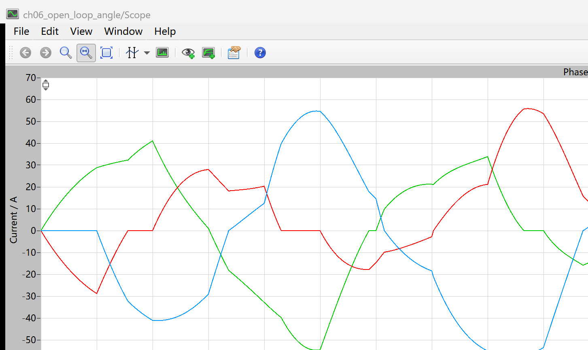
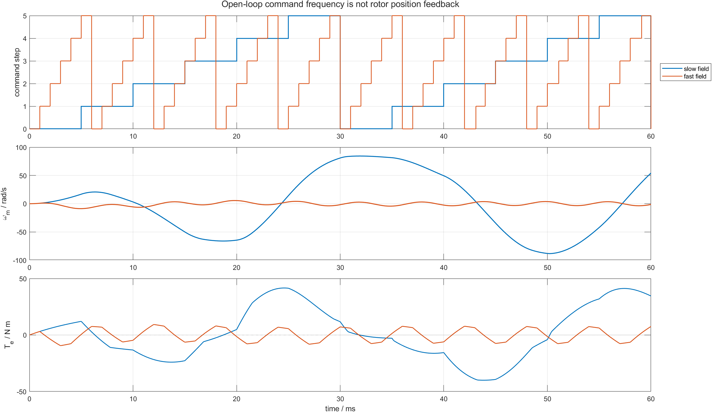

# 06 命令电角在旋转，转子为什么可能不动：BLDC 开环换相频率

第 05 篇用固定 step 周期循环六步表。把这个周期换成电频率，就得到最小开环旋转磁场：

```text
f_e -> T_step = 1/(6*f_e) -> step 0..5 -> 三值相命令 -> IGBT bridge
```

“开环”表示 step 只由时间推进，不读取转子位置。命令电角一定按设定速度前进，但转子能否跟上由电磁转矩、惯量和负载共同决定。

配套仓库：[https://github.com/Old-Ding/BLDC](https://github.com/Old-Ding/BLDC)

## 频率、step 周期和同步机械速度

六步表每推进一次跨过 60 电角度，因此：

```text
f_step = 6*f_e
T_step = 1/(6*f_e)
omega_sync = 2*pi*f_e/p
```

本章 PLECS Machine 的极对数 `p=1`。两个场景只改变 step 周期：

| 场景 | step 周期 | 电频率 | 对应同步机械速度 |
|---|---:|---:|---:|
| `slow_field` | 5 ms | 33.333 Hz | 209.440 rad/s |
| `fast_field` | 1 ms | 166.667 Hz | 1047.198 rad/s |

两场景都从静止开始，母线为 48 V，无外部负载，仿真 60 ms。模型仍是 PLECS 两电平 IGBT 桥和 BLDC Machine：

```text
models/plecs/ch06_open_loop_angle/ch06_open_loop_angle.plecs
```

## PLECS 原生 Scope：慢场确实建立了绕组电流



Scope 证明六步命令经过真实桥后形成三相绕组电流。电流连续而命令离散，是绕组电感和换相续流共同作用的结果。

但电流存在不等于平均转矩足够，也不等于转子位置与命令扇区对齐。还必须看速度和转矩。

## 慢场和快场的差别



三层图按命令 step、机械速度、电磁转矩读取：

- 慢场每 5 ms 推进一步，60 ms 后转速达到 `54.191 rad/s`，平均转矩为 `1.832 N m`；
- 快场每 1 ms 推进一步，转子末值只有 `-1.342 rad/s`，平均转矩为 `-0.038 N m`；
- 两场景的命令 step 都严格循环，区别发生在转子响应，而不是六步表是否执行。

| 场景 | 正转矩时间占比 | 末值速度/rad/s | 平均转矩/N m | 结果 |
|---|---:|---:|---:|---|
| `slow_field` | 0.486 | 54.191 | 1.832 | PASS |
| `fast_field` | 0.501 | -1.342 | -0.038 | PASS |

快场 PASS 的含义是正确复现“命令磁场过快，正负转矩近似抵消，转子无法跟随”，不是表示启动成功。

## 为什么慢场仍没有达到同步速度

慢场对应同步速度为 `209.44 rad/s`，实际只有 `54.19 rad/s`。当前固定频率从 t=0 直接施加，没有初始定位、频率斜坡和位置反馈。转子与定子磁场之间的相位差不断变化，所以转矩仍会正负交替。

开环控制只保证：

```text
command_step(t) = floor(t/T_step) mod 6
```

它不保证：

```text
rotor_sector(t) = command_step(t)
```

这两个变量的差就是后续判断同步和失步的核心。

## 如何解读本章证据

| 证据 | 教学结论 | 不要误读成 |
|---|---|---|
| 两场景命令 step 都连续循环 | 开环电角由时间和频率确定 | 转子位置参与了换相 |
| 慢场产生正平均转矩并加速 | 较慢旋转磁场给转子留下响应时间 | 固定慢频率已经是完整启动算法 |
| 快场平均转矩接近 0 | 转子来不及跟随，正负转矩抵消 | 三相桥或六步表损坏 |
| 实际速度远低于同步速度 | 开环命令与机械响应之间存在滑差 | BLDC 正常稳态允许长期异步运行 |

本章使用全母线六步命令，没有 PWM 电流限制。峰值电流不用于生产参数设计；这里只比较相同功率级下的频率因果关系。

## 复现实验

```powershell
Set-Location .\BLDC
python .\scripts\build_ch05_plecs_model.py
python .\scripts\build_ch06_plecs_model.py
python .\scripts\ch06_plecs_open_loop_angle.py
matlab -batch "run('scripts/ch06_open_loop_postprocess.m')"
```

期望输出：

```text
Generated chapter 06 PLECS open-loop evidence. scenarios=2 pass=2 time_points=601 signals=14
Generated chapter 06 MATLAB post-processing. scenarios=2 pass=2 figures=1
```

## 配套文件

| 文件 | 作用 |
|---|---|
| [`models/plecs/ch06_open_loop_angle/ch06_open_loop_angle.plecs`](../models/plecs/ch06_open_loop_angle/ch06_open_loop_angle.plecs) | 60 ms 开环频率 PLECS 模型 |
| [`scripts/ch06_plecs_open_loop_angle.py`](../scripts/ch06_plecs_open_loop_angle.py) | 慢/快场景、step 解码和指标判定 |
| [`waveforms/06-open-loop-angle/plecs_open_loop_summary.csv`](../waveforms/06-open-loop-angle/plecs_open_loop_summary.csv) | 频率、同步速度、实际速度和转矩汇总 |
| [`reports/06-open-loop-angle-test_report.md`](../reports/06-open-loop-angle-test_report.md) | 场景报告 |
| [`docs/06-open-loop-electrical-angle-reproduce.md`](../docs/06-open-loop-electrical-angle-reproduce.md) | 复现说明 |

## 下一章：怎样让旋转磁场从慢到快

下一章加入初始定位和 step 周期斜坡，对比“从低频逐步加速”和“直接施加高频”。目标是找到启动成功与失败之间可测量的速度、转矩和相位差证据。
