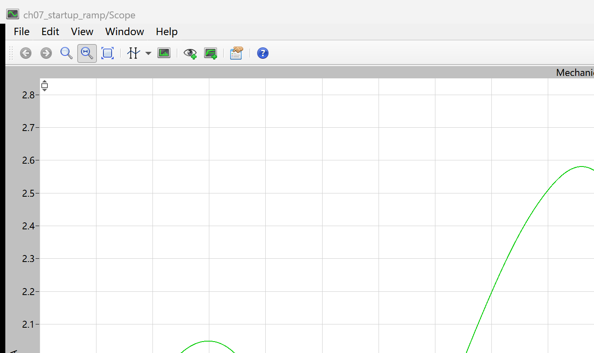
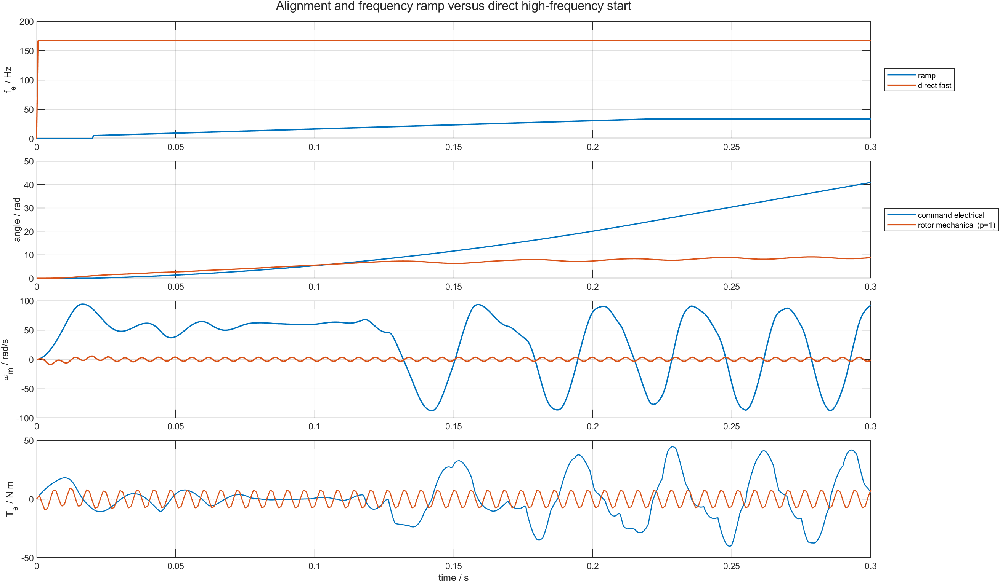

# 07 从静止到旋转：BLDC 定位与开环频率斜坡

第 06 篇已经看到：命令电角按固定频率旋转，不等于转子能够跟随。直接从静止施加 `166.667 Hz` 电频率时，转子末值速度只有 `-1.342 rad/s`。问题不在六步表是否执行，而在转子尚未来得及建立速度，命令磁场就已经跨过多个电角扇区。

最小的改进不是立即加入闭环，而是先完成两件事：

```text
固定 step 0 定位 -> 从低频连续升高换相频率 -> 观察速度、转矩与相位差
```

本章用 PLECS 两电平 IGBT 桥和 BLDC Machine 比较“定位后斜坡启动”与“直接高频启动”。配套仓库：[https://github.com/Old-Ding/BLDC](https://github.com/Old-Ding/BLDC)

## 为什么启动前先定位

静止时没有可用的反电动势，单靠绕组端电压无法知道转子处于哪个电角扇区。如果第一拍换相与转子初始位置不匹配，产生的电磁转矩可能很小，甚至方向相反。

定位阶段把六步表固定在 step 0：

```text
A+ -> 直流母线正端
B- -> 直流母线负端
C  -> 悬空
```

这个状态建立一个静止定子磁场，使转子先朝确定方向受力。本实验的定位时间为 `20 ms`。定位只是在启动前建立已知参考，不提供连续转子位置，也不是闭环控制。

## 变频时为什么必须积分频率

电频率是电角度的变化率：

```text
d(theta_cmd)/dt = 2*pi*f_e(t)
```

因此命令电角必须由频率积分得到。斜坡期间令频率从 `f0` 线性增加到 `f1`：

```text
k = (f1-f0)/T_ramp
f_e(t) = f0 + k*t
theta_cmd(t) = 2*pi*(f0*t + 0.5*k*t^2)
```

斜坡结束后继续累加已经走过的电角：

```text
theta_cmd(t) = 2*pi*(0.5*(f0+f1)*T_ramp + f1*(t-T_ramp))
```

六步换相 step 再由连续电角量化：

```text
step = floor(6*theta_cmd/(2*pi)) mod 6
```

不能用 `t/当前 step 周期` 直接计算 step。周期在变化时，分母变化会让计算出的累计步数突然前跳或后跳；积分形式保证命令电角连续，只让旋转速度改变。

## 模型中的信号链

```text
PLECS Clock
  -> Startup angle generator：定位、频率积分、60 度量化
  -> 三值相命令 cmd_a/cmd_b/cmd_c
  -> 上下桥臂门极映射
  -> 两电平 IGBT bridge
  -> BLDC Machine
  -> 相电流、机械角、速度、电磁转矩
```

`Startup angle generator` 是本仓库写入 PLECS 模型的 C-Script，不是 PLECS 内置启动器。它只依据时间推进，不读取机械角。机械角来自 PLECS Machine 的 Angle Sensor；Python 脚本对原始 `[-pi, pi]` 角度解包后，再计算命令角与转子角的有符号最短差：

```text
delta_theta = atan2(sin(theta_cmd-theta_rotor), cos(theta_cmd-theta_rotor))
```

本章设 `p=1`，所以机械角可直接与电角比较。多极对电机应先使用 `theta_e=p*theta_m`。

## 实验参数与判据

| 参数 | 定位后斜坡 `ramp_start` | 直接高频 `direct_fast` |
|---|---:|---:|
| 直流母线 | 48 V | 48 V |
| 极对数 | 1 | 1 |
| 初始速度 | 0 rad/s | 0 rad/s |
| 负载转矩 | 0 N m | 0 N m |
| 定位时间 | 20 ms | 0 ms |
| 起始电频率 | 5 Hz | 166.667 Hz |
| 最终电频率 | 33.333 Hz | 166.667 Hz |
| 斜坡时间 | 200 ms | 0 ms |
| 仿真时间 | 300 ms | 300 ms |
| 采样间隔 | 0.5 ms | 0.5 ms |

这里的 PASS 是现象复现判据：斜坡场景应产生明显正向加速和正尾段平均转矩；直接高频场景应复现转子基本无法启动。PASS 不表示斜坡已经达到同步，也不表示电流满足产品设计限制。

## PLECS 原生 Scope：转子机械角确实在变化



这张图由 PLECS Scope 窗口直接截取，显示 BLDC Machine 角度传感器输出的原始机械角。角度随转子运动变化，并在 `[-pi, pi]` 边界折返；它证明截图来自实际机器模型的动态状态，不是单独绘制的六步逻辑时序图。

Scope 不能直接回答转子是否同步。同步需要比较命令电角、转子角和理论同步速度，因此还要读取 RPC 导出的 15 路数据做后处理。

## MATLAB 对比：斜坡改善启动，但没有消除滑移



MATLAB 图从上到下依次显示命令电频率、斜坡场景的命令角与转子角、两场景机械速度以及电磁转矩。

斜坡场景在 `20 ms` 定位后从 `5 Hz` 起步，并在 `200 ms` 内升到 `33.333 Hz`。转子末值速度达到 `92.088 rad/s`，尾段平均转矩为 `5.525 N m`，说明慢速起步确实比直接高频更容易建立持续的正向加速。

但 `33.333 Hz`、`p=1` 对应的同步机械速度为：

```text
omega_sync = 2*pi*f_e/p = 209.440 rad/s
```

实际末值只有同步速度的约 `44%`。命令角与转子角没有保持固定间隔，速度和转矩后段仍然大幅振荡。这不是稳定同步，只是比直接高频获得了更好的平均加速效果。

| 场景 | 同步速度/rad/s | 末值速度/rad/s | 尾段转矩/N m | 尾段绝对相差/rad | 峰值相电流/A | 结果 |
|---|---:|---:|---:|---:|---:|---|
| `ramp_start` | 209.440 | 92.088 | 5.525 | 1.334 | 61.063 | PASS |
| `direct_fast` | 1047.198 | -1.225 | 0.110 | 1.540 | 14.460 | PASS |

直接高频场景的命令磁场从 t=0 就以 `166.667 Hz` 旋转，对应同步速度 `1047.198 rad/s`。转子来不及进入相邻扇区，正负转矩快速抵消，最终速度仍接近零。

## 为什么斜坡场景出现 61 A 峰值

当前桥臂使用全母线六步导通，没有 PWM 占空比调节，也没有电流环和限流。低速时反电动势较小，绕组电流主要由母线电压、相电阻和相电感限制；定位与换相瞬间都可能出现较大电流。

因此 `61.063 A` 不是推荐电机参数，而是在当前教学模型边界下测得的风险信号。它说明“让转子转起来”和“把电流控制在允许范围内”是两个不同问题。后续加入 PWM 之前，不能把该启动方法直接移植到硬件。

## 这组结果能证明什么

| 证据 | 能证明 | 不能证明 |
|---|---|---|
| PLECS 原生 Scope 中机械角连续变化并在边界折返 | BLDC Machine 的转子状态确实发生变化 | 启动已经稳定同步 |
| 斜坡末值速度明显高于直接高频 | 低频起步给转子留下了建立运动的时间 | 当前斜坡参数是最优参数 |
| 尾段正平均转矩为 5.525 N m | 斜坡场景获得了净正向加速 | 转矩脉动已经可接受 |
| 命令角与转子角持续滑移 | 开环时间基准不能保证转子位置跟随 | Hall 位置反馈一定无需校准 |
| 峰值相电流达到 61.063 A | 全母线启动存在明显过流风险 | 实际硬件也一定出现相同峰值 |

## 复现实验

先启动 PLECS 5.0，并在首选项中启用 XML-RPC 端口 `1080`，然后执行：

```powershell
Set-Location .\BLDC
python .\scripts\build_ch02_plecs_model.py
python .\scripts\build_ch03_plecs_model.py
python .\scripts\build_ch07_plecs_model.py
python .\scripts\ch07_plecs_startup_ramp.py
matlab -batch "run('scripts/ch07_startup_postprocess.m')"
```

期望输出：

```text
Generated chapter 07 PLECS startup evidence. scenarios=2 pass=2 time_points=601 signals=15
Generated chapter 07 MATLAB post-processing. scenarios=2 pass=2 figures=1
```

## 配套文件

| 文件 | 作用 |
|---|---|
| [`models/plecs/ch07_startup_ramp/ch07_startup_ramp.plecs`](../models/plecs/ch07_startup_ramp/ch07_startup_ramp.plecs) | 定位、频率斜坡、真实 IGBT 桥和 BLDC Machine 模型 |
| [`scripts/build_ch07_plecs_model.py`](../scripts/build_ch07_plecs_model.py) | 从已验证角度模型生成第 07 篇模型 |
| [`scripts/ch07_plecs_startup_ramp.py`](../scripts/ch07_plecs_startup_ramp.py) | 运行两场景、导出 15 路数据并计算判据 |
| [`scripts/ch07_startup_postprocess.m`](../scripts/ch07_startup_postprocess.m) | MATLAB 对比图生成脚本 |
| [`waveforms/07-startup-ramp/plecs_startup_summary.csv`](../waveforms/07-startup-ramp/plecs_startup_summary.csv) | 同步速度、实际速度、相差、电流和结果汇总 |
| [`reports/07-startup-ramp-test_report.md`](../reports/07-startup-ramp-test_report.md) | PLECS 场景测试报告 |
| [`docs/07-startup-ramp-reproduce.md`](../docs/07-startup-ramp-reproduce.md) | 完整复现步骤和失败解释 |

## 下一章：怎样确认转子正在失步

下一章把相位差变成主要观测量，并加入过快斜坡与负载扰动。读者将用同一组速度、转矩和角度数据区分“仍在加速”“暂时落后”和“已经持续失步”。
