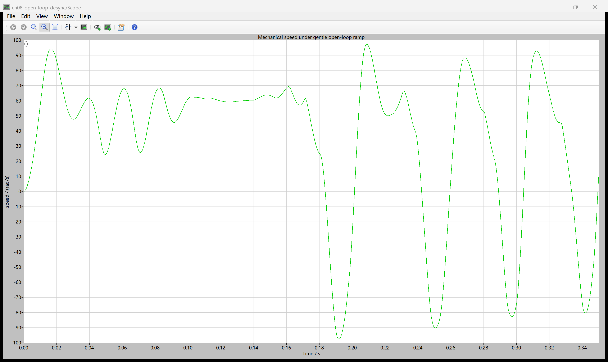
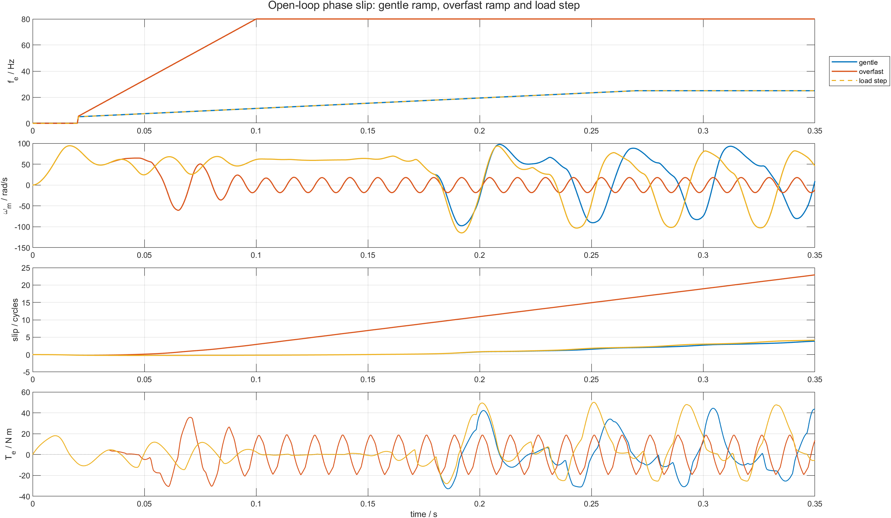

# 08 转速还在变化，为什么已经失步：BLDC 开环相位诊断

第 07 篇的定位与频率斜坡能让转子获得平均正转矩，却没有让转子跟随命令磁场。只看“转速是否上升”很容易误判：转子可能一边加速，一边被命令电角连续甩开。

判断开环是否失步，必须同时观察三件事：

```text
命令电角走了多远 -> 转子电角走了多远 -> 两者差值是否持续跨过整圈
```

本章仍使用同一套 PLECS IGBT bridge 与 BLDC Machine，只改变斜坡速度和机械负载。配套仓库：[https://github.com/Old-Ding/BLDC](https://github.com/Old-Ding/BLDC)

## “暂时落后”和“持续失步”不是一回事

命令电角与转子电角的差为：

```text
delta_theta = theta_cmd - theta_rotor
```

把它折回 `[-pi, pi]`，可以得到当前最近方向的相位差，适合判断换相时刻；但折回后的波形会在 `+pi` 与 `-pi` 之间跳变，看不出命令磁场累计套了转子多少圈。

因此失步诊断保留未折回差值：

```text
N_slip = abs(delta_theta_unwrapped(t_end)-delta_theta_unwrapped(0))/(2*pi)
```

若相位差在一个有限范围内摆动，转子仍可能与磁场保持平均同步；若 `N_slip` 持续增加，说明命令磁场不断越过转子，这就是持续失步。

另一个辅助量是尾段平均速度与同步速度之比：

```text
r_omega = mean(omega_m_tail)/(2*pi*f_e/p)
```

本章 `p=1`。速度比接近 1 才可能同步；速度仍为正但比值很小，不能算跟随成功。

## 三种场景只改变什么

| 场景 | 定位 | 频率斜坡 | 机械扰动 | 诊断目的 |
|---|---:|---:|---:|---|
| `gentle_ramp` | 20 ms | 5→25 Hz，250 ms | 0 N m | 证明“较缓斜坡”仍可能持续滑移 |
| `overfast_ramp` | 20 ms | 5→80 Hz，80 ms | 0 N m | 观察命令磁场快速甩开转子 |
| `load_step` | 20 ms | 5→25 Hz，250 ms | 180 ms 时 0→8 N m | 观察机械扰动如何改变相位轨迹 |

三场景的母线均为 `48 V`，初始速度为 `0 rad/s`，仿真 `350 ms`，导出间隔 `0.5 ms`。负载阶跃由 PLECS 原生 `Step` 组件直接接到机械 Torque 端口，不是 MATLAB 在结果上叠加的曲线。

## PLECS 原生 Scope：缓斜坡也可能越过同步边界



原生 Scope 显示 `gentle_ramp` 的 PLECS Machine 机械速度。前 0.17 s 速度大致保持正向；随着命令频率继续上升，速度开始在正负方向之间大幅摆动，末值仅 `9.361 rad/s`，而 25 Hz 电角频率对应的同步机械速度为 `157.080 rad/s`。

速度塌落说明转子没有跟住旋转磁场，但它还不能给出“落后了多少电角度”。累计诊断仍要对 PLECS RPC 返回的机械角解包，再与由频率积分得到的命令角相减。

## MATLAB 对比：失步首先表现为相位差持续累积



四层图依次读取命令频率、机械速度、累计滑移圈数和电磁转矩：

- `gentle_ramp` 的频率只有 `25 Hz`，但 350 ms 内仍累计滑移 `3.854` 圈；
- `overfast_ramp` 在 80 ms 内升到 `80 Hz`，累计滑移达到 `22.921` 圈，尾段平均速度仅 `0.077 rad/s`；
- `load_step` 在 180 ms 前与缓斜坡重合，扰动后速度和转矩轨迹分离，最终累计滑移增至 `4.140` 圈。

| 场景 | 同步速度/rad/s | 尾段平均速度/rad/s | 速度比 | 累计滑移/圈 | 负转矩占比 | 结果 |
|---|---:|---:|---:|---:|---:|---|
| `gentle_ramp` | 157.080 | 13.900 | 0.0885 | 3.854 | 0.529 | PASS |
| `overfast_ramp` | 502.655 | 0.077 | 0.0002 | 22.921 | 0.508 | PASS |
| `load_step` | 157.080 | 13.930 | 0.0887 | 4.140 | 0.421 | PASS |

`gentle_ramp` 的速度和转矩都在大幅振荡。某一时刻转速为正、某一段平均转矩为正，都无法抵消“命令角已经多走了近四圈”这个事实。

## 为什么过快斜坡会让正负转矩抵消

六步换相表假设通电扇区与转子磁极保持合适的相对位置。开环 step 只按时间前进：

```text
step_cmd = floor(6*theta_cmd/(2*pi)) mod 6
```

当命令角持续跨过转子，原本应产生正转矩的相序很快进入低转矩区，再进入负转矩区。`overfast_ramp` 的负转矩占比约 `50.8%`，尾段正负转矩几乎抵消，所以同步速度虽然是 `502.655 rad/s`，实际尾段平均速度接近零。

## 负载阶跃为什么不能只看最终速度

机械扰动改变的是转子加速度：

```text
J*d(omega_m)/dt = T_e - T_load - B*omega_m
```

相位差又是速度差的积分。因此负载加入后，速度轨迹哪怕短时朝某个方向变化，累计相位仍可能继续恶化。`load_step` 与 `gentle_ramp` 的最终速度不同超过 `36 rad/s`，累计滑移也增加约 `0.286` 圈，说明扰动确实进入机械方程并改变了相位历史。

这里不把“最终速度更低”设为唯一判据，因为已经失步的开环系统会出现反转和强烈振荡，单个末值不具备稳定工况含义。

## PASS 到底表示什么

| 场景 | PASS 判据 | 表示什么 |
|---|---|---|
| 缓斜坡 | 滑移超过 2 圈且速度比小于 0.2 | 正确复现“看似较缓仍失步” |
| 过快斜坡 | 滑移大于缓斜坡 4 倍且尾段速度绝对值小于 5 rad/s | 正确复现磁场甩开与转矩抵消 |
| 负载阶跃 | 滑移比缓斜坡增加 0.2 圈以上且末值速度差超过 20 rad/s | 正确复现机械扰动改变相位轨迹 |

这些 PASS 都是失步现象的诊断通过，不是控制性能通过。

## 证据边界

| 证据 | 能证明 | 不能证明 |
|---|---|---|
| 未折回相位差持续增加 | 命令磁场不断跨过转子 | Hall 安装角已经正确 |
| 速度比远小于 1 | 转子没有达到命令同步速度 | 电机在所有开环参数下都无法启动 |
| 负转矩约占一半 | 换相相位反复进入制动区域 | 功率桥存在接线错误 |
| 负载阶跃后轨迹分离 | 机械扰动真实进入 PLECS 模型 | 8 N m 是该电机的额定负载 |

## 复现实验

```powershell
Set-Location .\BLDC
python .\scripts\build_ch08_plecs_model.py
python .\scripts\ch08_plecs_desync.py
matlab -batch "run('scripts/ch08_desync_postprocess.m')"
```

期望输出：

```text
Generated chapter 08 PLECS desynchronization evidence. scenarios=3 pass=3 time_points=701 signals=15
Generated chapter 08 MATLAB diagnostic figure. scenarios=3 figures=1
```

## 配套文件

| 文件 | 作用 |
|---|---|
| [`models/plecs/ch08_open_loop_desync/ch08_open_loop_desync.plecs`](../models/plecs/ch08_open_loop_desync/ch08_open_loop_desync.plecs) | 带 PLECS 原生负载阶跃的开环机器模型 |
| [`scripts/ch08_plecs_desync.py`](../scripts/ch08_plecs_desync.py) | 三场景运行、角度解包、滑移指标与 PASS 判定 |
| [`scripts/ch08_desync_postprocess.m`](../scripts/ch08_desync_postprocess.m) | MATLAB 四层诊断图 |
| [`waveforms/08-open-loop-desync/plecs_desync_summary.csv`](../waveforms/08-open-loop-desync/plecs_desync_summary.csv) | 三场景指标汇总 |
| [`reports/08-open-loop-desync-test_report.md`](../reports/08-open-loop-desync-test_report.md) | PLECS 场景报告 |
| [`docs/08-open-loop-desynchronization-reproduce.md`](../docs/08-open-loop-desynchronization-reproduce.md) | 复现与失败解释 |

## 下一章：位置反馈怎样变成六个 Hall 状态

下一章从转子电角生成三路 Hall 信号，检查六个合法状态、正反转顺序和 `000/111` 非法状态。目标是让换相时刻重新由转子位置决定，而不是继续猜时间。
