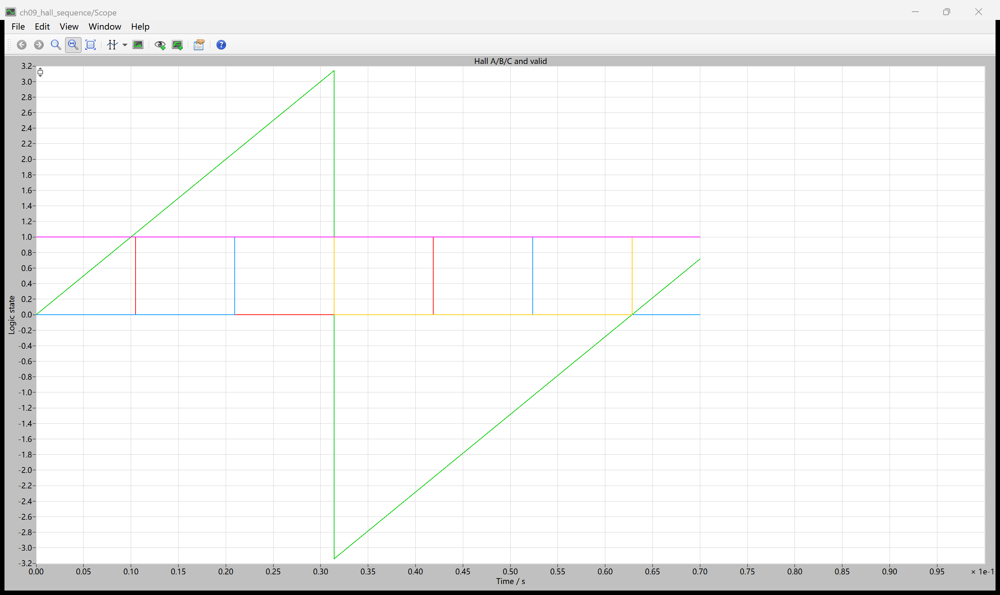
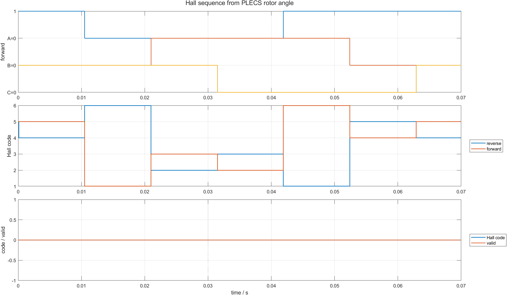

# 09 三路 Hall 为什么只有六个合法状态：扇区、方向与非法码

第 08 篇证明，按时间推进换相会让命令磁场持续跨过转子。要让换相重新跟随位置，控制器首先需要一个离散位置编码。三路数字 Hall 传感器每路只有 0/1，理论上有 8 种组合，但正常六步电机只使用其中 6 种。

本章暂不驱动功率桥，只让 PLECS BLDC Machine 自由正转或反转，并把角度传感器输出变成 Hall A/B/C。这样先回答“位置编码对不对”，不把换相表和电磁转矩混进同一个测试。

配套仓库：[https://github.com/Old-Ding/BLDC](https://github.com/Old-Ding/BLDC)

## 三位二进制为什么不是普通计数器

Hall 码按下面方式组合：

```text
hall_code = 4*HallA + 2*HallB + HallC
```

本模型每跨过 60 电角度切换一次，正转序列为：

```text
101 -> 001 -> 011 -> 010 -> 110 -> 100 -> 101
 5      1      3      2      6      4      5
```

相邻状态只改变一位。这种格雷码特性减少传感器边界附近多位同时翻转造成的瞬时错误。它不是 `1→2→3→4→5→6` 的普通二进制计数。

反转时，同一组六个状态按相反顺序出现：

```text
5 -> 4 -> 6 -> 2 -> 3 -> 1 -> 5
```

因此方向不能由某一个 Hall 码决定，只能由“前一合法码→当前合法码”的跳变方向决定。

## `000` 和 `111` 为什么非法

正常安装下，三个 Hall 传感器的有效区间错开 120 电角度，任意时刻不会三路全低或全高。因此：

```text
000 -> 断线、无供电、输入被拉低或模型强制故障
111 -> 短路、输入被拉高、安装/译码异常或模型强制故障
```

控制器遇到非法码时应关闭桥臂并记录故障，不能用上一次扇区继续猜换相。本章只验证识别，不处理故障锁存和重启。

## PLECS Hall 编码器的数据流

```text
BLDC Machine 机械角
  -> theta_e = p*theta_m + hall_offset
  -> 每 60° 量化为 sector 0..5
  -> 查表得到 Hall A/B/C
  -> 合法性 valid = code != 0 && code != 7
```

`Hall encoder` 是本仓库写入 PLECS 的 C-Script。它读取 PLECS Angle Sensor，不是 MATLAB 事后制造的方波。正反转场景使用 `300 V` 母线但桥臂全关，目的是让 `100 rad/s` 的自由转子不因反电动势超过低压母线而通过续流二极管回灌制动；逐点相电流仍为零。

## 场景参数

| 场景 | 初始机械速度 | 强制码 | 观察目标 |
|---|---:|---:|---|
| `forward` | +100 rad/s | 无 | 正序与单比特跳变 |
| `reverse` | -100 rad/s | 无 | 反序与方向判断 |
| `invalid_000` | +100 rad/s | 000 | 非法低电平识别 |
| `invalid_111` | +100 rad/s | 111 | 非法高电平识别 |

仿真时间 `70 ms`，采样间隔 `0.1 ms`，每场景返回 19 路、701 点。19 路中包括原有机器量，以及机械角、Hall A/B/C 和 valid。

## PLECS 原生 Scope：角度与 Hall 边沿来自同一模型



原生 Scope 把机械角和 Hall 逻辑量画在同一坐标轴上。绿色斜线是机械角，折回发生在 `pi→-pi`；0/1 阶跃是由同一角度实时量化出的 Hall 信号。截图证明方波来自 PLECS 模型内的角度链路。

由于机械角与逻辑量量纲不同，原生 Scope 用于确认来源；精确阅读序列和非法码使用 MATLAB 分层图。

## MATLAB：正反序与非法状态



正转在 70 ms 内观测到完整循环：

```text
5-1-3-2-6-4-5
```

反转得到：

```text
5-4-6-2-3-1-5-4
```

第三层图显示强制 `000` 时 `hall_code=0` 且 `valid=0`。`111` 场景同理，701 个采样点全部被判非法。

| 场景 | 跳变数 | 观测序列 | 方向 | 非法采样数 | 结果 |
|---|---:|---|---|---:|---|
| `forward` | 6 | 5-1-3-2-6-4-5 | forward | 0 | PASS |
| `reverse` | 7 | 5-4-6-2-3-1-5-4 | reverse | 0 | PASS |
| `invalid_000` | 0 | 0 | invalid | 701 | PASS |
| `invalid_111` | 0 | 7 | invalid | 701 | PASS |

## 如何检查跳变是否合法

收到新码时先检查两层条件：

```text
1. 当前码是否属于 {1,2,3,4,5,6}
2. 当前码相对前一码是否恰好前进或后退一个合法状态
```

例如正转时 `1→3` 合法，`1→6` 跳过两个扇区。跳扇区可能来自采样过慢、噪声、接触不良或转速过高。`000/111` 是码值非法；`1→6` 是序列非法，两者不能混成同一个错误计数。

## 不要误读

| 结果 | 能证明 | 不能证明 |
|---|---|---|
| 六码正序/反序完整 | 角度到 Hall 的编码和方向关系正确 | 该 Hall 表已经能产生正转矩 |
| 相邻码只变一位 | 编码满足格雷码特性 | 输入端无需消抖或滤波 |
| 000/111 被判非法 | 基本码值检查有效 | 已完成故障锁存和安全重启 |
| 相电流为零 | 本章隔离了位置编码职责 | 真实桥臂通电后仍无电流 |

## 复现实验

```powershell
Set-Location .\BLDC
python .\scripts\build_ch09_plecs_model.py
python .\scripts\ch09_plecs_hall_sequence.py
matlab -batch "run('scripts/ch09_hall_postprocess.m')"
```

期望输出：

```text
Generated chapter 09 PLECS Hall evidence. scenarios=4 pass=4 time_points=701 signals=19
Generated chapter 09 MATLAB Hall figure. scenarios=4 figures=1
```

## 配套文件

| 文件 | 作用 |
|---|---|
| [`models/plecs/ch09_hall_sequence/ch09_hall_sequence.plecs`](../models/plecs/ch09_hall_sequence/ch09_hall_sequence.plecs) | 角度、Hall 编码与非法状态 PLECS 模型 |
| [`scripts/ch09_plecs_hall_sequence.py`](../scripts/ch09_plecs_hall_sequence.py) | 四场景运行、序列和方向判定 |
| [`scripts/ch09_hall_postprocess.m`](../scripts/ch09_hall_postprocess.m) | MATLAB Hall 分层图 |
| [`waveforms/09-hall-sequence/plecs_hall_summary.csv`](../waveforms/09-hall-sequence/plecs_hall_summary.csv) | 序列、方向、非法采样数汇总 |
| [`reports/09-hall-sequence-test_report.md`](../reports/09-hall-sequence-test_report.md) | 场景报告 |
| [`docs/09-hall-sequence-reproduce.md`](../docs/09-hall-sequence-reproduce.md) | 复现说明 |

## 下一章：合法 Hall 为什么仍可能产生反转矩

下一章把 Hall 扇区真正接到六步换相表，并扫描 6 个安装偏置。重点检查相同合法 Hall 序列在错开 60° 后，平均转矩和峰值电流会发生什么变化。
