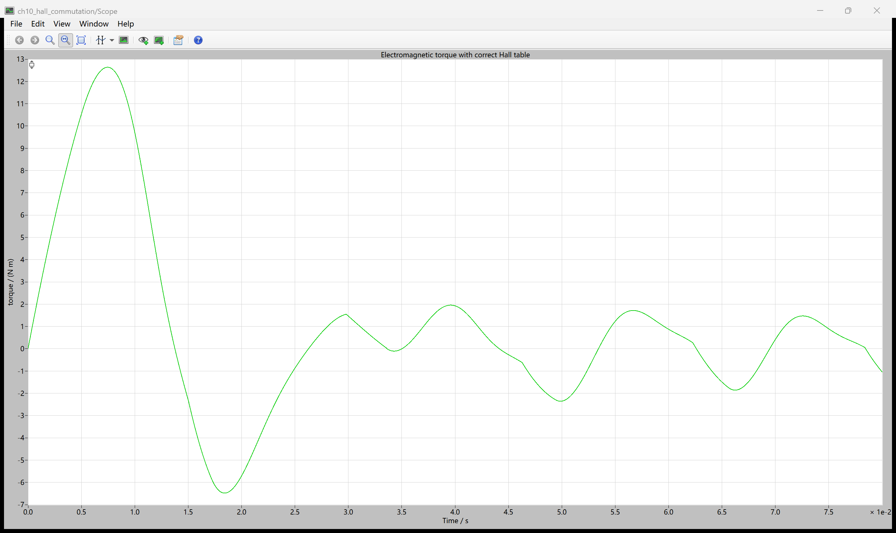
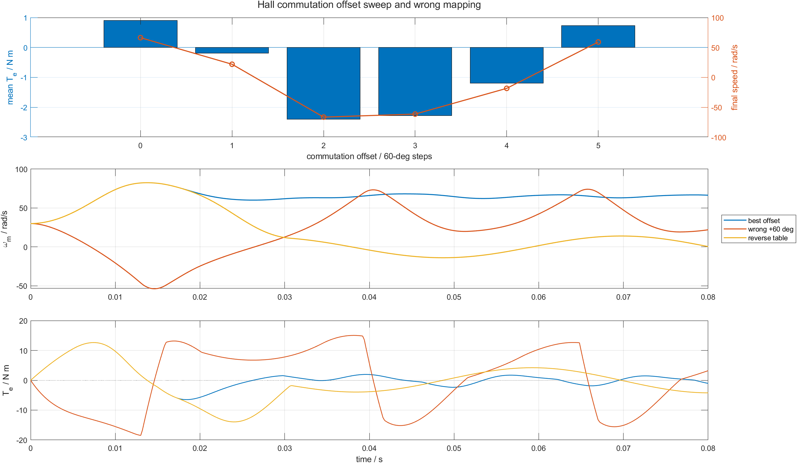

# 10 Hall 序列合法，电机为什么仍会反转：换相表与安装偏置

第 09 篇已经得到完整合法序列 `5→1→3→2→6→4`。但 Hall 码只说明转子落在哪个 60° 扇区，并没有自动告诉控制器这个扇区应接通哪一对桥臂。若安装偏置或查表偏移错一个扇区，Hall 仍然合法，转矩却可能变负，电流还会显著增加。

本章把 PLECS Angle Sensor 生成的 Hall 扇区接入真实 IGBT bridge，扫描全部 6 个换相偏置，再加入反向表和全关基线。配套仓库：[https://github.com/Old-Ding/BLDC](https://github.com/Old-Ding/BLDC)

## 两张表必须对齐

位置编码表回答：

```text
theta_e -> sector -> Hall code
```

换相表回答：

```text
Hall sector -> A+/B-/C 悬空等三值相命令
```

本模型先由转子角得到 `sector 0..5`，再加入以 60° 为单位的换相偏置：

```text
step = (sector + offset_steps) mod 6
phase_cmd = six_step_table[step]
```

`offset_steps=1` 表示整张换相表相对转子位置提前一个 60° 扇区。它不是软件显示上的小误差，而是把另一组相绕组接入母线。

## 为什么先从 30 rad/s 开始

零速时 Hall 码不会变化，某些初始角又可能落在低转矩位置。为了隔离“表对齐”而不是重复讨论开环定位，本章所有通电场景都从 `30 rad/s` 正转开始，母线 `48 V`、无外部负载、仿真 `80 ms`。

同一模型还运行 `all_off`：桥臂关闭后速度保持 30 rad/s、电流和电磁转矩为零。它证明场景间的速度变化来自换相通电，不是初始条件或脚本后处理。

## PLECS 原生 Scope：正确偏置仍有六步转矩脉动



原生 Scope 显示 `offset_0` 下 PLECS Machine 的电磁转矩。启动瞬态先出现约 `12.7 N m` 正峰值和一次负向回摆，随后进入六步换相造成的周期脉动；同一 CSV 的全时段平均转矩为 `0.906 N m`，使转子从 30 rad/s 加速到 66.399 rad/s。

正确换相不等于瞬时转矩始终为正。判断偏置优劣要比较同一时间窗的平均转矩、末值速度和峰值电流，不能从单个峰值下结论。

## 6 个偏置的 PLECS 扫描结果



顶图显示平均转矩和末值速度：

- `offset_0` 的平均转矩最高，为 `0.906 N m`，末值速度 `66.399 rad/s`；
- `offset_1` 只错开 +60°，平均转矩已经变为 `-0.195 N m`，末值速度降到 `22.001 rad/s`；
- `offset_2/3/4` 都产生明显负平均转矩并使电机反向；
- `offset_5` 仍为正平均转矩，但只有 `0.727 N m`，低于正确对齐。

| 场景 | 偏置 | 末值速度/rad/s | 平均转矩/N m | 峰值相电流/A | 结果 |
|---|---:|---:|---:|---:|---|
| `offset_0` | 0° | 66.399 | 0.906 | 21.478 | PASS |
| `offset_1` | +60° | 22.001 | -0.195 | 65.388 | PASS |
| `offset_2` | +120° | -66.302 | -2.402 | 36.387 | PASS |
| `offset_3` | 180° | -61.252 | -2.274 | 43.441 | PASS |
| `offset_4` | +240° | -18.255 | -1.196 | 62.740 | PASS |
| `offset_5` | +300° | 59.161 | 0.727 | 17.348 | PASS |
| `reverse_table` | 0°，反表 | 0.431 | -0.743 | 62.088 | PASS |
| `all_off` | 不通电 | 30.000 | 0.000 | 0.000 | PASS |

每个 PASS 表示该偏置的预期物理现象被复现。`offset_1` PASS 不是控制正确，而是成功复现“合法 Hall + 错 60°”造成负平均转矩和大电流。

## 为什么错 60° 会同时降转矩、升电流

电磁转矩取决于反电动势与相电流的相位配合：

```text
T_e*omega_m = e_a*i_a + e_b*i_b + e_c*i_c
```

错位后，大电流可能流入反电动势符号不匹配的相，电功率不再有效转换为正机械功率。`offset_1` 的峰值电流从正确偏置的 `21.478 A` 升到 `65.388 A`，平均转矩却从正变负。这说明“电流大”不是“转矩大”的充分条件。

## 反向表为什么不等于正常反转

`reverse_table` 保持转子初始正转，却把换相顺序反向。结果是正负转矩反复切换，末值速度接近零，峰值电流达到 `62.088 A`。

要命令正常反转，必须协调目标方向、Hall 状态迁移、换相表和启动过程；不能在转子正转时突然把表反过来，并把剧烈制动误叫成反转控制。

## 工程标定顺序

实际硬件首次上电应低压、限流，并按以下顺序确认：

```text
1. 手动转动电机，记录 Hall 正反序
2. 确认相线 A/B/C 与软件命名
3. 低占空比逐个扫描换相偏置
4. 比较电流、转矩方向和启动一致性
5. 固化 Hall->phase_cmd 表
```

本章全母线运行只用于仿真放大差异，不能直接作为硬件标定电压或电流设置。

## 不要误读

| 证据 | 能证明 | 不能证明 |
|---|---|---|
| offset 0 平均转矩最高 | 当前模型参数下的最佳 60° 对齐 | 所有实物电机都使用 offset 0 |
| +60° 电流大且平均转矩为负 | 错位会把电能送入错误相位 | 电流采样和保护已经完成 |
| all_off 电流与转矩为零 | 通电场景差异来自换相 | 桥臂死区已经验证 |
| 反向表使速度接近零 | 突然反表会强烈制动 | 已实现可靠双向启动 |

## 复现实验

```powershell
Set-Location .\BLDC
python .\scripts\build_ch10_plecs_model.py
python .\scripts\ch10_plecs_hall_commutation.py
matlab -batch "run('scripts/ch10_hall_commutation_postprocess.m')"
```

期望输出：

```text
Generated chapter 10 PLECS Hall commutation evidence. scenarios=8 pass=8 time_points=401 signals=15 best_offset=0
Generated chapter 10 MATLAB Hall commutation figure. scenarios=8 best_offset=0
```

## 配套文件

| 文件 | 作用 |
|---|---|
| [`models/plecs/ch10_hall_commutation/ch10_hall_commutation.plecs`](../models/plecs/ch10_hall_commutation/ch10_hall_commutation.plecs) | Hall 位置换相、偏置和反向表模型 |
| [`scripts/ch10_plecs_hall_commutation.py`](../scripts/ch10_plecs_hall_commutation.py) | 8 场景 PLECS 扫描与判据 |
| [`scripts/ch10_hall_commutation_postprocess.m`](../scripts/ch10_hall_commutation_postprocess.m) | 偏置柱图和三场景波形 |
| [`waveforms/10-hall-commutation/plecs_hall_commutation_summary.csv`](../waveforms/10-hall-commutation/plecs_hall_commutation_summary.csv) | 转矩、速度和电流汇总 |
| [`reports/10-hall-commutation-test_report.md`](../reports/10-hall-commutation-test_report.md) | 场景报告 |
| [`docs/10-hall-commutation-reproduce.md`](../docs/10-hall-commutation-reproduce.md) | 复现说明 |

## 下一章：怎样用 PWM 调节能量而不改变 Hall 顺序

下一章在正确 Hall 换相表上加入 PWM，占空比只调节每个扇区送入绕组的平均电压，并检查换相空白时间。重点观察低、中、高 duty 下的电流和转速是否按预期变化。
