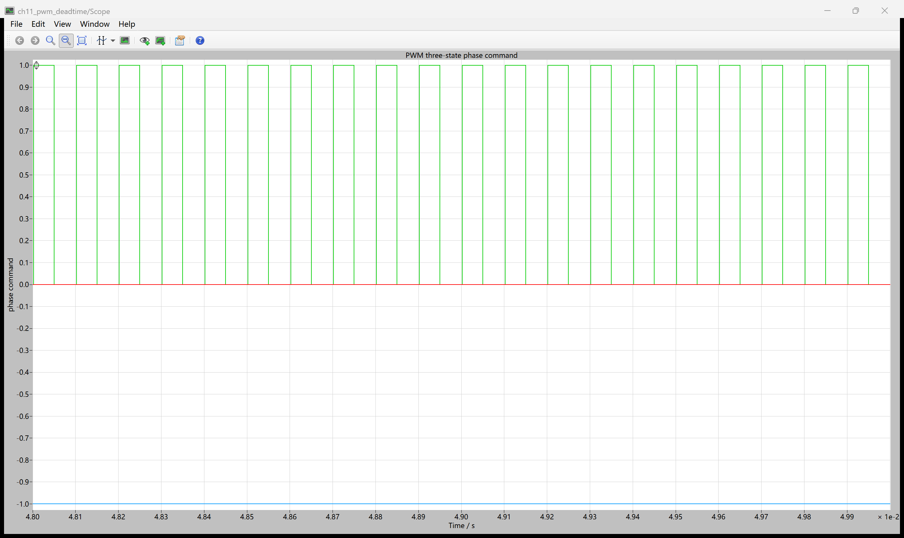
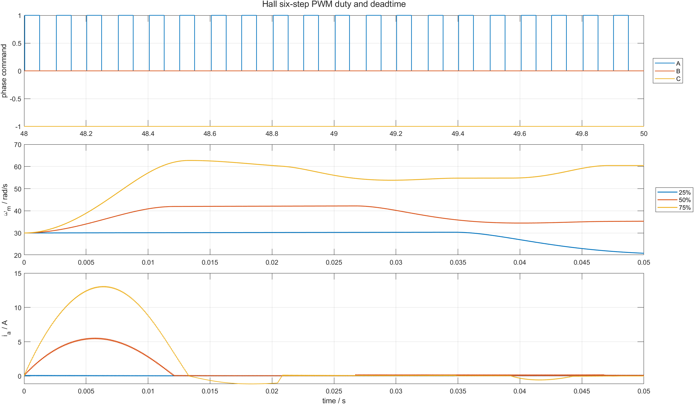

# 11 Hall 顺序不变，电机能量怎样改变：PWM duty 与换相保护间隔

第 10 篇的正确 Hall 表使用全母线六步，平均转矩为正，但没有办法调节绕组获得的平均电压。PWM 的职责不是改变 Hall 顺序，而是在每个 60° 扇区内控制通电时间。

本章在 `offset_0` Hall 换相上加入 10 kHz 单极性 PWM：正相高侧按 duty 开关，负相低侧保持导通，第三相悬空。配套仓库：[https://github.com/Old-Ding/BLDC](https://github.com/Old-Ding/BLDC)

## duty 改变的是平均电压，不是换相扇区

以 `A+ B- C悬空` 为例：

```text
PWM ON : A=+1, B=-1, C=0
PWM OFF: A= 0, B=-1, C=0
```

一个 PWM 周期内，高侧导通比例近似为 `D`，理想平均有效电压随 `D*Udc` 增加。Hall 扇区仍决定哪一相是正相、负相和悬空相；PWM 只调节正相高侧的导通时间。

先看一个 `50%` duty 的手算周期。本章 PWM 频率为 10 kHz，周期是 `100 us`；若没有保护间隔，高侧应导通约 `50 us`。加入 `2 us` 高侧开通延迟后，单个周期里可用高侧时间会先少掉这段延迟；再遇到 Hall 扇区切换时，还会出现三相全关的保护间隔。因此实测 duty 低于命令 duty 是预期现象，不是脚本统计错误。

## 本模型中的 deadtime 边界

本章 `deadtime_s` 承担两种保护间隔：

```text
每个 PWM 周期开始 -> 高侧延迟 deadtime 后才允许导通
Hall 扇区改变      -> 三相命令全关 deadtime，再进入新扇区
```

模型采用单极性 PWM，同一桥臂没有同步整流的互补上下管切换，因此该实验能证明“高侧开通延迟和换相全关间隔”对有效 duty 的影响，不能替代带互补 PWM 的六路门极死区验证。

## 场景参数

| 场景 | 命令 duty | deadtime | 目的 |
|---|---:|---:|---|
| `duty_025` | 25% | 2 μs | 低平均电压 |
| `duty_050` | 50% | 2 μs | 中等平均电压 |
| `duty_075` | 75% | 2 μs | 高平均电压 |
| `zero_deadtime` | 50% | 0 μs | 对比无开通延迟 |
| `large_deadtime` | 50% | 15 μs | 观察保护间隔侵占有效 duty |

母线 `48 V`、初速 `30 rad/s`、无外部负载，仿真 `50 ms`，PLECS 输出间隔 `2 μs`，每场景 25001 点。

## PLECS 原生 Scope：10 kHz 三值相命令



Scope 时间窗为 2 ms，可以直接看到高侧命令在 0/1 之间以 10 kHz 切换，负相保持 `-1`。这张图来自 PLECS 模型内 `Hall PWM commutator` 的实际输出，不是 MATLAB 生成的示意方波。

## MATLAB：duty、速度和相电流



在相同 Hall 顺序下，duty 从 25% 增至 75%，末值速度依次为 `20.851`、`35.310`、`60.441 rad/s`。25% 时平均电压不足以维持 30 rad/s 初速，转子减速；75% 则建立更大电流和正平均转矩。

| 场景 | 命令 duty | 实测高侧 duty | 末值速度/rad/s | 平均转矩/N m | 峰值相电流/A | 结果 |
|---|---:|---:|---:|---:|---:|---|
| `duty_025` | 0.25 | 0.2263 | 20.851 | -0.366 | 7.183 | PASS |
| `duty_050` | 0.50 | 0.4802 | 35.310 | 0.212 | 8.839 | PASS |
| `duty_075` | 0.75 | 0.7262 | 60.441 | 1.218 | 13.106 | PASS |
| `zero_deadtime` | 0.50 | 0.5063 | 37.122 | 0.285 | 9.017 | PASS |
| `large_deadtime` | 0.50 | 0.3537 | 24.007 | -0.240 | 7.653 | PASS |

实测 duty 与命令不完全相等，原因包括 2 μs 高侧开通延迟、Hall 换相全关和离散采样。15 μs 保护间隔占 100 μs PWM 周期的 15%，使 50% 命令实际只剩约 35.4%。

## 为什么 duty 不能直接当转速

PWM duty 控制的是桥臂平均作用，不是机械速度。转速还受反电动势、转矩、惯量和负载决定：

```text
duty -> 平均相电压 -> 相电流 -> 电磁转矩 -> 机械加速度 -> 转速
```

因此 50% duty 不表示 50% 额定转速。只有把速度测量和 PI 闭环加进来，duty 才会根据速度误差自动调整。

## 不要误读

| 证据 | 能证明 | 不能证明 |
|---|---|---|
| 原生 Scope 出现 10 kHz PWM | 模型确实运行开关命令 | 六路互补门极死区已全部验证 |
| duty 增大时速度和电流整体增大 | PWM 改变绕组能量 | duty 与速度线性一一对应 |
| 大 deadtime 降低有效 duty | 保护时间会损失电压利用率 | 15 μs 是硬件推荐值 |
| 峰值电流低于全母线换相 | PWM 降低当前场景电流 | 已实现硬件过流保护 |

## 复现实验

```powershell
Set-Location .\BLDC
python .\scripts\build_ch11_plecs_model.py
python .\scripts\ch11_plecs_pwm_deadtime.py
matlab -batch "run('scripts/ch11_pwm_postprocess.m')"
```

期望输出：

```text
Generated chapter 11 PLECS PWM evidence. scenarios=5 pass=5 time_points=25001 signals=15
Generated chapter 11 MATLAB PWM figure. scenarios=5 figures=1
```

## 配套文件

| 文件 | 作用 |
|---|---|
| [`models/plecs/ch11_pwm_deadtime/ch11_pwm_deadtime.plecs`](../models/plecs/ch11_pwm_deadtime/ch11_pwm_deadtime.plecs) | Hall 单极性 PWM 与保护间隔模型 |
| [`scripts/ch11_plecs_pwm_deadtime.py`](../scripts/ch11_plecs_pwm_deadtime.py) | 5 场景运行和有效 duty 统计 |
| [`scripts/ch11_pwm_postprocess.m`](../scripts/ch11_pwm_postprocess.m) | PWM、速度和电流对比图 |
| [`waveforms/11-pwm-deadtime/plecs_pwm_summary.csv`](../waveforms/11-pwm-deadtime/plecs_pwm_summary.csv) | duty、速度、转矩和电流汇总 |
| [`reports/11-pwm-deadtime-test_report.md`](../reports/11-pwm-deadtime-test_report.md) | 场景报告 |
| [`docs/11-pwm-deadtime-reproduce.md`](../docs/11-pwm-deadtime-reproduce.md) | 复现说明 |

## 下一章：Hall 边沿怎样变成有符号速度

下一章记录相邻 Hall 边沿之间的时间，用固定 60° 电角位移除以时间得到速度，并检查低速量化、高速采样误差、反转符号和无边沿超时。
