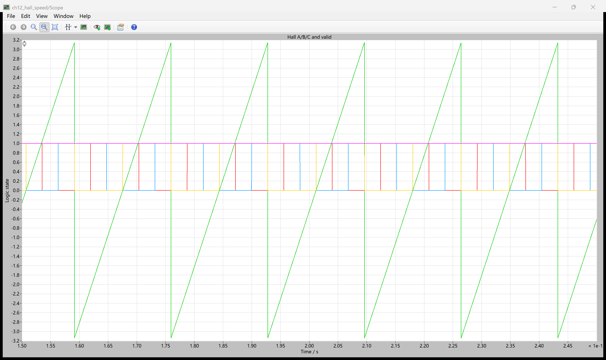
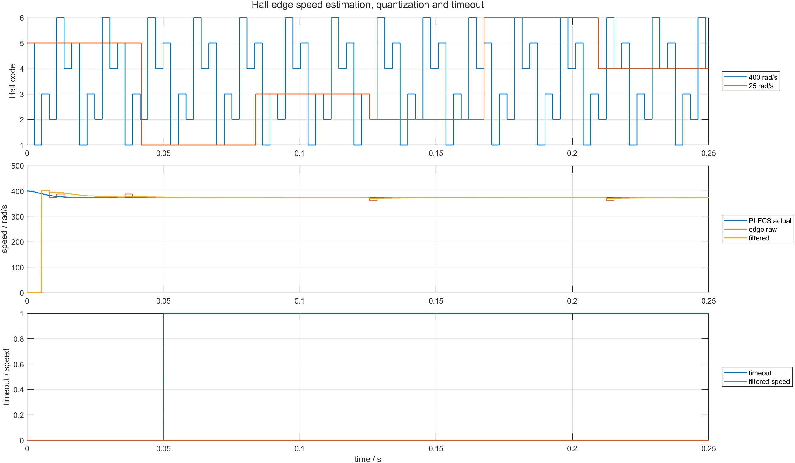

# 12 Hall 只有离散边沿，连续转速从哪里来：计时、量化、滤波与超时

三路 Hall 每转过 60 电角度才改变一次状态。控制器没有连续角度，只能记录相邻合法边沿的时间差，再把固定角位移除以时间。

本章使用第 09 篇 PLECS Hall 编码器，运行 25、100、400、-100 和 0 rad/s 五种场景。配套仓库：[https://github.com/Old-Ding/BLDC](https://github.com/Old-Ding/BLDC)

## 从一个 Hall 边沿到速度公式

相邻合法 Hall 状态相差 60 电角度：

```text
Delta_theta_e = pi/3
Delta_theta_m = pi/(3*p)
omega_m = direction * pi/(3*p*Delta_t)
```

`direction` 由前一码和当前码在合法序列中的前进/后退方向得到。只看 `Delta_t` 会丢失反转符号。

本章 `p=1`。例如 100 rad/s 时理论边沿间隔约：

```text
Delta_t = pi/(3*100) = 10.472 ms
```

## 采样量化为什么会造成速度台阶

PLECS 机械状态是连续求解的，但测试脚本以 `100 μs` 间隔读取 Hall。边沿时间只能落在采样网格上，因此测得的 `Delta_t` 存在最多约一个采样周期的量化误差。

速度越高，边沿间隔越短，同一个 100 μs 误差占比越大：

```text
relative timing error ~= sample_time / edge_period
```

原始速度会在几个离散值之间跳动。低通滤波可以减小跳动，但会引入响应延迟，不能把滤波后的平滑误认为更高的测量带宽。

## 为什么必须有超时

若电机停止，Hall 不再产生边沿。若控制器一直保留最后一次非零估算，就会把静止误报成仍在旋转。本章设置 `50 ms` 超时：

```text
current_time - last_edge_time >= 50 ms
  -> speed_raw = 0
  -> speed_filtered = 0
  -> timeout = 1
```

超时只说明“规定时间内没有合法边沿”，可能是停转、堵转、断线或采样链路故障，不能只凭超时确定唯一根因。

## PLECS 原生 Scope：高速 Hall 边沿密度



Scope 显示 400 rad/s 场景的机械角折回和 Hall 逻辑边沿。相同 0.25 s 窗口内，高速场景边沿明显更密集。测速脚本读取的就是这些 PLECS 输出，不是另建的理想脉冲源。

## MATLAB：原始估算、滤波与超时



上层对比 25 与 400 rad/s 的 Hall 码密度；中层显示高速场景的 PLECS 实际速度、边沿原始估算和一阶滤波；下层显示静止 50 ms 后 timeout 拉高。

400 rad/s 场景在仿真过程中实际平均速度降至 `374.508 rad/s`，原始估算中位数为 `373.999 rad/s`。比较对象必须是同次 PLECS 实际速度，不应强行拿初始 400 rad/s 当作全程真值。

| 场景 | 边沿数 | 原始估算中位数/rad/s | 实际绝对均值/rad/s | 相对误差 | 最终超时 | 结果 |
|---|---:|---:|---:|---:|---:|---|
| `slow_25` | 5 | 24.993 | 25.000 | 0.0003 | 0 | PASS |
| `medium_100` | 23 | 99.733 | 100.000 | 0.0027 | 0 | PASS |
| `fast_400` | 89 | 373.999 | 374.508 | 0.0014 | 0 | PASS |
| `reverse_100` | 24 | -99.733 | 100.000 | 0.0027 | 0 | PASS |
| `stopped_timeout` | 0 | 0.000 | 0.000 | 0.0000 | 1 | PASS |

## 滤波系数怎样理解

本章使用：

```text
speed_filt[k] = 0.25*speed_raw[k] + 0.75*speed_filt[k-1]
```

系数 0.25 只是教学参数。增大系数会更快但更抖，减小系数会更平滑但延迟更大。实际参数应按最低边沿频率、速度环带宽和允许延迟联合确定。

## 不要误读

| 证据 | 能证明 | 不能证明 |
|---|---|---|
| 正反转估算符号正确 | 序列方向进入了速度计算 | 机械方向传感器接线一定正确 |
| 中位误差低于 0.3% | 当前采样率和场景下测速准确 | 所有转速下误差都小于 0.3% |
| 滤波曲线更平滑 | 高频量化跳动被衰减 | 滤波没有相位延迟 |
| 50 ms 后 timeout=1 | 无边沿状态被及时清零 | 已区分停转、断线和堵转 |

## 复现实验

```powershell
Set-Location .\BLDC
python .\scripts\build_ch12_plecs_model.py
python .\scripts\ch12_plecs_hall_speed.py
matlab -batch "run('scripts/ch12_hall_speed_postprocess.m')"
```

期望输出：

```text
Generated chapter 12 PLECS Hall-speed evidence. scenarios=5 pass=5 time_points=2501 signals=19
Generated chapter 12 MATLAB Hall-speed figure. scenarios=5 figures=1
```

## 配套文件

| 文件 | 作用 |
|---|---|
| [`models/plecs/ch12_hall_speed/ch12_hall_speed.plecs`](../models/plecs/ch12_hall_speed/ch12_hall_speed.plecs) | 长时间 Hall 边沿 PLECS 模型 |
| [`scripts/ch12_plecs_hall_speed.py`](../scripts/ch12_plecs_hall_speed.py) | 边沿计时、方向、滤波和超时 |
| [`scripts/ch12_hall_speed_postprocess.m`](../scripts/ch12_hall_speed_postprocess.m) | 量化和超时图 |
| [`waveforms/12-hall-speed/plecs_hall_speed_summary.csv`](../waveforms/12-hall-speed/plecs_hall_speed_summary.csv) | 五场景误差汇总 |
| [`reports/12-hall-speed-test_report.md`](../reports/12-hall-speed-test_report.md) | 场景报告 |
| [`docs/12-hall-speed-reproduce.md`](../docs/12-hall-speed-reproduce.md) | 复现说明 |

## 下一章：速度误差怎样变成 duty

下一章把 PLECS Machine 的实际速度送入 PI，检查目标阶跃、负载阶跃、duty 限幅和积分抗饱和。重点观察达到上限后，积分项是否会阻碍恢复。
