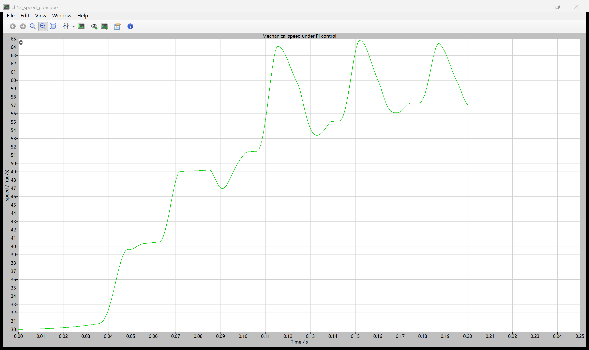
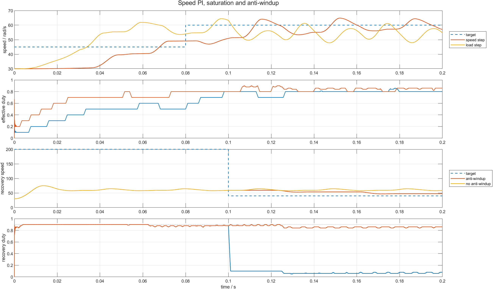

# 13 速度误差怎样变成 duty：PI、限幅与积分抗饱和

速度环并不直接命令电机“转到 60 rad/s”。它只能根据目标速度与反馈速度的误差，调整 PWM 占空比；占空比改变三相桥送入绕组的平均能量，电磁转矩和机械速度才随之变化。

本章先把 Hall 测速的量化影响隔离掉，使用 PLECS Machine 的实际速度作为 PI 反馈，集中验证速度 PI、duty 限幅和积分抗饱和。下一章再把第 12 章的 Hall 边沿测速接入同一个闭环。配套仓库：[https://github.com/Old-Ding/BLDC](https://github.com/Old-Ding/BLDC)

## 先建立速度环的数据流

```text
目标速度 omega_ref
  -> 速度误差 e = omega_ref - omega
  -> PI 计算未限幅 duty_raw
  -> [0.1, 0.9] 限幅
  -> 10 kHz PWM 与 Hall 六步相命令
  -> 三相 IGBT 桥和 BLDC Machine
  -> 实际速度 omega
  -> 返回误差计算
```

这条链里，PI 只拥有一项职责：把速度误差变成 duty。六步换相表决定哪两相工作，PWM 决定当前有效步在一个载波周期内工作多久，PLECS 功率级和电机模型决定电流、转矩与速度怎样演化。

## PI 的比例项和积分项分别解决什么

本章使用并联形式：

```text
duty_raw = Kp * e + x_i
dx_i/dt = Ki * e
duty = clamp(duty_raw, duty_min, duty_max)
```

比例项 `Kp*e` 立即响应当前误差。积分状态 `x_i` 累加过去的误差，用来补偿持续负载下仅靠比例项留下的静差。

若目标突然升高，正误差使 duty 增大；若负载转矩增加、实际速度下降，误差同样增大，PI 会提高 duty，尝试恢复转速。控制器没有直接输出转矩，它只能通过 duty 改变桥臂施加的平均电压和相电流。

## 为什么 duty 必须限幅

本章限制：

```text
0.1 <= duty <= 0.9
```

下限保留最小有效驱动，上限为换相空白和死区留出余量。更重要的是，执行器存在物理上限：当 `duty=0.9` 时，PI 再要求更高的输出也无法送到功率级。

如果积分器仍在高限幅期间持续累加正误差，`x_i` 会远大于执行器可用范围。之后目标降低，即使误差已经变成负值，也必须先消耗这部分积累，duty 才能离开上限。这就是积分饱和。

## 条件积分怎样阻止继续饱和

本章的抗饱和规则只放在积分状态的导数计算中：

```text
if duty_raw >= duty_max and error > 0:
    dx_i/dt = 0
elif duty_raw <= duty_min and error < 0:
    dx_i/dt = 0
else:
    dx_i/dt = Ki * error
```

判据只冻结“会把输出推得更深”的积分方向。高限幅时若误差转负，积分仍可下降；低限幅时若误差转正，积分仍可上升。这样不会把积分器永久锁住，也不需要在输出层再加一套重复保护。

PLECS C-Script 使用一个连续状态 `ContState(0)` 保存积分量，`DerivativeFcn` 决定它是否继续积分。PWM 和六步表仍在 `OutputFcn` 中根据最终 duty 生成三值相命令。

## 本章参数

| 参数 | 数值 | 单位 | 作用与限制 |
|---|---:|---|---|
| 直流母线 `Udc` | 48 | V | 三相桥供电 |
| PWM 频率 | 10 | kHz | 与第 11 章一致 |
| 死区/换相空白 | 2 | μs | 本章不重新验证互补门极 |
| `Kp` | 0.008 | duty/(rad/s) | 当前误差的即时增益 |
| `Ki` | 0.8 | duty/rad | 积分状态增长速度 |
| duty 下限 | 0.1 | 1 | 最小控制输出 |
| duty 上限 | 0.9 | 1 | 执行器饱和边界 |
| 初始机械速度 | 30 | rad/s | 除零速启动外的统一初值 |
| 仿真时长 | 0.2 | s | 用于比较短时动态与恢复 |

这些参数用于建立可观察的教学场景，不是面向某台实机完成的带宽设计。真实调参还需要电机惯量、负载范围、电流限制、采样周期和速度估算延迟。

## PLECS 原生 Scope：目标阶跃时实际速度怎样响应



Scope 来自 `ch13_speed_pi.plecs` 的 `speed_step_aw` 场景。实际速度从 30 rad/s 初值上升，在目标从 45 切到 60 rad/s 后继续加速，并出现由六步转矩脉动和当前 PI 参数共同造成的速度波动。

读图时不要只看末点是否等于 60，还要观察上升过程、峰值和持续振荡。单个末值可能恰好靠近目标，却不能代表整个尾段误差很小。

## 四个场景分别回答什么

| 场景 | 输入变化 | 要验证的结论 |
|---|---|---|
| `speed_step_aw` | 45→60 rad/s，0.08 s | 正常目标阶跃能离开高限幅并接近目标 |
| `load_step_aw` | 0→3 N·m，0.10 s | 负载增加会提高电流和控制输出 |
| `recovery_aw` | 200→40 rad/s，0.10 s | 条件积分使 duty 快速退出上限 |
| `recovery_no_aw` | 同上，关闭抗饱和 | 积分累积会延迟恢复 |

前两个场景验证正常调节，后两个场景使用相同输入、只改变 `antiwindup_enable`，因此恢复差异可以归因到积分规则。

## MATLAB 后处理：不要只看一条速度曲线



图的上半部分对比目标阶跃、负载阶跃及其有效 duty；下半部分固定同一个不可达的 200 rad/s 初始目标，在 0.10 s 降到 40 rad/s。

开启抗饱和后，降目标后的高限幅占比只有 `0.0004`；关闭后仍有 `0.6560` 的采样点处于高限幅。对应尾段绝对误差分别为 `7.593 rad/s` 和 `21.101 rad/s`。这不是仅靠曲线外观给出的判断，数字来自同次 PLECS CSV。

| 场景 | 抗饱和 | 末值速度/rad/s | 尾段绝对误差/rad/s | 降目标后高限幅占比 | 峰值相电流/A | 结果 |
|---|---:|---:|---:|---:|---:|---|
| `speed_step_aw` | 1 | 57.076 | 2.169 | 0.0036 | 11.628 | PASS |
| `load_step_aw` | 1 | 54.717 | 6.979 | 0.0000 | 14.642 | PASS |
| `recovery_aw` | 1 | 47.595 | 7.593 | 0.0004 | 17.625 | PASS |
| `recovery_no_aw` | 0 | 58.339 | 21.101 | 0.6560 | 17.625 | PASS |

`recovery_no_aw` 的 PASS 表示成功复现了“关闭抗饱和后恢复明显变差”，不是表示这个控制结果满足速度指标。

## 怎样理解负载阶跃结果

`load_step_aw` 的峰值相电流为 `14.642 A`，高于普通速度阶跃的 `11.628 A`。这说明 PI 在负载增加后确实通过 duty 提高了电气激励。

尾段速度仍有 `6.979 rad/s` 的平均绝对误差，说明当前参数、0.2 s 时间窗和六步转矩脉动下尚未完全收敛。不能把“抗饱和有效”误读成“PI 已经最优整定”。

## 这组证据能证明什么

| 观察 | 教学结论 | 不要误读成 |
|---|---|---|
| 目标阶跃后速度接近 60 rad/s | PI 能通过 duty 改变机械速度 | 已完成全速度范围稳定性证明 |
| 3 N·m 阶跃使峰值电流增加 | 负载误差进入了能量调节链 | 已具备独立电流环和过流保护 |
| 抗饱和场景迅速退出高限幅 | 条件积分阻止继续累积 | 所有抗饱和结构效果都相同 |
| 无抗饱和尾段误差更大 | 积分饱和会阻碍降目标恢复 | 仅凭末值即可完成 PI 整定 |

## 复现实验

```powershell
Set-Location .\BLDC
python .\scripts\build_ch13_plecs_model.py
python .\scripts\ch13_plecs_speed_pi.py
matlab -batch "run('scripts/ch13_speed_pi_postprocess.m')"
```

期望输出：

```text
Generated chapter 13 PLECS speed-PI evidence. scenarios=4 pass=4 time_points=20001 signals=15
Generated chapter 13 MATLAB speed-PI figure. scenarios=4 figures=1
```

## 配套文件

| 文件 | 作用 |
|---|---|
| [`models/plecs/ch13_speed_pi/ch13_speed_pi.plecs`](../models/plecs/ch13_speed_pi/ch13_speed_pi.plecs) | 速度 PI、限幅和条件积分模型 |
| [`scripts/build_ch13_plecs_model.py`](../scripts/build_ch13_plecs_model.py) | 从第 11 章模型生成本章 PLECS 文件 |
| [`scripts/ch13_plecs_speed_pi.py`](../scripts/ch13_plecs_speed_pi.py) | 运行四场景并生成 CSV 与报告 |
| [`scripts/ch13_speed_pi_postprocess.m`](../scripts/ch13_speed_pi_postprocess.m) | MATLAB 对比图 |
| [`waveforms/13-speed-pi/plecs_speed_pi_summary.csv`](../waveforms/13-speed-pi/plecs_speed_pi_summary.csv) | 四场景指标汇总 |
| [`reports/13-speed-pi-test_report.md`](../reports/13-speed-pi-test_report.md) | PASS/FAIL 报告 |
| [`docs/13-speed-pi-reproduce.md`](../docs/13-speed-pi-reproduce.md) | 完整复现说明 |

## 下一章：把 Hall 边沿测速真正接进 PI

下一章不再使用 Machine 实际速度作为控制反馈，而是把第 12 章的 Hall 边沿估算接入 PI，并用 Machine 速度只做验收真值。随后检查零速启动、目标阶跃、负载、非法 Hall 和过载能否在同一模型中闭环运行。
