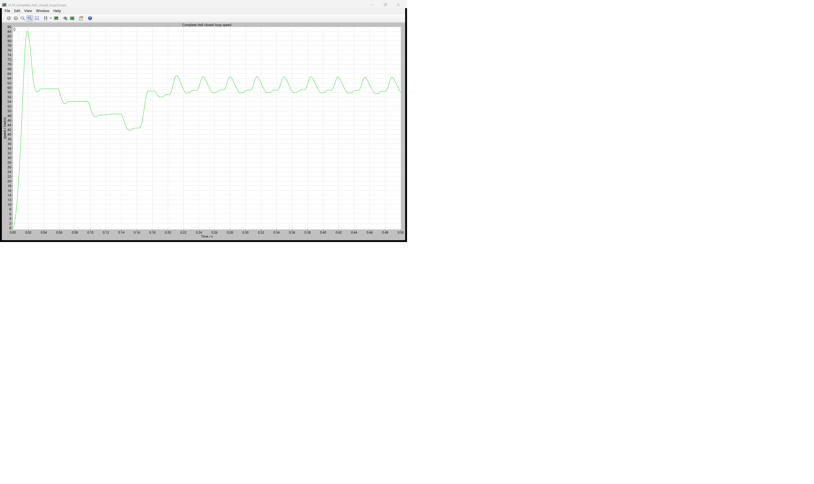
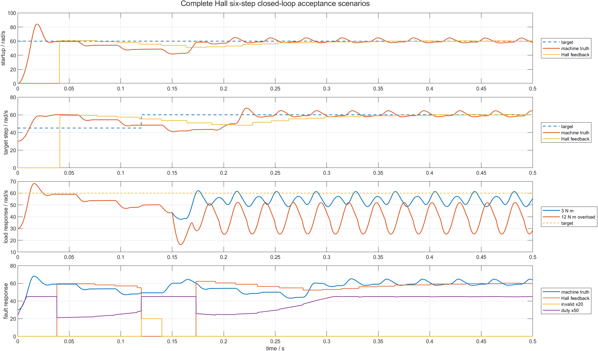

# 14 把启动、Hall、PWM、测速和 PI 合在一起：完整六步闭环验收

前面的章节分别验证了三相桥、六步表、开环启动、Hall 序列、PWM、边沿测速和速度 PI。把这些模块放到同一个模型后，最关键的问题不再是某个公式是否单独正确，而是反馈数据是否真的沿着闭环流动，故障时各层是否做了自己负责的动作。

本章使用完整 PLECS 开关功率级和 BLDC Machine，运行零速启动、目标阶跃、负载阶跃、非法 Hall 和过载五个场景。配套仓库：[https://github.com/Old-Ding/BLDC](https://github.com/Old-Ding/BLDC)

## 完整闭环里每个信号怎样流动

```text
BLDC Machine 机械角
  -> 理想 Hall A/B/C 与合法扇区
  -> 相邻合法边沿计时
  -> Hall 速度估算 hall_speed_feedback
  -> 速度误差
  -> PI + duty 限幅
  -> 10 kHz PWM + Hall 六步表
  -> 三值相命令
  -> 两电平三相 IGBT 桥
  -> 相电流、电磁转矩、机械速度
  -> 新的 Hall 边沿
```

PI 使用的是 `hall_speed_feedback_rad_s`，不是 PLECS Machine 的 `speed_rad_s`。Machine 实际速度仍导出到 CSV，但只作为验收真值，用来回答“Hall 反馈与真实机械状态是否一致”。

位置反馈仍由 Machine 机械角生成理想 Hall 扇区。它能验证换相、边沿计时和故障逻辑，但不包含传感器噪声、安装误差、数字滤波毛刺或真实输入电路延迟。

## Hall 速度为什么先同步一条边沿

相邻完整 Hall 扇区对应固定的 60 电角度，速度公式为：

```text
omega_m = direction * (pi/3) / (p * Delta_t)
```

模型刚启动或非法 Hall 刚恢复时，当前时刻通常位于某个扇区中间。恢复后的第一条边沿只覆盖“残余半个扇区”，不能直接代入完整 60° 公式。

因此本章恢复顺序是：

```text
初始化或故障恢复
  -> 记录当前扇区
  -> 第一条合法边沿：只同步并重新开始计时
  -> 第二条合法边沿：得到第一个完整扇区周期
  -> 后续边沿：计算并以 alpha=0.25 滤波
```

这个同步规则属于 Hall 测速职责层。PI 不需要再判断“这是不是故障后的第一条边沿”，换相输出层也不需要重复实现测速保护。

## 非法 Hall 时三层分别做什么

本章在 `0.12-0.14 s` 注入非法 Hall 窗口：

| 层 | 动作 | 原因 |
|---|---|---|
| 换相输出 | 三相命令全关 | 非法位置不能选择安全换相步 |
| PI 积分 | 冻结 | 执行器已关闭，继续积分只会制造饱和 |
| Hall 测速 | 标记失效；恢复后重新同步边沿 | 故障窗口不能计入合法边沿周期 |

故障结束后不立即猜测速度，而是等完整边沿周期重新建立反馈。这样恢复会稍有延迟，但不会把故障时间错误地当成一个超长 Hall 周期，也不会把残余扇区误算成异常高速。

## 本章参数

| 参数 | 数值 | 单位 | 作用与限制 |
|---|---:|---|---|
| 直流母线 | 48 | V | 两电平三相桥供电 |
| 极对数 `p` | 1 | 1 | Hall 电角度到机械速度换算 |
| PWM 频率 | 10 | kHz | 有效步高侧 PWM |
| 死区/换相空白 | 2 | μs | 防止换相瞬间直接切换 |
| `Kp` | 0.008 | duty/(rad/s) | 速度比例增益 |
| `Ki` | 0.8 | duty/rad | 速度积分增益 |
| duty 范围 | 0.1-0.9 | 1 | 执行器限幅 |
| Hall 滤波系数 | 0.25 | 1 | 新边沿速度权重 |
| Hall 超时 | 50 | ms | 无合法边沿后速度清零 |
| 仿真步间输出 | 10 | μs | CSV 输出采样间隔 |
| 仿真时长 | 0.5 | s | 给故障和负载留出恢复窗口 |

## PLECS 原生 Scope：零速启动不是一条平滑直线



原生 Scope 显示 `zero_speed_start` 场景的 Machine 实际速度。启动初期 Hall 尚未形成完整测速周期，PI 输出较大，速度出现明显超调；随后 Hall 反馈按边沿更新，实际速度围绕 60 rad/s 周期波动。

这张图证明真实 PLECS 开关桥和电机模型在闭环内运行。CSV 同时导出 Hall A/B/C、Hall code、decoded sector、fault、enable、duty 和六路 gate；MATLAB 图把 Hall 反馈量和 Machine 真值画在一起。

## 五个验收场景

| 场景 | 输入或故障 | 验收重点 |
|---|---|---|
| `zero_speed_start` | 0→60 rad/s | 无初始 Hall 速度时能建立闭环 |
| `target_step` | 45→60 rad/s，0.12 s | 目标变化后 Hall 反馈能跟随 |
| `load_step` | 0→3 N·m，0.15 s | duty 提升并维持可接受速度 |
| `invalid_hall` | 非法窗口 0.12-0.14 s | 命令全关、积分冻结、恢复重同步 |
| `overload` | 0→12 N·m，0.15 s | duty 长期高限幅且速度明显塌落 |

过载场景的 PASS 仍表示正确识别执行器饱和和速度不足，不表示 12 N·m 下满足速度目标。

## MATLAB 综合图怎样读



第一层是零速启动，第二层是目标阶跃。橙色阶梯线为 Hall 反馈，连续曲线为 Machine 验收真值。Hall 反馈只在边沿时更新，因此不应要求每个 10 μs 采样点都与连续速度重合。

第三层对比 3 N·m 和 12 N·m。3 N·m 时速度仍围绕目标附近波动；12 N·m 时 duty 长期处于高限幅，速度显著低于目标。

第四层显示非法 Hall 窗口。`invalid x20` 拉高期间有效 duty 为零；恢复后 Hall 先重新同步，反馈与实际速度再逐步回到正常闭环。

## 为什么用尾段均值偏差检查 Hall 反馈

Hall 速度是“边沿更新、区间保持”的阶梯信号，Machine 速度是连续量。若逐点计算两者绝对差，扇区内正常加减速也会被记为测速误差。

本章在尾段 50 ms 内比较两者均值：

```text
hall_tail_bias = abs(mean(machine_speed) - mean(hall_feedback))
```

五个场景的偏差都小于 `0.85 rad/s`。这个指标检查长期偏差，不掩盖阶梯量化；图中仍保留每个边沿更新过程供读者观察。

| 场景 | 末值速度/rad/s | 尾段目标误差/rad/s | Hall 尾段均值偏差/rad/s | 负载后高限幅占比 | 故障全关占比 | 结果 |
|---|---:|---:|---:|---:|---:|---|
| `zero_speed_start` | 58.037 | 2.166 | 0.488 | 0.000 | 0.000 | PASS |
| `target_step` | 64.168 | 1.958 | 0.243 | 0.000 | 0.000 | PASS |
| `load_step` | 55.417 | 6.516 | 0.840 | 0.947 | 0.000 | PASS |
| `invalid_hall` | 63.663 | 1.988 | 0.842 | 0.000 | 1.000 | PASS |
| `overload` | 28.826 | 20.718 | 0.057 | 0.947 | 0.000 | PASS |

`fault_all_off_fraction=1.000` 表示非法 Hall 窗口内所有采样点的六路 gate 均为全关。`post_load_high_saturation_fraction=0.947` 表示过载后约 94.7% 的采样点处于高有效 duty 区域。

## 第一季闭环到这里完成了什么

| 证据 | 能证明 | 不要误读成 |
|---|---|---|
| 零速启动并建立 Hall 速度 | 无初始速度时闭环能够接管 | 所有负载和惯量下都能可靠启动 |
| 目标、负载和故障场景同模运行 | PLECS 原生 CSV 可用于同一套验收谓词检查 | 真实传感器输入电路、毛刺滤波和硬件保护已经覆盖 |
| 非法 Hall 时全关并恢复 | 故障窗口职责分层正确 | 已覆盖断线、毛刺、错序等全部传感器故障 |
| 过载时高限幅且速度塌落 | 执行器饱和边界可观察 | 已实现电流限制、堵转保护和热保护 |
| PLECS、CSV、MATLAB 指标一致 | 结论可以由同一数据复核 | 已完成 MCU 时序、定点和硬件验证 |

当前模型仍使用理想 Hall 位置、单极性高侧 PWM 教学结构和 PLECS 连续 C-Script。读这组结果时，应把它理解为“PLECS 仿真内 Hall interface、测速、PI、PWM 和 gate 诊断已经闭合”，不要误读成真实传感器硬件、MCU 定时、定点实现或上板安全裕量已经完成。

## 复现实验

```powershell
Set-Location .\BLDC
python .\scripts\build_ch14_plecs_model.py
python .\scripts\ch14_plecs_complete_closed_loop.py
python .\scripts\ch14_acceptance_check.py
matlab -batch "run('scripts/ch14_closed_loop_postprocess.m')"
```

期望输出：

```text
Generated chapter 14 PLECS closed-loop evidence. scenarios=5 pass=5 time_points=50001 signals=35
Generated C14 acceptance check. formal_pass=True mutation_pass=True
Generated chapter 14 MATLAB closed-loop figure. scenarios=5 figures=1
```

## 配套文件

| 文件 | 作用 |
|---|---|
| [`models/plecs/ch14_complete_hall_closed_loop/ch14_complete_hall_closed_loop.plecs`](../models/plecs/ch14_complete_hall_closed_loop/ch14_complete_hall_closed_loop.plecs) | 第一季完整 Hall 六步闭环模型 |
| [`scripts/build_ch14_plecs_model.py`](../scripts/build_ch14_plecs_model.py) | 从第 13 章模型接入 Hall 边沿测速和故障恢复 |
| [`scripts/ch14_plecs_complete_closed_loop.py`](../scripts/ch14_plecs_complete_closed_loop.py) | 五场景验收、CSV 和报告生成 |
| [`scripts/ch14_acceptance_check.py`](../scripts/ch14_acceptance_check.py) | 复核 PLECS 原生 Hall/control/gate 字段和失败样本谓词 |
| [`scripts/ch14_closed_loop_postprocess.m`](../scripts/ch14_closed_loop_postprocess.m) | Hall 反馈与 Machine 真值综合图 |
| [`waveforms/14-complete-hall-closed-loop/plecs_closed_loop_summary.csv`](../waveforms/14-complete-hall-closed-loop/plecs_closed_loop_summary.csv) | 五场景指标汇总 |
| [`reports/14-complete-hall-closed-loop-test_report.md`](../reports/14-complete-hall-closed-loop-test_report.md) | PASS/FAIL 报告 |
| [`docs/14-complete-hall-closed-loop-reproduce.md`](../docs/14-complete-hall-closed-loop-reproduce.md) | 完整复现说明 |

## 下一章：同一套判断怎样进入可编译 C 控制核心

下一章把 Hall 解码、测速、PI 和换相职责拆成可编译 C 模块，先展示最小手工编译与测试路径，再用自动化脚本生成主机侧 PASS/FAIL 报告。PLECS CSV 将作为控制行为的参考数据，而不是替代 C 编译证据。
