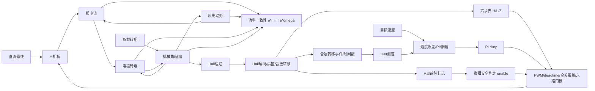
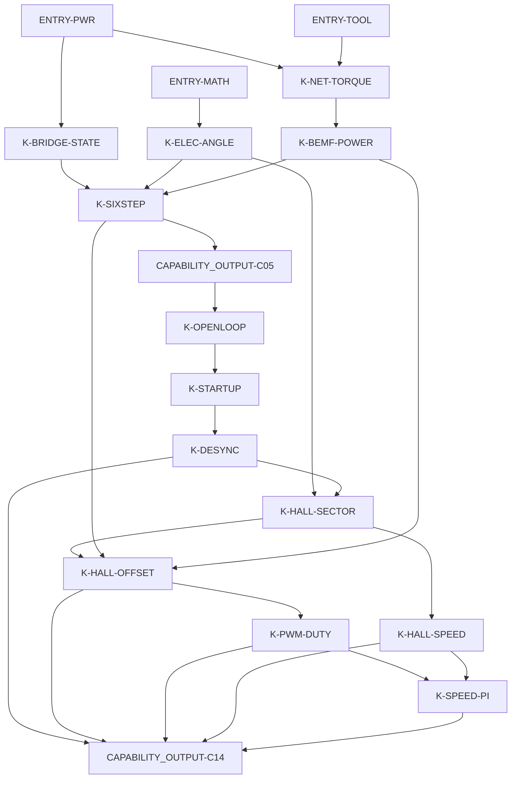

# BLDC 技术教程系列架构

候选版本：`v0.1`
目标仓库：`Old-Ding/BLDC`
本文件职责：固定系列的读者基线、能力出口、知识依赖、章节边界和证据契约。审批状态、审查 Agent、发布记录和哈希锁不写入本文件，应单独记录在 `reports/series-architecture-independent-review.md`。

## 1. 目标读者

| 字段 | 定义 |
|---|---|
| 目标读者 | 已经接触过电机、功率电子或嵌入式控制，但还不能把 BLDC 的三相桥、换相、Hall、PWM、测速和速度环串成可验证工程链路的读者。 |
| 已有领域知识 | 能区分直流母线、三相绕组、开关管、相电流、转矩、负载和转速；不要求已经会设计完整 BLDC 控制器。 |
| 已有数学基础 | 能读懂代数关系、正负号、平均值、误差、比例积分和角度单位；三相坐标变换、FOC 和无感估算会在后续阶段首次讲解。 |
| 已有工具能力 | 能在 Windows 上运行 PowerShell，能安装或打开 PLECS Standalone、MATLAB；Python 脚本的作用会在复现实验中说明。 |
| 硬件条件 | 第一季不要求真实硬件；所有正式结论限定在 PLECS 开关功率级、BLDC Machine、CSV、MATLAB 后处理和报告范围内。 |
| 需要先走其他路线的人群 | 没有基本电路概念、不会区分电压/电流/功率/转矩、不能运行本地脚本的读者，需要先补电路基础和命令行基础。 |

## 2. 终局工程能力

### CAP-CHAIN-01 读懂电流到转速的因果链

| 字段 | 内容 |
|---|---|
| 可观察任务 | 给出相电流、反电动势、电磁转矩、负载和转速曲线时，判断电机为什么加速、减速或失速。 |
| 证据链 | C01、C03、C04 的 PLECS CSV、Scope 图、MATLAB 对比图和报告。 |
| 过关标准 | 能用 `J*domega/dt = Te - TL - B*omega - Tloss` 解释至少一个额定负载和一个过载场景；能说明 `sum(e*i)=Te*omega_m` 是非零速功率一致性检查，不是零速转矩产生的因果来源。 |
| 建设章节 | C01、C03、C04 |
| 最终集成章节 | C14 |

### CAP-BRIDGE-01 从相命令追到三相桥电流路径

| 字段 | 内容 |
|---|---|
| 可观察任务 | 给定三值相命令，判断哪两相接入母线、哪一相悬空、线电压方向和相电流方向。 |
| 证据链 | C02 的真实 PLECS 三相桥、7 个场景 CSV、64 组合真值表、Scope 图和报告。 |
| 过关标准 | 能解释 `Apos_Bneg` 与 `all_off` 的电流路径差异，并能识别直通和无效组合。 |
| 建设章节 | C02 |
| 最终集成章节 | C05、C14 |

### CAP-SIXSTEP-01 建立六步换相的物理来源

| 字段 | 内容 |
|---|---|
| 可观察任务 | 从电角度、反电动势符号、相状态和换相顺序推导六步导通为什么是一相高、一相低、一相悬空。 |
| 证据链 | C03、C04、C05 的角度、功率、序列和桥状态实验。 |
| 过关标准 | 能说明一个 60 度扇区里哪两相应导通，能解释顺序反转和全关场景的结果。 |
| 建设章节 | C03、C04、C05 |
| 最终集成章节 | C10、C14 |

### CAP-OPENLOOP-01 诊断开环启动和失步

| 字段 | 内容 |
|---|---|
| 可观察任务 | 给出命令电角频率、转子角、速度和转矩曲线时，判断转子是否跟上旋转磁场以及为什么失步。 |
| 证据链 | C06、C07、C08 的慢/快开环、启动斜坡、同步跟随、过快斜坡和负载阶跃场景；C08 同一 PLECS 观测链覆盖 1 个同步正例和 3 个失步场景。 |
| 过关标准 | 能区分“磁场在转”和“转子同步跟随”，并能用相位差、速度趋势和转矩脉动定位失步。 |
| 建设章节 | C06、C07、C08 |
| 最终集成章节 | C14 |

### CAP-HALL-01 用 Hall 位置反馈驱动六步换相

| 字段 | 内容 |
|---|---|
| 可观察任务 | 给定 Hall A/B/C 序列、方向和换相偏置，判断编码是否合法、方向是否一致、偏置是否产生反转或转矩下降。 |
| 证据链 | C09、C10 的合法/非法 Hall、正反方向、6 个偏置、反向表和全关场景；C10 与 C14 模型原生导出 Hall A/B/C、Hall code、解码扇区、合法转移、enable 和 fault。 |
| 过关标准 | 能识别 `000/111` 非法，能解释合法 Hall 序列为什么仍可能因偏置错误而反转，并能从 CSV 追踪 `Hall interface -> decoded sector -> commutator/PWM`。 |
| 建设章节 | C09、C10 |
| 最终集成章节 | C14 |

### CAP-PWM-01 解释 duty 和 deadtime 对六步能量的影响

| 字段 | 内容 |
|---|---|
| 可观察任务 | 给定 duty、deadtime、相命令和速度/电流结果，判断平均能量是否改变以及换相顺序是否改变。 |
| 证据链 | C11 的 10 kHz PWM、低中高 duty、零死区和大死区 PLECS 场景。 |
| 过关标准 | 能说明 duty 调的是同一换相步内的有效通电时间，不直接定义 Hall 扇区或目标转速。 |
| 建设章节 | C11 |
| 最终集成章节 | C13、C14 |

### CAP-SPEED-01 从 Hall 边沿得到有符号速度

| 字段 | 内容 |
|---|---|
| 可观察任务 | 给定 Hall 边沿时间、极对数和方向，计算速度估计并解释量化、滤波和超时。 |
| 证据链 | C12 的慢速、中速、高速、反转、4 极对和停止超时场景；PLECS 原生导出 Hall code、合法边沿计数、原始/滤波速度和 timeout。 |
| 过关标准 | 能把边沿周期换算为机械速度，能解释高速估算为什么要和同次 PLECS 实际速度比较。 |
| 建设章节 | C12 |
| 最终集成章节 | C14 |

### CAP-PI-01 把速度误差变成 duty 并诊断饱和

| 字段 | 内容 |
|---|---|
| 可观察任务 | 给定目标速度、反馈速度、duty、积分状态和负载扰动，判断 PI 是否饱和、是否需要抗饱和。 |
| 证据链 | C13 的目标阶跃、负载阶跃、开启/关闭抗饱和恢复场景。 |
| 过关标准 | 能解释 duty 限幅后积分继续累积为什么会拖慢恢复，并能用报告中的饱和占比和尾段误差判断。 |
| 建设章节 | C13 |
| 最终集成章节 | C14 |

### CAP-INTEGRATION-01 复现完整 Hall 六步闭环验收

| 字段 | 内容 |
|---|---|
| 可观察任务 | 运行完整 PLECS 闭环模型，检查零速启动、目标阶跃、负载阶跃、非法 Hall 和过载五类场景。 |
| 证据链 | C14 的 5 组 PLECS CSV、Scope 图、综合 MATLAB 图和验收检查；模型原生导出 Hall A/B/C、Hall code、合法转移、fault、enable、duty 和六路门极。 |
| 过关标准 | 5/5 场景按定义复现，五类失败样本被验收谓词检出，非法 Hall 窗口内六路门极全关。 |
| 建设章节 | C01-C14 |
| 最终集成章节 | C14 |

### 后续阶段能力边界

| 能力 ID | 阶段 | 可观察任务 | 当前边界 |
|---|---|---|---|
| CAP-FW-01 | C15-C22 固件工程 | 编译 C 控制核心、运行主机测试、完成定点、ADC/PWM、ISR、保护、CI/HIL 和硬件上电证据。 | 第一季不能宣称 MCU-ready；C14 只能作为仿真行为参考，不替代 C 编译和目标时序证据。 |
| CAP-SENSORLESS-01 | C23-C29 无感六步 | 从悬空相反电动势过零、消隐和换相延迟建立无感接管闭环。 | 第一季 Hall 反馈不能替代无感过零证据。 |
| CAP-FOC-01 | C30-C36 FOC | 建立 Clarke/Park、电流环、SVPWM、弱磁和六步/FOC 对比。 | 第一季不引入 dq 电流闭环，不混写为入门六步内容。 |

## 3. 系统因果与数据流

### SYS-DC 直流母线与三相桥

| 字段 | 内容 |
|---|---|
| 输入 | 母线电压、六路门极命令、deadtime 后的 enable/all-off 状态。 |
| 内部责任 | 把门极命令变成上桥/下桥/悬空状态和线电压。 |
| 输出 | 三相端电压、相电流路径、直通或全关状态。 |
| 可观测证据 | C02、C05、C11 的 PLECS Scope、CSV 和真值表。 |
| 责任边界 | 证明开关级和电流路径，不证明 Hall 位置或速度控制正确。 |

### SYS-MOTOR BLDC 电磁与机械对象

| 字段 | 内容 |
|---|---|
| 输入 | 相电压、相电流、机械角/速度、负载转矩、惯量和阻尼。 |
| 内部责任 | 相电压、绕组 R/L 和反电动势共同决定相电流；相电流与转子电角度/磁链共同决定电磁转矩；转矩再经 `J*domega/dt = Te - TL - B*omega - Tloss` 改变机械速度和位置。`sum(e*i)` 与 `Te*omega_m` 只用于非零速功率一致性检查，不作为转矩产生的主因果链。 |
| 输出 | 反电动势、电磁转矩、机械角、机械速度、Hall 信号。 |
| 可观测证据 | C01、C03、C04、C06-C14 的 PLECS CSV 与 Scope。 |
| 责任边界 | 第一季是仿真对象，不包含真实器件热、采样延迟、传感器噪声和硬件安全验证。 |

### SYS-FEEDBACK Hall、测速与控制器

| 字段 | 内容 |
|---|---|
| 输入 | Hall A/B/C、Hall 边沿时间戳、目标速度、实际或估算速度、Hall 故障状态。 |
| 内部责任 | Hall 解码只产出扇区、合法转移事件、时间戳和故障标志；Hall 测速只用合法 60 度电角转移事件计算速度；PI 只产出 duty；换相安全判定只产出 enable；PWM/deadtime/门极合成层唯一负责把 H/L/Z、duty、deadtime 和 enable 合成为六路门极，故障全关只在这一层覆盖一次。 |
| 输出 | 扇区、合法转移事件、速度反馈、PWM duty、H/L/Z、enable、六路门极、诊断标志。 |
| 可观测证据 | C09-C14 的合法/非法 Hall、偏置、PWM、测速、PI 和闭环报告。 |
| 责任边界 | PLECS C-Script 或脚本中的控制逻辑不是 MCU 固件证据；C 编译和目标时序进入 C15 以后。 |

## 4. 知识依赖图

箭头 `A -> B` 表示没有 A，读者无法独立解释或验证 B。

## 5. 知识与前置注册表

| ID | 类型 | 入口依据或来源能力 | 为什么需要 / 解决的现象 | 输入 | 转换或责任 | 输出 | 证据和边界 | Owner / 首次使用 | 最小例子 | 复用规则 |
|---|---|---|---|---|---|---|---|---|---|---|
| ENTRY-PWR | ENTRY | 目标读者能区分电压、电流、功率和负载。 | 读懂功率级和电机响应。 | 电压、电流、负载、转速。 | 基础物理量识别。 | 可读曲线名称和单位。 | 只证明入口能力，不证明 BLDC 控制。 | 入口 / C01 | 电流大不等于一定加速。 | 后续可直接使用电压、电流、负载术语。 |
| ENTRY-MATH | ENTRY | 目标读者能处理正负号、角度、平均值和误差。 | 支撑净转矩、电角度、速度误差。 | 数值、角度、采样点。 | 单位换算和简单公式。 | 预测方向或平均指标。 | 不包含 dq 坐标和复杂控制理论。 | 入口 / C01 | `Te - TL < 0` 时减速。 | 后续只讲新增公式含义。 |
| ENTRY-TOOL | ENTRY | 能运行 PowerShell、PLECS、MATLAB 的基本命令。 | 复现实验必须能启动工具链。 | 命令、脚本路径、端口。 | 执行和查看输出。 | CSV、图片、报告。 | 工具可用性不等于技术结论。 | 入口 / C01 | `python scripts/ch01_...py` 生成 CSV。 | 每章只说明新增命令或新增工具边界。 |
| K-NET-TORQUE | CONCEPT | C01 首次教学。 | 解释电流存在但仍减速。 | 电磁转矩、负载转矩、速度、阻尼和损耗边界。 | 比较 `Te - TL - B*omega - Tloss` 的符号；C01 简化场景中 `B` 与 `Tloss` 置零。 | 加速、减速或近似平衡判断。 | C01 两负载场景；不证明控制器最优。 | C01 / C01 | 4 N m 电磁转矩遇到 6 N m 负载会减速。 | C04、C14 用作转速变化解释。 |
| K-BRIDGE-STATE | CONCEPT | C02 首次教学。 | 把三值相命令展开成真实桥臂状态。 | A/B/C 的 H/L/Z 或 `1/-1/0`。 | 映射到上桥、下桥、悬空和线电压。 | 相电流方向、合法性、全关。 | C02 七场景和 64 组合；不证明转矩方向。 | C02 / C02 | `Apos_Bneg` 使 A 到 B 建立电流。 | C05、C10、C11 消费相状态语言。 |
| K-ELEC-ANGLE | CONCEPT | C03 首次教学。 | 极对数改变换相频率。 | 机械角、极对数。 | `theta_e = pole_pairs * theta_m`。 | 电角度和扇区。 | C03 两极对数场景；不证明换相表正确。 | C03 / C03 | 4 极对机械转一圈，电角转四圈。 | C05-C10 用电角扇区不重复推导。 |
| K-BEMF-POWER | CONCEPT | C04 首次教学。 | 用 `e*i` 解释转矩正负。 | 反电动势、相电流、机械速度。 | 在 SI 单位下求瞬时电磁功率并和 `Te*omega_m` 对照；`omega_m` 用 rad/s，零速附近不通过除法求转矩。 | 正转矩、负转矩、再生判断。 | C04 三场景功率残差；不覆盖硬件损耗。 | C04 / C04 | 相同电流方向遇到不同反电动势可得到不同转矩。 | C05、C10 判断换相方向。 |
| K-SIXSTEP | CONCEPT | C05 首次教学。 | 说明六步为什么每步两相导通一相悬空。 | 电角扇区、相状态、功率方向。 | 按 60 度扇区切换 H/L/Z。 | 正序、反序、全关序列。 | C05 三场景；不解决启动同步。 | C05 / C05 | `A+ B- C悬空` 是一个有效步。 | C06-C14 作为换相基本动作。 |
| CAPABILITY_OUTPUT-C05 | CAPABILITY_OUTPUT | C05 产出。 | 让后续章节使用六步序列而不重复桥状态推导。 | 六步相状态。 | C05 报告验证顺序和全关。 | 可复用的六步命令链。 | 只覆盖序列合法性，不覆盖闭环。 | C05 / C06 | 正序六步能依次切换。 | C06-C14 可直接引用。 |
| K-OPENLOOP | CONCEPT | C06 首次教学。 | 区分命令电角旋转和转子实际跟随。 | step 周期、命令角、转子角。 | 按固定时间推进六步。 | 转矩、速度和相位响应。 | C06 慢/快场景；不证明能从静止启动。 | C06 / C06 | 磁场转得过快时平均转矩抵消。 | C07、C08 消费开环频率概念。 |
| K-STARTUP | CONCEPT | C07 首次教学。 | 静止转子不能直接跟随高频换相。 | 初始定位、斜坡频率、负载。 | 先建立方向再提高频率。 | 启动速度和相位差。 | C07 斜坡/直接高频对比；不等于闭环启动。 | C07 / C07 | 先低频再加速比直接高频更容易拖动。 | C08、C14 消费启动边界。 |
| K-DESYNC | CONCEPT | C08 首次教学。 | 解释开环失步根因。 | 负载、频率斜坡、转子角。 | 比较命令角和实际角差。 | 同步或失步诊断。 | C08 PLECS 覆盖 1 个同步正例和 3 个失步场景；信号级 oracle 只固定分类器边界。 | C08 / C08 | 相位差持续滑移表示失步。 | C14 用于解释过载边界。 |
| K-HALL-SECTOR | CONCEPT | C09 首次教学。 | 用三路 Hall 表示离散转子扇区和方向。 | Hall A/B/C、电角度、方向。 | 验证合法码和序列方向。 | 扇区、方向、非法码。 | C09 正反/非法场景；不证明换相偏置正确。 | C09 / C09 | `000/111` 不是合法 120 度 Hall 状态。 | C10-C14 使用 Hall 扇区。 |
| K-HALL-OFFSET | CONCEPT | C10 首次教学。 | 合法 Hall 序列仍可能因安装偏置导致反转或转矩下降。 | Hall 扇区、偏置、换相表。 | 扫描 6 个偏置并比较转矩/速度。 | 正确偏置、错误偏置、全关边界。 | C10 八场景；不证明真实硬件标定。 | C10 / C10 | 错 60 度可能转矩下降且电流变大。 | C14 使用已验证偏置。 |
| K-PWM-DUTY | CONCEPT | C11 首次教学。 | 调能量而不改变 Hall 顺序。 | duty、deadtime、六步相状态。 | 在同一换相步内调有效通电时间。 | 平均电压、电流、速度变化。 | C11 五场景；不证明目标速度闭环。 | C11 / C11 | 50% duty 比 25% duty 有更高平均能量。 | C13、C14 作为 PI 输出执行器。 |
| K-HALL-SPEED | CONCEPT | C12 首次教学。 | 离散 Hall 边沿怎样得到连续速度估计。 | 边沿时间、方向、极对数。 | 用边沿间隔换算速度并滤波/超时。 | 有符号速度估计和 timeout。 | C12 六场景含 4 极对 PLECS 原生测速；不等于无感估速。 | C12 / C12 | 边沿越密，估算速度越高。 | C14 作为速度反馈。 |
| K-SPEED-PI | CONCEPT | C13 首次教学。 | 速度误差怎样变成 duty，饱和时怎样恢复。 | 目标速度、反馈速度、误差、积分。 | PI 计算、限幅、条件积分。 | duty、积分状态、恢复效果。 | C13 四场景；反馈先用 Machine 真值隔离测速影响。 | C13 / C13 | duty 已到上限时继续积分会拖慢降目标恢复。 | C14 与 Hall 测速合并。 |
| CAPABILITY_OUTPUT-C14 | CAPABILITY_OUTPUT | C14 产出。 | 第一季仿真闭环结论。 | Hall、PWM、PI、三相桥、BLDC Machine。 | 运行完整闭环场景套件并输出可观察 Hall/control/gate 原生诊断。 | 5/5 场景验收结果和 5/5 失败样本检出。 | 只证明 PLECS 仿真闭环，不证明 C 编译、MCU 时序或硬件安全裕量。 | C14 / C15 | 非法 Hall 触发全关，过载复现速度不足。 | C15 只能使用通过审查后的 C14 CSV 作为行为参考，不替代编译证据。 |

## 6. 模块划分

| 模块 | 工程责任 / 因果边界 | 入口能力 | 结束时能回答的问题 | 集成证据 |
|---|---|---|---|---|
| M00 路线入口 | 先建立系统依赖图和复现规则。 | ENTRY-PWR、ENTRY-MATH、ENTRY-TOOL。 | 读者知道第一季为什么从三相桥、转矩、Hall 和闭环推进。 | C00 路线文章和复现入口。 |
| M01 功率级与电机物理 | 三相桥、电角度、反电动势、转矩和六步表的物理来源。 | ENTRY-PWR、ENTRY-MATH。 | 相命令怎样变成电流，电流和转子磁链怎样决定转矩，反电动势怎样参与绕组电流和功率一致性。 | C01-C05 的模型、CSV、Scope、MATLAB 图和报告。 |
| M02 开环启动与同步 | 没有位置反馈时，命令磁场和转子实际运动的关系。 | CAPABILITY_OUTPUT-C05。 | 开环为什么需要斜坡，失步怎样从相位和速度诊断。 | C06-C08 PLECS 覆盖同步正例、过快斜坡和负载扰动失步。 |
| M03 Hall 换相与执行器 | Hall 扇区、偏置、PWM 和 deadtime。 | CAPABILITY_OUTPUT-C05、K-ELEC-ANGLE。 | 合法 Hall 如何驱动六步，duty 如何调能量。 | C09-C11 的 Hall、偏置、PWM 证据；C10-C14 Hall 解码接口已由 PLECS 原生诊断闭合。 |
| M04 反馈和速度闭环 | Hall 测速、PI、完整闭环场景。 | K-HALL-SECTOR、K-PWM-DUTY。 | 从边沿到速度，再从速度误差到 duty，最后闭环是否成立。 | C12 PLECS 原生测速、C13 PI 证据和 C14 Hall/control/gate 原生闭环验收。 |
| M05 固件工程 | C 编译、单元测试、定点、外设映射、ISR、保护和硬件验证。 | 通过审查的 CAPABILITY_OUTPUT-C14。 | 同一套控制判断能否进入可编译、可测试、可上板的软件结构。 | C15-C22，尚未在第一季完成。 |

## 7. 章节索引

| 章节 | 唯一核心问题 | 详细契约 |
|---|---|---|
| C00 BLDC 完整学习路线 | 第一季需要先建立哪条物理和控制依赖链？ | [查看](#c00) |
| C01 电流还在，为什么会减速 | 电流存在时，净转矩为什么仍可能为负？ | [查看](#c01) |
| C02 三相桥状态 | 三值相命令怎样变成真实桥臂和电流路径？ | [查看](#c02) |
| C03 机械角与电角度 | 极对数为什么改变换相频率？ | [查看](#c03) |
| C04 反电动势与转矩 | `e*i` 怎样决定转矩方向和功率流？ | [查看](#c04) |
| C05 六步换相表 | 为什么六个桥状态要按 120 度顺序切换？ | [查看](#c05) |
| C06 开环电角频率 | 命令电角旋转时，转子为什么可能不跟随？ | [查看](#c06) |
| C07 启动斜坡 | 静止转子为什么不能直接高频换相？ | [查看](#c07) |
| C08 开环失步 | 负载或斜坡过快时，失步怎样被诊断？ | [查看](#c08) |
| C09 Hall 序列 | 三路 Hall 为什么只有六个合法状态？ | [查看](#c09) |
| C10 Hall 换相偏置 | Hall 合法时，换相表为什么仍可能错？ | [查看](#c10) |
| C11 PWM 与 deadtime | duty 怎样调能量而不改变换相顺序？ | [查看](#c11) |
| C12 Hall 边沿测速 | 离散 Hall 边沿怎样得到有符号速度？ | [查看](#c12) |
| C13 速度 PI | 速度误差怎样变成 duty，饱和怎样处理？ | [查看](#c13) |
| C14 完整 Hall 六步闭环 | 启动、Hall、PWM、测速和 PI 合并后能否通过场景验收？ | [查看](#c14) |

## 8. 单章详细契约

### C00 BLDC 完整学习路线

| 字段 | 内容 |
|---|---|
| 唯一核心问题 | 第一季需要先建立哪条物理和控制依赖链？ |
| 明确不解决 | 不做仿真实验结论，不宣称任何控制性能。 |
| 终局能力映射 | CAP-CHAIN-01 到 CAP-INTEGRATION-01 的导航入口。 |
| 前置 ID | ENTRY-PWR、ENTRY-MATH、ENTRY-TOOL。 |
| 最小心智模型 | 电源和三相桥给电机施加相电流，电机产生转矩，Hall 和速度反馈再改变下一次命令。 |
| 最小示例 | 从“电流还在但电机减速”进入净转矩，再走向桥、角度、换相、Hall、PWM、测速和 PI。 |
| 正常场景 | 读者按路线定位当前章节和复现实验入口。 |
| 边界场景 | 路线文章不能替代正式实验章节。 |
| 模型/源码 | `docs/series-plan.md`、`blog/00-bldc-learning-route.md`、`docs/00-bldc-learning-route-reproduce.md`。 |
| 独立判据 | 不适用；路线章节只做导航。 |
| 结果数据 | 无正式场景数据。 |
| 正式图片 | 无强制仿真图。 |
| 报告与复现文档 | `docs/00-bldc-learning-route-reproduce.md`。 |
| 目标掌握级别 | L2 Explain。 |
| 必须解释 | 为什么 Hall 六步闭环要先于固件、无感和 FOC。 |
| 必须预测 | 进入某一章前应已经掌握哪些上游结论。 |
| 必须复现/诊断 | 能找到第一季每章的文章、模型、数据和报告。 |
| 可测过关标准 | 能从索引找到 C01-C14 任一章节的复现入口。 |
| 下一章复用结论 | 第一季先从“电流、转矩、负载和转速”建立整条因果链。 |

### C01 电流还在，为什么会减速

| 字段 | 内容 |
|---|---|
| 唯一核心问题 | 电流存在时，净转矩为什么仍可能为负或不足？ |
| 明确不解决 | 不讲三相桥开关细节、Hall、PWM、速度闭环和硬件验证。 |
| 终局能力映射 | CAP-CHAIN-01。 |
| 前置 ID | ENTRY-PWR、ENTRY-MATH、ENTRY-TOOL。 |
| 最小心智模型 | 相电流和反电动势产生电磁转矩；速度变化由电磁转矩与负载转矩的差决定。 |
| 最小示例 | 简化场景中 `B=0`、`Tloss=0`，`Te=4 N m`、`TL=6 N m` 时 `Te-TL<0`，转速下降。 |
| 正常场景 | `nominal_load`：负载 3 N m，尾段转矩约 2.9936 N m，速度约 3490.23 rpm。 |
| 边界场景 | `overload`：负载 6 N m，电流仍约 6 A，但尾段转矩约 4.0098 N m，速度降至约 271.99 rpm。 |
| 模型/源码 | `models/plecs/ch01_bldc_baseline/ch01_bldc_baseline.plecs`、`scripts/ch01_plecs_bldc_baseline.py`、`scripts/ch01_control_chain_demo.m`。 |
| 独立判据 | 简化机械方程下的净转矩符号和 PLECS Machine 输出的同次速度趋势互相校验；MATLAB 只读 CSV。 |
| 结果数据 | `waveforms/01-bldc-control-chain/plecs_*.csv`、`plecs_baseline_summary.csv`。 |
| 正式图片 | `assets/01-bldc-control-chain/plecs_load_comparison.png`、`plecs_scope_nominal_load.png`、`plecs_scope_overload.png`。 |
| 图注契约 | 对象：负载转矩对比和 PLECS 原始尾段；场景：3 N m 与 6 N m；结论：过载 PASS 表示复现转矩不足和掉速。 |
| 报告与复现文档 | `reports/01-bldc-control-chain-test_report.md`、`docs/01-bldc-control-chain-reproduce.md`。 |
| 目标掌握级别 | L3 Predict + L4 Reproduce。 |
| 必须解释 | 为什么“有电流”不等于“有足够转矩维持速度”。 |
| 必须预测 | 负载增加到超过可用平均转矩时，速度会下降。 |
| 必须复现/诊断 | 重新生成两场景 CSV、图和报告，并解释 `overload PASS` 的含义。 |
| 可测过关标准 | 2/2 场景 PASS，且读者能用净转矩解释两场景差异。 |
| 下一章复用结论 | 转矩链成立后，需要看电流由哪个桥臂状态产生。 |

### C02 三相桥状态

| 字段 | 内容 |
|---|---|
| 唯一核心问题 | 三值相命令怎样变成真实桥臂和电流路径？ |
| 明确不解决 | 不讲电角度、转矩方向、Hall 和速度环。 |
| 终局能力映射 | CAP-BRIDGE-01。 |
| 前置 ID | ENTRY-PWR、K-NET-TORQUE。 |
| 最小心智模型 | 每一相只能是上桥接母线、下桥接地或悬空；两相导通形成电流回路。 |
| 最小示例 | `Apos_Bneg` 表示 A 上桥、B 下桥、C 悬空。 |
| 正常场景 | 6 个两相导通场景均建立对应线电压和相电流。 |
| 边界场景 | `all_off` 和 64 组合真值表检查全关、无效和直通风险。 |
| 模型/源码 | `models/plecs/ch02_three_phase_bridge/ch02_three_phase_bridge.plecs`、`scripts/ch02_plecs_three_phase_bridge.py`。 |
| 独立判据 | 两相串联 R-L 方向和 KCL 作为检查，不读取图形结论。 |
| 结果数据 | `waveforms/02-three-phase-bridge/*.csv`、`gate_truth_table.csv`。 |
| 正式图片 | `assets/02-three-phase-bridge/plecs_scope_Apos_Bneg.png`、`plecs_bridge_paths.png`、`gate_truth_table_matrix.png`。 |
| 图注契约 | 对象：桥状态、电流路径和门极矩阵；场景：有效导通、全关、无效组合；结论：三值相命令能追到真实桥臂责任。 |
| 报告与复现文档 | `reports/02-three-phase-bridge-test_report.md`、`docs/02-three-phase-bridge-reproduce.md`。 |
| 目标掌握级别 | L3 + L4。 |
| 必须解释 | H/L/Z 与六路门极、相电压、线电压的关系。 |
| 必须预测 | 给一个三值命令，预测哪两相会出现相反电流。 |
| 必须复现/诊断 | 运行 7 个 PLECS 场景并检查 64 组合矩阵。 |
| 可测过关标准 | 7/7 PLECS 场景 PASS，64/64 门极组合被分类。 |
| 下一章复用结论 | 已能把相命令变成电流路径，下一步需要知道何时切换。 |

### C03 机械角与电角度

| 字段 | 内容 |
|---|---|
| 唯一核心问题 | 极对数为什么改变换相频率？ |
| 明确不解决 | 不推导反电动势功率和六步表。 |
| 终局能力映射 | CAP-SIXSTEP-01。 |
| 前置 ID | ENTRY-MATH、K-BRIDGE-STATE。 |
| 最小心智模型 | 电角度是机械角按极对数放大后的磁场角度。 |
| 最小示例 | 4 极对电机机械转 1 圈，电角度转 4 圈。 |
| 正常场景 | `one_pole_pair`：机械角和电角度同步。 |
| 边界场景 | `four_pole_pairs`：同一机械运动产生 4 倍电角增量。 |
| 模型/源码 | `models/plecs/ch03_electrical_angle/ch03_electrical_angle.plecs`、`scripts/ch03_plecs_electrical_angle.py`、`scripts/ch03_electrical_angle_postprocess.m`。 |
| 独立判据 | 连续机械角 unwrap 后按极对数计算电角增量，与 PLECS 输出交叉检查。 |
| 结果数据 | `waveforms/03-electrical-angle/plecs_*.csv`、`plecs_angle_summary.csv`。 |
| 正式图片 | `assets/03-electrical-angle/plecs_scope_mechanical_angle.png`、`mechanical_vs_electrical_angle.png`。 |
| 图注契约 | 对象：机械角、电角度和极对数；场景：1 与 4 极对；结论：换相频率由电角度决定。 |
| 报告与复现文档 | `reports/03-electrical-angle-test_report.md`、`docs/03-mechanical-and-electrical-angle-reproduce.md`。 |
| 目标掌握级别 | L3 + L4。 |
| 必须解释 | 为什么换相看电角度而不是只看机械角。 |
| 必须预测 | 极对数加倍时，同机械速度下电角频率加倍。 |
| 必须复现/诊断 | 重新生成两极对数场景和角度映射图。 |
| 可测过关标准 | 2/2 场景 PASS，电角/机械角增量比等于极对数。 |
| 下一章复用结论 | 已有电角度，下一步用反电动势和电流判断转矩方向。 |

### C04 反电动势与转矩

| 字段 | 内容 |
|---|---|
| 唯一核心问题 | `e*i` 怎样决定电磁转矩方向和功率流？ |
| 明确不解决 | 不生成六步表，不证明硬件效率。 |
| 终局能力映射 | CAP-CHAIN-01、CAP-SIXSTEP-01。 |
| 前置 ID | K-NET-TORQUE、K-ELEC-ANGLE。 |
| 最小心智模型 | 三相 `e*i` 之和是电磁功率；在 `omega_m` 非零且单位为 rad/s 时，`sum(e*i) = Te * omega_m` 可用于校验转矩符号和功率方向，零速附近不靠除法求转矩。 |
| 最小示例 | 正电磁功率驱动电机，负电磁功率对应再生或制动。 |
| 正常场景 | `nominal_load`、`overload` 验证驱动功率链。 |
| 边界场景 | `regenerative_braking` 验证功率符号反转。 |
| 模型/源码 | `scripts/ch04_torque_power_check.py`、`scripts/ch04_torque_power_postprocess.m`。 |
| 独立判据 | 同一 PLECS 行内比较 `sum(e*i)` 与 `Te*omega_m` 的残差；剔除 `omega_m` 接近零而不适合做除法解释的样本。 |
| 结果数据 | `waveforms/04-torque-power/plecs_power_*.csv`、`plecs_power_summary.csv`。 |
| 正式图片 | `assets/04-torque-power/plecs_scope_regenerative_braking.png`、`plecs_power_balance_scenarios.png`、`plecs_ei_to_torque_nominal.png`。 |
| 图注契约 | 对象：反电动势、电流、功率和转矩；场景：驱动、过载、再生；结论：转矩方向来自功率符号。 |
| 报告与复现文档 | `reports/04-torque-power-test_report.md`、`docs/04-back-emf-and-torque-reproduce.md`。 |
| 目标掌握级别 | L3 + L4。 |
| 必须解释 | 为什么同样大小的电流可能产生不同方向的转矩。 |
| 必须预测 | 改变电流和反电动势相对符号会改变功率符号。 |
| 必须复现/诊断 | 运行三场景并检查功率残差。 |
| 可测过关标准 | 3/3 场景 PASS，功率残差在浮点误差范围内。 |
| 下一章复用结论 | 六步表必须让相电流和反电动势在目标方向上做正功。 |

### C05 六步换相表

| 字段 | 内容 |
|---|---|
| 唯一核心问题 | 为什么六个有效桥状态要按 120 度导通顺序切换？ |
| 明确不解决 | 不解决开环启动、Hall 位置反馈和 PWM 调能量。 |
| 终局能力映射 | CAP-SIXSTEP-01、CAP-BRIDGE-01。 |
| 前置 ID | K-BRIDGE-STATE、K-ELEC-ANGLE、K-BEMF-POWER。 |
| 最小心智模型 | 每个 60 度电角扇区选择两相导通、一相悬空，让电磁功率方向符合目标转向。 |
| 最小示例 | 一个有效步里 A 高、B 低、C 悬空；下一步按电角扇区切换。 |
| 正常场景 | `forward` 正序六步。 |
| 边界场景 | `reverse` 反序、`all_off` 全关。 |
| 模型/源码 | `models/plecs/ch05_six_step_sequence/ch05_six_step_sequence.plecs`、`scripts/ch05_plecs_six_step.py`、`src/bldc_six_step.c`。 |
| 独立判据 | 测试侧物理 oracle 的期望表不从 C 表生成：解析梯形反电动势方程先给出每个 60 度电角扇区中心的 `eA/eB/eC`，理想两相导通桥臂/绕组模型再给出电流路径并计算 `sum(e*i)`；脚本把这份物理期望逐扇区对照 `src/bldc_six_step.c` 的 `forward[6]` 被测表；再对被测表施加整体扇区偏移、A/B 相标签交换、方向反置三类 mutation，要求状态不匹配或功率低于期望能被检出。PLECS 场景只负责桥状态合法性、顺序和三相电流 KCL。 |
| 结果数据 | `waveforms/05-six-step-sequence/*.csv`、`plecs_six_step_summary.csv`、`six_step_physical_oracle.csv`、`six_step_oracle_mutations.csv`。 |
| 正式图片 | `assets/05-six-step-sequence/plecs_scope_forward_sequence.png`、`plecs_forward_six_step.png`、`forward_reverse_sequence.png`。 |
| 图注契约 | 对象：六步相状态、电流和顺序；场景：正序、反序、全关；结论：六步命令合法并可作为开环输入。 |
| 报告与复现文档 | `reports/05-six-step-sequence-test_report.md`、`reports/05-six-step-physical-oracle.md`、`docs/05-six-step-commutation-reproduce.md`。 |
| 目标掌握级别 | L3 + L4。 |
| 必须解释 | 为什么六步不是任意排列，而是由电角扇区和功率方向约束。 |
| 必须预测 | 顺序反转会改变旋转方向，全关不会产生驱动转矩。 |
| 必须复现/诊断 | 运行三场景并检查状态序列；运行物理 oracle 并解释为什么三类 mutation 必须失败。 |
| 可测过关标准 | PLECS 三场景 3/3 PASS；C 表与物理 oracle 六扇区 6/6 匹配、每扇区归一化 `sum(e*i)` 为满功率；`sector_shift_plus_60deg`、`phase_label_swap_A_B`、`direction_inverted` 三类 mutation 全部 `FAIL_DETECTED`，生成 CAPABILITY_OUTPUT-C05。 |
| 下一章复用结论 | 六步序列可作为开环旋转磁场的命令输入。 |

### C06 开环电角频率

| 字段 | 内容 |
|---|---|
| 唯一核心问题 | 命令电角在旋转时，转子为什么可能不跟随？ |
| 明确不解决 | 不从静止可靠启动，不使用 Hall 反馈。 |
| 终局能力映射 | CAP-OPENLOOP-01。 |
| 前置 ID | CAPABILITY_OUTPUT-C05、K-ELEC-ANGLE。 |
| 最小心智模型 | 控制器按固定周期推进电角步进；转子是否跟随由平均转矩和惯量决定。 |
| 最小示例 | 慢速旋转磁场能给转子持续加速，过快时转矩正负抵消。 |
| 正常场景 | `slow_field` 产生正平均转矩并加速。 |
| 边界场景 | `fast_field` 复现无法跟随。 |
| 模型/源码 | `models/plecs/ch06_open_loop_angle/ch06_open_loop_angle.plecs`、`scripts/ch06_plecs_open_loop_angle.py`。 |
| 独立判据 | 命令电角、转子角、速度和转矩来自 PLECS 同场景输出。 |
| 结果数据 | `waveforms/06-open-loop-angle/*.csv`、`plecs_open_loop_summary.csv`。 |
| 正式图片 | `assets/06-open-loop-angle/plecs_scope_slow_field.png`、`slow_vs_fast_open_loop.png`。 |
| 图注契约 | 对象：命令电角、转子角、速度和转矩；场景：慢场、快场；结论：开环能否跟随取决于同步能力。 |
| 报告与复现文档 | `reports/06-open-loop-angle-test_report.md`、`docs/06-open-loop-electrical-angle-reproduce.md`。 |
| 目标掌握级别 | L3 + L4。 |
| 必须解释 | 磁场旋转和转子旋转不是同一件事。 |
| 必须预测 | 频率过高时平均转矩会下降或抵消。 |
| 必须复现/诊断 | 运行慢/快两场景并比较转速趋势。 |
| 可测过关标准 | 2/2 场景 PASS。 |
| 下一章复用结论 | 从静止启动需要把命令频率按转子可跟随速度拉升。 |

### C07 启动斜坡

| 字段 | 内容 |
|---|---|
| 唯一核心问题 | 静止转子为什么不能直接高频换相？ |
| 明确不解决 | 不判断 Hall 闭环，不优化启动电流。 |
| 终局能力映射 | CAP-OPENLOOP-01。 |
| 前置 ID | K-OPENLOOP、K-NET-TORQUE。 |
| 最小心智模型 | 静止时先定位，再用较低频率启动并逐渐提高命令频率。 |
| 最小示例 | 斜坡启动让转子逐步跟上，直接高频可能只产生大电流和小速度。 |
| 正常场景 | `ramp_start`。 |
| 边界场景 | `direct_fast`。 |
| 模型/源码 | `models/plecs/ch07_startup_ramp/ch07_startup_ramp.plecs`、`scripts/ch07_plecs_startup_ramp.py`。 |
| 独立判据 | 最终速度、相位差、峰值电流和转矩来自 PLECS CSV。 |
| 结果数据 | `waveforms/07-startup-ramp/*.csv`、`plecs_startup_summary.csv`。 |
| 正式图片 | `assets/07-startup-ramp/plecs_scope_ramp_start.png`、`ramp_vs_direct_start.png`。 |
| 图注契约 | 对象：启动斜坡、速度、相位差和电流；场景：斜坡与直接高频；结论：斜坡降低无法同步风险。 |
| 报告与复现文档 | `reports/07-startup-ramp-test_report.md`、`docs/07-startup-ramp-reproduce.md`。 |
| 目标掌握级别 | L3 + L4。 |
| 必须解释 | 静止启动的难点是让转子先获得可跟随的同步条件。 |
| 必须预测 | 直接高频启动会有更大的同步失败风险。 |
| 必须复现/诊断 | 运行两场景并比较相位差和速度。 |
| 可测过关标准 | 2/2 场景 PASS。 |
| 下一章复用结论 | 启动失败和负载扰动都可用相位差与速度滑移诊断。 |

### C08 开环失步

| 字段 | 内容 |
|---|---|
| 唯一核心问题 | 负载或斜坡过快时，失步怎样被诊断？ |
| 明确不解决 | 不使用 Hall 修复失步，不做闭环控制。 |
| 终局能力映射 | CAP-OPENLOOP-01。 |
| 前置 ID | K-STARTUP、K-NET-TORQUE。 |
| 最小心智模型 | 开环只有命令角，没有位置反馈；相位差持续滑移说明转子没有锁住命令磁场。 |
| 最小示例 | 命令角继续推进，但转子角无法保持相对位置。 |
| 正常场景 | `sync_follow` 是 PLECS 同步跟随正例；`signal_locked_reference` 只作为信号级同步判据夹具。 |
| 边界场景 | `gentle_ramp`、`overfast_ramp`、`load_step` 均为 PLECS 失步场景。 |
| 模型/源码 | `models/plecs/ch08_open_loop_desync/ch08_open_loop_desync.plecs`、`scripts/ch08_plecs_desync.py`。 |
| 独立判据 | 同次 PLECS 输出的命令角、转子角、速度和转矩；`desync_classifier_oracle.csv` 只固定同步/失步阈值。 |
| 结果数据 | `waveforms/08-open-loop-desync/*.csv`、`plecs_desync_summary.csv`、`desync_classifier_oracle.csv`。 |
| 正式图片 | `assets/08-open-loop-desync/plecs_scope_gentle_ramp.png`、`desync_three_scenarios.png`。 |
| 图注契约 | 对象：相位差、速度和转矩；场景：缓斜坡失步、过快失步、负载失步；结论：失步是同步关系破裂。 |
| 报告与复现文档 | `reports/08-open-loop-desync-test_report.md`、`reports/08-open-loop-desync-classifier.md`、`docs/08-open-loop-desynchronization-reproduce.md`。 |
| 目标掌握级别 | L5 Diagnose。 |
| 必须解释 | 为什么看速度变化不够，还要看命令角与转子角的相对关系。 |
| 必须预测 | 负载阶跃或斜坡过快会使相位差失控。 |
| 必须复现/诊断 | 根据图和报告定位同步正例与三类失步指标。 |
| 可测过关标准 | 4 个 PLECS 场景均被同一分类器正确分类，`sync_follow` 为 `SYNC_FOLLOW_CONFIRMED`，三类失步为 `DESYNC_CONFIRMED`。 |
| 下一章复用结论 | 要减少开环相位盲区，需要引入位置反馈。 |

### C09 Hall 序列

| 字段 | 内容 |
|---|---|
| 唯一核心问题 | 三路 Hall 为什么只有六个合法状态？ |
| 明确不解决 | 不把 Hall 直接等同于正确换相偏置。 |
| 终局能力映射 | CAP-HALL-01。 |
| 前置 ID | K-ELEC-ANGLE、K-DESYNC。 |
| 最小心智模型 | 三个 Hall 传感器把一圈电角度分成六个稳定扇区，`000/111` 不代表有效扇区。 |
| 最小示例 | 正转和反转会以相反顺序经过同一组合法码。 |
| 正常场景 | `forward`、`reverse`。 |
| 边界场景 | `invalid_000`、`invalid_111`、`non_adjacent_legal_jump`。 |
| 模型/源码 | `models/plecs/ch09_hall_sequence/ch09_hall_sequence.plecs`、`scripts/ch09_plecs_hall_sequence.py`。 |
| 独立判据 | PLECS Angle Sensor/Hall 输出与电角度序列对照；Hall 转移 oracle 用上一合法码、当前码和合法序列表判定相邻正转、相邻反转、保持、非法码或非相邻合法跳码。 |
| 结果数据 | `waveforms/09-hall-sequence/*.csv`、`plecs_hall_summary.csv`、`hall_transition_oracle.csv`。 |
| 正式图片 | `assets/09-hall-sequence/plecs_scope_hall_forward.png`、`hall_sequence_direction_invalid.png`。 |
| 图注契约 | 对象：Hall A/B/C、电角度和方向；场景：正反方向与非法码；结论：Hall 是离散扇区反馈。 |
| 报告与复现文档 | `reports/09-hall-sequence-test_report.md`、`reports/09-hall-transition-contract.md`、`docs/09-hall-sequence-reproduce.md`。 |
| 目标掌握级别 | L3 + L4。 |
| 必须解释 | 合法 Hall 码、方向顺序和非法码的含义。 |
| 必须预测 | 反转时合法码顺序反过来，非法码和非相邻合法跳码都应产生 Hall 故障标志。 |
| 必须复现/诊断 | 运行四个 PLECS 场景并检查转移次数和非法标志；运行 Hall 转移 oracle 并解释非相邻合法跳码为什么不是有效换相依据。 |
| 可测过关标准 | PLECS 4/4 场景 PASS；Hall 转移 oracle 6/6 用例 PASS。 |
| 下一章复用结论 | Hall 只能给出扇区，仍需校准换相偏置。 |

### C10 Hall 换相偏置

| 字段 | 内容 |
|---|---|
| 唯一核心问题 | Hall 序列合法时，换相表为什么仍可能错？ |
| 明确不解决 | 不证明真实电机安装标定流程，不做硬件测试。 |
| 终局能力映射 | CAP-HALL-01、CAP-SIXSTEP-01。 |
| 前置 ID | K-HALL-SECTOR、K-SIXSTEP、K-BEMF-POWER。 |
| 最小心智模型 | Hall 码必须与相电流作用的电角扇区对齐；错一个偏置也可能合法但转矩方向错。 |
| 最小示例 | offset 0 正常，offset 2 可能让平均转矩变负。 |
| 正常场景 | `offset_0`。 |
| 边界场景 | `offset_1` 到 `offset_5`、`reverse_table`、`all_off`。 |
| 模型/源码 | `models/plecs/ch10_hall_commutation/ch10_hall_commutation.plecs`、`scripts/ch10_plecs_hall_commutation.py`。 |
| 独立判据 | 转矩、速度和电流来自 PLECS，不用换相表自证正确。 |
| 结果数据 | `waveforms/10-hall-commutation/*.csv`、`plecs_hall_commutation_summary.csv`。 |
| 正式图片 | `assets/10-hall-commutation/plecs_scope_correct_hall.png`、`hall_offset_sweep.png`。 |
| 图注契约 | 对象：Hall 偏置扫描、速度、平均转矩和电流；场景：正确、错位、反表、全关；结论：合法 Hall 不等于正确换相。 |
| 报告与复现文档 | `reports/10-hall-commutation-test_report.md`、`docs/10-hall-commutation-reproduce.md`。 |
| 目标掌握级别 | L5 Diagnose。 |
| 必须解释 | 偏置错误为什么能同时导致转矩下降和电流升高。 |
| 必须预测 | 错 60 度、反向表和全关会产生不同特征。 |
| 必须复现/诊断 | 运行 8 场景并从报告找出最佳偏置。 |
| 可测过关标准 | 8/8 场景按定义 PASS，能识别错误偏置不是控制正确。 |
| 下一章复用结论 | Hall 换相表已对齐，下一步只改变每个步内的通电占空比。 |

### C11 PWM 与 deadtime

| 字段 | 内容 |
|---|---|
| 唯一核心问题 | duty 怎样调能量而不改变换相顺序？ |
| 明确不解决 | 不做速度 PI，不做真实驱动器死区优化。 |
| 终局能力映射 | CAP-PWM-01。 |
| 前置 ID | K-HALL-OFFSET、K-BRIDGE-STATE。 |
| 最小心智模型 | Hall 决定当前六步扇区，PWM 只决定该扇区在载波周期内通电多久。 |
| 最小示例 | 同一个 Hall 扇区下，25%、50%、75% duty 改变平均能量。 |
| 正常场景 | `duty_025`、`duty_050`、`duty_075`。 |
| 边界场景 | `zero_deadtime`、`large_deadtime`。 |
| 模型/源码 | `models/plecs/ch11_pwm_deadtime/ch11_pwm_deadtime.plecs`、`scripts/ch11_plecs_pwm_deadtime.py`。 |
| 独立判据 | 实测有效 duty、速度和相电流来自 PLECS CSV。 |
| 结果数据 | `waveforms/11-pwm-deadtime/*.csv`、`plecs_pwm_summary.csv`。 |
| 正式图片 | `assets/11-pwm-deadtime/plecs_scope_pwm_50.png`、`pwm_duty_comparison.png`。 |
| 图注契约 | 对象：10 kHz PWM、duty、deadtime、速度和相电流；场景：三档 duty 与死区边界；结论：PWM 调能量不改 Hall 顺序。 |
| 报告与复现文档 | `reports/11-pwm-deadtime-test_report.md`、`docs/11-pwm-deadtime-reproduce.md`。 |
| 目标掌握级别 | L3 + L4。 |
| 必须解释 | duty 不是目标速度，也不是 Hall 扇区。 |
| 必须预测 | duty 增大通常提高可用平均电压和速度，大死区降低有效 duty。 |
| 必须复现/诊断 | 运行五场景并比较有效 duty。 |
| 可测过关标准 | 5/5 场景 PASS。 |
| 下一章复用结论 | 执行器输入是 duty；闭环前还需要速度反馈。 |

### C12 Hall 边沿测速

| 字段 | 内容 |
|---|---|
| 唯一核心问题 | 离散 Hall 边沿怎样得到有符号速度？ |
| 明确不解决 | 不做 PI，不做无感估速，不处理真实输入捕获硬件。 |
| 终局能力映射 | CAP-SPEED-01。 |
| 前置 ID | K-HALL-SECTOR、K-ELEC-ANGLE。 |
| 最小心智模型 | Hall 解码层只把相邻合法转移作为测速事件；每次有效转移跨过 `pi/3` 电角度，机械速度按 `omega_m = s * (pi/3) / (pole_pairs * delta_t)` 计算，`s` 由正反序给出 `+1/-1`。 |
| 最小示例 | `pole_pairs=1`、相邻正转边沿间隔 `delta_t=0.010 s` 时，`omega_m = 104.72 rad/s`；间隔翻倍时估算速度减半。 |
| 正常场景 | `slow_25`、`medium_100`、`fast_400`、`reverse_100`。 |
| 边界场景 | `stopped_timeout`。 |
| 模型/源码 | `models/plecs/ch12_hall_speed/ch12_hall_speed.plecs`、`scripts/ch12_plecs_hall_speed.py`。 |
| 独立判据 | 有效 Hall 转移事件、时间戳、`delta_t` 和公式输出与 PLECS Machine 实际速度同场景比较；非相邻跳码不进入测速公式。 |
| 结果数据 | `waveforms/12-hall-speed/*.csv`、`plecs_hall_speed_summary.csv`。 |
| 正式图片 | `assets/12-hall-speed/plecs_scope_hall_edges_fast.png`、`hall_speed_quantization_timeout.png`。 |
| 图注契约 | 对象：Hall 边沿、原始估算、滤波和 timeout；场景：多速度、反转、静止；结论：Hall 可提供离散有符号速度反馈。 |
| 报告与复现文档 | `reports/12-hall-speed-test_report.md`、`docs/12-hall-speed-reproduce.md`。 |
| 目标掌握级别 | L3 + L4。 |
| 必须解释 | 有效转移事件、时间戳、`delta_t`、方向符号、滤波和 timeout 为什么都属于 Hall 测速模块。 |
| 必须预测 | 速度越低边沿越稀疏，静止时必须靠 timeout 清零。 |
| 必须复现/诊断 | 运行五场景并解释边沿计数、误差和 timeout。 |
| 可测过关标准 | 5/5 场景 PASS。 |
| 下一章复用结论 | 已有速度反馈公式，下一步把速度误差转成 duty。 |

### C13 速度 PI

| 字段 | 内容 |
|---|---|
| 唯一核心问题 | 速度误差怎样变成 duty，饱和怎样处理？ |
| 明确不解决 | 本章反馈先用 PLECS Machine 实际速度隔离 Hall 测速量化；不宣称完整 Hall 闭环。 |
| 终局能力映射 | CAP-PI-01、CAP-PWM-01。 |
| 前置 ID | K-PWM-DUTY、K-HALL-SPEED、K-NET-TORQUE。 |
| 最小心智模型 | PI 只负责把速度误差变成 duty；限幅保护执行器，抗饱和保护积分状态。 |
| 最小示例 | duty 已到上限且目标降低时，继续积分会让恢复变慢。 |
| 正常场景 | `speed_step_aw`、`load_step_aw`。 |
| 边界场景 | `recovery_aw` 与 `recovery_no_aw`。 |
| 模型/源码 | `models/plecs/ch13_speed_pi/ch13_speed_pi.plecs`、`scripts/ch13_plecs_speed_pi.py`。 |
| 独立判据 | 开启/关闭抗饱和的恢复误差和饱和占比对照。 |
| 结果数据 | `waveforms/13-speed-pi/*.csv`、`plecs_speed_pi_summary.csv`。 |
| 正式图片 | `assets/13-speed-pi/plecs_scope_speed_pi.png`、`speed_pi_antiwindup.png`。 |
| 图注契约 | 对象：速度、目标、duty、积分和饱和；场景：目标阶跃、负载阶跃、恢复对照；结论：抗饱和改善限幅后的恢复。 |
| 报告与复现文档 | `reports/13-speed-pi-test_report.md`、`docs/13-speed-pi-reproduce.md`。 |
| 目标掌握级别 | L5 Diagnose。 |
| 必须解释 | PI、限幅、积分状态和 PWM 执行器的职责边界。 |
| 必须预测 | 无抗饱和恢复会比有抗饱和更慢。 |
| 必须复现/诊断 | 运行四场景并比较尾段误差和高限幅占比。 |
| 可测过关标准 | 4/4 场景 PASS。 |
| 下一章复用结论 | PI 能输出 duty；完整闭环需要把 Hall 测速接入同一条链。 |

### C14 完整 Hall 六步闭环

| 字段 | 内容 |
|---|---|
| 唯一核心问题 | 启动、Hall、PWM、测速和 PI 合并后能否通过场景验收？ |
| 明确不解决 | 不宣称 C 代码可编译、MCU 定时器正确、硬件可上板或无感/FOC 成立。 |
| 终局能力映射 | CAP-INTEGRATION-01、CAP-HALL-01、CAP-SPEED-01、CAP-PI-01。 |
| 前置 ID | K-HALL-OFFSET、K-PWM-DUTY、K-HALL-SPEED、K-SPEED-PI、K-DESYNC。 |
| 最小心智模型 | Hall 产生扇区和速度反馈，PI 生成 duty，PWM 和六步表驱动三相桥，电机状态再回到 Hall。 |
| 最小示例 | 非法 Hall 让换相层全关；过载让 duty 饱和但速度仍不足。 |
| 正常场景 | `zero_speed_start`、`target_step`、`load_step`。 |
| 边界场景 | `invalid_hall`、`overload`。 |
| 模型/源码 | `models/plecs/ch14_complete_hall_closed_loop/ch14_complete_hall_closed_loop.plecs`、`scripts/ch14_plecs_complete_closed_loop.py`。 |
| 独立判据 | Hall 反馈速度与 PLECS Machine 实际速度尾段偏差、Hall 故障后门极合成层全关占比、高限幅占比、速度误差、峰值相电流、启动到 50 rad/s 时间、目标阶跃后到 55 rad/s 时间，以及五类失败样本谓词。 |
| 结果数据 | `waveforms/14-complete-hall-closed-loop/*.csv`、`plecs_closed_loop_summary.csv`、`plecs_acceptance_summary_v2.csv`、`acceptance_mutations.csv`。 |
| 正式图片 | `assets/14-complete-hall-closed-loop/plecs_scope_complete_startup.png`、`complete_closed_loop_scenarios.png`。 |
| 图注契约 | 对象：完整 Hall/control/gate 原生诊断链和五场景指标；场景：启动、目标、负载、非法 Hall、过载；结论：PLECS 仿真闭环通过验收，但不代表固件或硬件已完成。 |
| 报告与复现文档 | `reports/14-complete-hall-closed-loop-test_report.md`、`reports/14-complete-hall-acceptance-check.md`、`docs/14-complete-hall-closed-loop-reproduce.md`。 |
| 目标掌握级别 | L5 Diagnose。 |
| 必须解释 | Hall 解码层判定非法码和非相邻合法跳码，测速层只计算合法转移速度，PI 层只计算 duty，门极合成层唯一执行故障全关，过载由速度误差和 duty 限幅共同体现。 |
| 必须预测 | Hall 故障会在门极合成层全关，过载会出现饱和和速度不足。 |
| 必须复现/诊断 | 运行五场景并定位每个 PASS 的真实含义；同时检查 Hall code、转移分类、fault、enable 和六路 gate 是否来自模型原生 CSV。 |
| 场景判据 | `zero_speed_start`：尾段速度误差 <= 5 rad/s、Hall 尾段偏差 <= 2 rad/s、启动到 50 rad/s <= 0.03 s、故障全关占比 = 0、峰值相电流 <= 35 A；`target_step`：尾段速度误差 <= 5 rad/s、Hall 尾段偏差 <= 2 rad/s、目标阶跃后到 55 rad/s <= 0.12 s、高限幅占比 <= 0.05；`load_step`：尾段速度误差 <= 8 rad/s、Hall 尾段偏差 <= 2 rad/s、负载后高限幅占比 >= 0.5、故障全关占比 = 0；`invalid_hall`：注入非法 Hall 后故障全关占比 >= 0.99，且正常段速度误差 <= 5 rad/s；`overload`：尾段速度误差 >= 15 rad/s、负载后高限幅占比 >= 0.8、故障全关占比 = 0、峰值相电流 <= 35 A，PASS 含义是正确识别过载而不是达到目标速度。 |
| 失败样本 | `startup_failure`、`steady_error_over_limit`、`load_recovery_timeout`、`invalid_hall_not_all_off`、`overload_misclassified` 必须分别让对应场景 FAIL；`acceptance_mutations.csv` 证明谓词能检出。 |
| 可测过关标准 | PLECS 原生诊断 CSV 的五个正式场景 PASS，五类失败样本 `FAIL_DETECTED`，非法 Hall 窗口六路 gate 全关。 |
| 下一章复用结论 | 第一季闭环行为可作为 C15 主机侧测试参考，但不能替代 C 编译证据。 |

## 9. 证据与掌握映射

| 链 ID | 主张 | 模型/源码 | 独立判据及来源 | 输入场景 | 原始数据 | 图片/报告 | 读者任务 | 掌握级别 | 过关标准 | 判定责任 |
|---|---|---|---|---|---|---|---|---|---|---|
| E-C01 | 电流存在仍会因净转矩不足而掉速。 | C01 PLECS 模型、Python 场景、MATLAB 后处理。 | 简化机械方程下净转矩符号与 PLECS 速度趋势一致。 | `nominal_load`、`overload`。 | `waveforms/01-bldc-control-chain/*.csv`。 | C01 三张图和测试报告。 | 手算净转矩方向并复现实验。 | L3+L4 | 2/2 PASS。 | `reports/01-bldc-control-chain-test_report.md`。 |
| E-C02 | 三值相命令能追到桥臂和电流路径。 | C02 PLECS 桥模型。 | R-L 电流方向、KCL、64 组合分类。 | 6 个导通 + 全关。 | `waveforms/02-three-phase-bridge/*.csv`。 | C02 Scope、路径图、矩阵图。 | 预测任一命令的电流方向。 | L3+L4 | 7/7 PASS。 | `reports/02-three-phase-bridge-test_report.md`。 |
| E-C03 | 极对数决定电角速度。 | C03 PLECS 角度模型。 | unwrap 机械角后按极对数检查。 | 1 极对、4 极对。 | `waveforms/03-electrical-angle/*.csv`。 | C03 Scope 和角度图。 | 预测电角增量比。 | L3+L4 | 2/2 PASS。 | `reports/03-electrical-angle-test_report.md`。 |
| E-C04 | `sum(e*i)` 与 `Te*omega_m` 验证非零速功率一致性和能量流向。 | C04 检查脚本和 PLECS 输出。 | 同行功率残差、SI 单位和非零速适用域；不把 `e*i` 当作零速转矩因果来源。 | 驱动、过载、再生。 | `waveforms/04-torque-power/*.csv`。 | C04 三张图和报告。 | 判断功率符号，并说明零速转矩仍由相电流和转子磁链关系决定。 | L3+L4 | 3/3 PASS。 | `reports/04-torque-power-test_report.md`。 |
| E-C05 | 六步序列合法，且每个扇区的 H/L/Z 与独立物理 oracle 一致。 | C05 PLECS/C 六步表、测试侧物理 oracle。 | 解析梯形反电动势 -> 桥臂/绕组电流路径 -> `sum(e*i)`，再逐扇区对照 `src/bldc_six_step.c` 的 `forward[6]`；三类 mutation 必须由状态或功率判据失败；PLECS 只判断状态合法性、顺序和 KCL。 | 正序、反序、全关、扇区偏移、相标签交换、方向反置。 | `waveforms/05-six-step-sequence/*.csv`、`six_step_physical_oracle.csv`、`six_step_oracle_mutations.csv`。 | C05 Scope、序列图、`reports/05-six-step-physical-oracle.md`。 | 推导一个扇区相状态，并解释 C 表匹配和 mutation 失败各证明什么。 | L3+L4 | PLECS 3/3 PASS，C 表与 oracle 6/6 满功率匹配，mutation 3/3 FAIL_DETECTED。 | `reports/05-six-step-sequence-test_report.md`、`reports/05-six-step-physical-oracle.md`。 |
| E-C06 | 开环频率过快会无法跟随。 | C06 PLECS 开环模型。 | 命令角、转子角、转矩和速度同源比较。 | 慢场、快场。 | `waveforms/06-open-loop-angle/*.csv`。 | C06 Scope 和对比图。 | 预测快场同步风险。 | L3+L4 | 2/2 PASS。 | `reports/06-open-loop-angle-test_report.md`。 |
| E-C07 | 启动斜坡比直接高频更可跟随。 | C07 PLECS 启动模型。 | 相位差、速度、峰值电流。 | 斜坡、直接高频。 | `waveforms/07-startup-ramp/*.csv`。 | C07 Scope 和对比图。 | 解释静止启动路径。 | L3+L4 | 2/2 PASS。 | `reports/07-startup-ramp-test_report.md`。 |
| E-C08 | 失步可由相位差和速度滑移诊断。 | C08 PLECS 失步模型和信号级分类 oracle。 | 命令角与转子角相对关系；信号级夹具只固定分类阈值。 | `sync_follow`、缓斜坡失步、过快失步、负载失步。 | `waveforms/08-open-loop-desync/*.csv`、`desync_classifier_oracle.csv`。 | C08 Scope、三场景图、`reports/08-open-loop-desync-classifier.md`。 | 定位同步/失步指标，并说明速度比和累计滑移怎样区分两类状态。 | L5 | PLECS 4/4 分类 PASS。 | `reports/08-open-loop-desync-test_report.md`、`reports/08-open-loop-desync-classifier.md`。 |
| E-C09 | Hall 只有六个合法状态并携带方向，相邻转移才可用于换相和测速。 | C09 PLECS Hall 模型、Hall 转移 oracle。 | Hall 序列与电角度方向对照；上一合法码和当前码的相邻性分类。 | 正转、反转、000、111、非相邻合法跳码。 | `waveforms/09-hall-sequence/*.csv`、`hall_transition_oracle.csv`。 | C09 Scope、方向/非法图、`reports/09-hall-transition-contract.md`。 | 识别合法码、方向、非法码和非相邻跳码。 | L3+L4 | PLECS 4/4 PASS，Hall 转移 oracle 6/6 PASS。 | `reports/09-hall-sequence-test_report.md`、`reports/09-hall-transition-contract.md`。 |
| E-C10 | Hall 偏置错误可使合法序列产生错误转矩。 | C10 PLECS Hall 换相模型。 | 速度、平均转矩、电流、Hall code、decoded sector、合法转移、enable/fault；Hall commutator 只消费 Hall interface 输出。 | 6 偏置、反表、全关。 | `waveforms/10-hall-commutation/*.csv`。 | C10 Scope 和偏置扫参图。 | 找最佳偏置和错误特征，并追踪 Hall interface 到换相命令的数据流。 | L5 | 8/8 PASS；Hall fault=0、正常 enable=1、全关 enable=0。 | `reports/10-hall-commutation-test_report.md`。 |
| E-C11 | PWM duty 调能量，deadtime 改有效 duty。 | C11 PLECS PWM 模型。 | PLECS 有效 duty、速度和相电流。 | 三档 duty、零/大死区。 | `waveforms/11-pwm-deadtime/*.csv`。 | C11 Scope 和 duty 对比图。 | 预测 duty 增大效果。 | L3+L4 | 5/5 PASS。 | `reports/11-pwm-deadtime-test_report.md`。 |
| E-C12 | Hall 相邻边沿可估算有符号速度。 | C12 PLECS Hall 测速模型和事件 oracle。 | `omega_m = s * (pi/3) / (pole_pairs * delta_t)` 与 PLECS Machine 实际速度比较；PLECS 原生导出 raw/filtered speed、timeout 和 legal_edge_count。 | 慢/中/快/反转/停止、4 极对、非法、非相邻、保持、超时恢复。 | `waveforms/12-hall-speed/*.csv`、`hall_speed_event_oracle.csv`、`hall_speed_event_oracle_summary.csv`。 | C12 Scope、测速图、`reports/12-hall-speed-event-oracle.md`。 | 手算一个边沿速度并解释滤波、量化、超时和非法跳码边界。 | L3+L4 | PLECS 6/6 PASS，事件 oracle 7/7 PASS。 | `reports/12-hall-speed-test_report.md`、`reports/12-hall-speed-event-oracle.md`。 |
| E-C13 | PI、限幅和抗饱和决定 duty 恢复。 | C13 PLECS PI 模型。 | 开关抗饱和对照。 | 目标阶跃、负载阶跃、恢复对照。 | `waveforms/13-speed-pi/*.csv`。 | C13 Scope 和 PI 图。 | 诊断积分饱和。 | L5 | 4/4 PASS。 | `reports/13-speed-pi-test_report.md`。 |
| E-C14 | 完整 Hall 六步闭环通过仿真验收。 | C14 PLECS 模型和原生诊断验收检查。 | 每个场景绑定速度误差、Hall 偏差、启动/阶跃时间、全关占比、高限幅占比、峰值相电流、Hall fault/enable、Hall 边沿计数和失败样本谓词。 | 启动、目标、负载、非法、过载，以及五类失败样本谓词。 | `waveforms/14-complete-hall-closed-loop/*.csv`、`plecs_closed_loop_summary.csv`、`plecs_acceptance_summary_v2.csv`、`acceptance_mutations.csv`。 | C14 Scope、五场景图、量化报告、`reports/14-complete-hall-acceptance-check.md`。 | 定位每场景 PASS 含义，并说明过载 PASS 不是达到目标速度。 | L5 | PLECS 原生诊断 5/5 PASS，五类失败样本 `FAIL_DETECTED`。 | `reports/14-complete-hall-closed-loop-test_report.md`、`reports/14-complete-hall-acceptance-check.md`。 |

### 学习者独立验收

系统验收只证明模型、脚本和报告对既定场景成立；学习者验收要证明读者能在未见输入上解释、预测或诊断。下面的任务不复用正文中的完整答案，作为章节发布或重写时的读者掌握检查。

| 能力 ID | 未见任务 | 输入材料 | 读者提交物 | 评分关键点 | 通过阈值 |
|---|---|---|---|---|---|
| CAP-CHAIN-01 | 给一组新的转矩、负载和速度片段，判断速度趋势。 | 截取的 CSV 行和参数表。 | 机械方程代入、速度趋势判断、功率一致性边界。 | 能区分转矩因果链和 `e*i` 功率检查。 | 3 个判断点至少 2 个正确，且边界说明正确。 |
| CAP-BRIDGE-01 | 给一个未在正文展开的三值相命令，画出电流路径。 | 相命令、母线极性、绕组连接。 | 高/低/悬空相、线电压方向、无效组合判断。 | 电流路径和直通判断不能互相矛盾。 | 路径、状态、风险三项全对。 |
| CAP-SIXSTEP-01 | 给一个电角扇区和转矩方向，推导 H/L/Z。 | 扇区编号、反电动势符号、目标方向。 | 两相导通、一相悬空、方向解释。 | 不能只背表，必须说明物理判据。 | 6 个扇区抽 2 个，至少 1 个完整正确且另一个无危险错误。 |
| CAP-OPENLOOP-01 | 给未见相位差曲线，判断同步或失步。 | 命令角、转子角、速度、负载变化。 | 失步判断、证据点、可能原因。 | 不能把“磁场在转”误判为“转子已跟随”。 | 同步/失步判断和两个证据点正确。 |
| CAP-HALL-01 | 给一段 Hall 序列和偏置，判断是否合法及换相风险。 | Hall A/B/C 序列、方向、偏置。 | 合法码、方向、非相邻跳码、偏置风险。 | 区分合法码、合法相邻转移和正确偏置。 | 四类判断至少三类正确；非法/跳码不能漏判。 |
| CAP-PWM-01 | 给 duty/deadtime 改动，预测平均能量变化。 | duty、deadtime、同一 Hall 扇区。 | 有效通电时间、能量趋势、边界说明。 | 不把 duty 当作换相顺序或目标速度。 | 趋势正确且边界说明正确。 |
| CAP-SPEED-01 | 给两次合法 Hall 边沿时间，计算机械速度。 | `delta_t`、方向、极对数、合法性标志。 | 公式、数值、符号、timeout 或跳码处理。 | 非相邻跳码不能更新测速基准。 | 数值误差在阈值内，异常处理正确。 |
| CAP-PI-01 | 给一段误差、duty 和积分状态，诊断饱和。 | 目标速度、反馈速度、duty、积分。 | 饱和判断、抗饱和解释、恢复趋势。 | 能说明为什么继续积分会拖慢恢复。 | 饱和判断和恢复方向均正确。 |
| CAP-INTEGRATION-01 | 给五场景中的一个未见故障片段，定位哪一层负责。 | Hall、duty、速度、相命令或门极诊断。 | 责任层、验收谓词、不能证明的边界。 | 不把离线后处理诊断当成模型内信号。 | 责任层和边界说明正确。 |

## 10. 双向覆盖检查

### 能力到章节

| 能力 ID | 建设章节 | 集成章节 | 证据是否完整 | 缺口 |
|---|---|---|---|---|
| CAP-CHAIN-01 | C01、C03、C04 | C14 | 第一季仿真证据完整 | 不覆盖硬件能效和热。 |
| CAP-BRIDGE-01 | C02 | C05、C14 | 第一季仿真证据完整 | 不覆盖真实驱动器死区损耗。 |
| CAP-SIXSTEP-01 | C03、C04、C05 | C10、C14 | 第一季仿真证据完整 | C10 偏置物理标定仍是仿真夹具。 |
| CAP-OPENLOOP-01 | C06、C07、C08 | C14 | 第一季仿真证据完整 | C08 不覆盖闭环修复，只诊断开环同步/失步。 |
| CAP-HALL-01 | C09、C10 | C14 | 第一季仿真证据完整 | C10/C14 不覆盖真实传感器噪声和输入电路。 |
| CAP-PWM-01 | C11 | C13、C14 | 第一季仿真证据完整 | 不覆盖真实驱动芯片 deadtime。 |
| CAP-SPEED-01 | C12 | C14 | 第一季仿真证据完整 | 不覆盖无感估速和真实捕获定时器量化。 |
| CAP-PI-01 | C13 | C14 | 第一季仿真证据完整 | 不覆盖定点和溢出。 |
| CAP-INTEGRATION-01 | C01-C14 | C14 | 第一季仿真证据完整 | 不覆盖 C 编译、MCU 时序、HIL 或硬件。 |
| CAP-FW-01 | C15-C22 | C22 | 未开始 | 需要 C 编译、测试和硬件/CI 证据。 |
| CAP-SENSORLESS-01 | C23-C29 | C29 | 未开始 | 需要反电动势过零和无感接管证据。 |
| CAP-FOC-01 | C30-C36 | C36 | 未开始 | 需要 dq、电流环、SVPWM 和 FOC 对比证据。 |

### 章节到能力

| 章节 | 推进的能力 ID | 独有贡献 | 是否孤立章节 |
|---|---|---|---|
| C00 | 全部第一季能力导航 | 建立路线和复现实验入口 | 否，路线入口。 |
| C01 | CAP-CHAIN-01 | 净转矩解释掉速 | 否。 |
| C02 | CAP-BRIDGE-01 | 相命令到桥臂电流路径 | 否。 |
| C03 | CAP-SIXSTEP-01 | 机械角到电角度 | 否。 |
| C04 | CAP-CHAIN-01、CAP-SIXSTEP-01 | `e*i` 功率一致性和能量符号 | 否。 |
| C05 | CAP-SIXSTEP-01、CAP-BRIDGE-01 | 120 度六步序列 | 否。 |
| C06 | CAP-OPENLOOP-01 | 开环命令角和转子跟随差异 | 否。 |
| C07 | CAP-OPENLOOP-01 | 启动斜坡 | 否。 |
| C08 | CAP-OPENLOOP-01 | 失步诊断 | 否。 |
| C09 | CAP-HALL-01 | Hall 合法码、方向和非法码 | 否。 |
| C10 | CAP-HALL-01、CAP-SIXSTEP-01 | Hall 偏置和错误转矩诊断 | 否。 |
| C11 | CAP-PWM-01 | duty/deadtime 对能量的影响 | 否。 |
| C12 | CAP-SPEED-01 | Hall 边沿测速、量化、超时 | 否。 |
| C13 | CAP-PI-01、CAP-PWM-01 | 速度 PI、限幅和抗饱和 | 否。 |
| C14 | CAP-INTEGRATION-01 | 第一季 PLECS 仿真闭环验收 | 否。 |

## 11. 架构门禁自检

- [x] 系统因果图描述真实对象，不是课程目录图。
- [x] 知识依赖图无已知环路。
- [x] 每个章节前置 ID 均能解析到注册表。
- [x] 每个首次概念均定义目的、输入、责任、输出、证据边界和最小示例。
- [x] 每项第一季终局能力都有章节、系统证据、学习者独立验收任务、掌握级别和可测过关标准。
- [x] 每章都推进至少一项终局能力，并且只有一个可独立验证的核心问题。
- [x] C01-C14 均有对应等级证据；C08、C10、C12 和 C14 的 PLECS 重跑缺口已关闭。
- [x] C08 同步正例、C10-C14 Hall 解码接口闭合、C12 4 极对 PLECS 和 C14 Hall/control/gate 原生诊断均已重跑。
- [x] 同源表格、模型或代码不被当作唯一物理真值；不适用处已写明边界。
- [x] 每张正式证据图均定义对象、场景和支持结论。
- [x] 下一章复用的是具体结论，不只是章节编号。
- [x] 紧凑索引与详细契约合计覆盖全部必填字段。
- [x] 本文件不包含模板变量。

## 12. 变更控制

出现以下任一情况时，本候选架构需要更新并重新进入外部审查记录：

1. 新增、删除、合并、拆分或重排章节。
2. 修改目标读者入口基线或终局能力。
3. 修改前置 ID、首次概念 owner 或证据判据。
4. 新实验推翻已有边界、场景结果或 pass criterion。
5. 将第一季仿真结论升级为 C 编译、HIL、硬件或量产控制结论。

当前第一季 `C00-C14` 的证据基线来自现有仓库文件，C14 已可作为 PLECS 仿真行为参考。下一步若推进 C15，应先取得通过审查的 `CAPABILITY_OUTPUT-C14`，再建立 C 编译、主机测试和报告契约。
